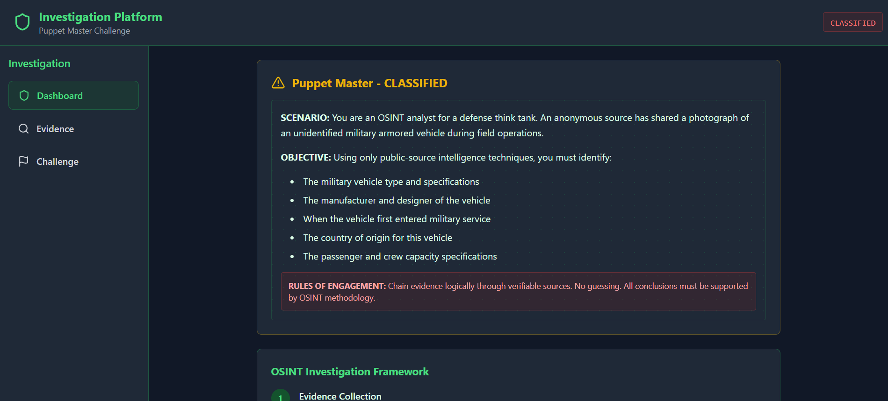
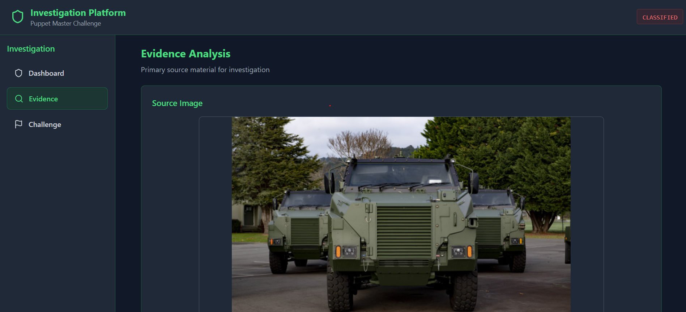
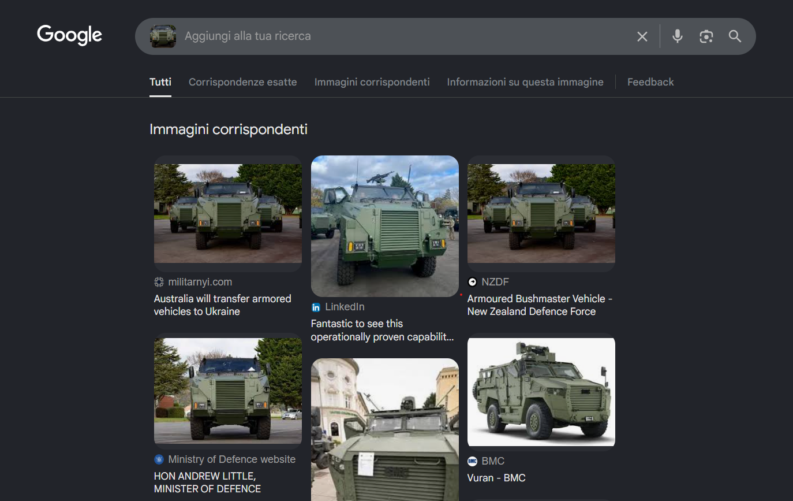
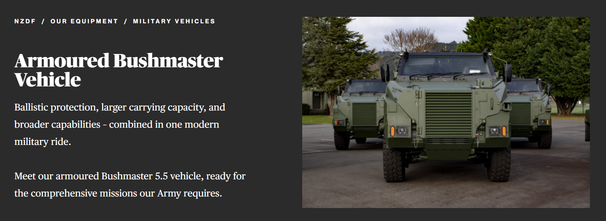
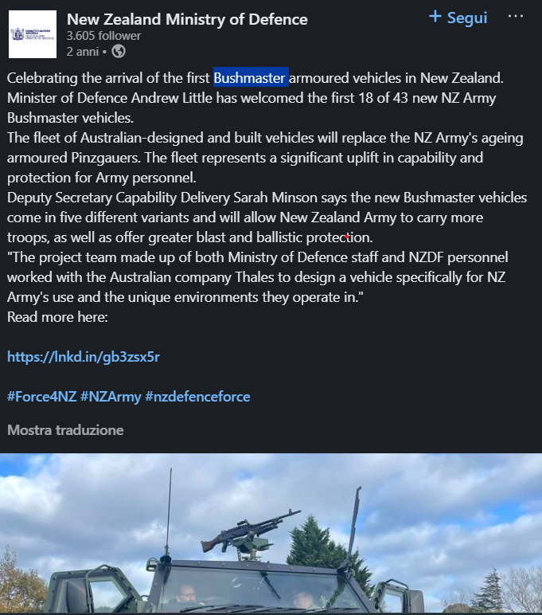
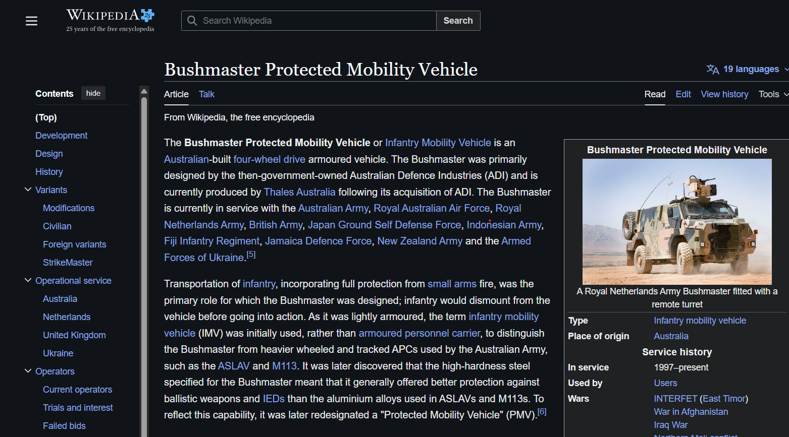

# The Puppet Master

Diamo un'occhiata all'ip fornito e vediamo che, data una foto di un mezzo militare, ci chiede di trovare alcune info su di esso

Nella pagina evidence vediamo la foto su cui investigare

Cercando l'immagine su google troviamo diversi articoli su differenti siti

Guardando in un paio di link vediamo che il nome del mezzo sembra essere bushmaster

La challenge chiede diverse info su questo mezzo che possiamo trovare nella pagina di wikipedia, il nome è nel titolo, l'azienda che l'ha fabbricato, quando è entrato in servizio, il suo paese di origine e quanti passeggeri e guidatori può portare, sono invece nella infobox sulla destra

