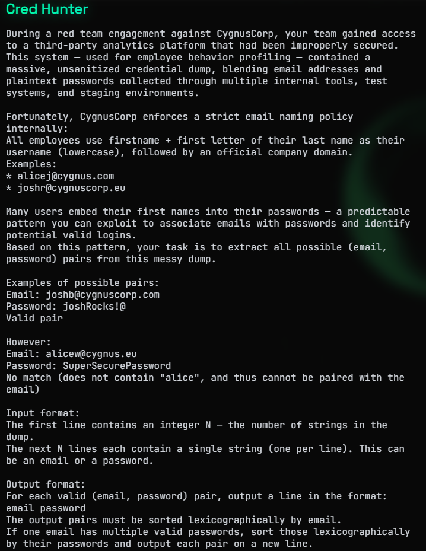
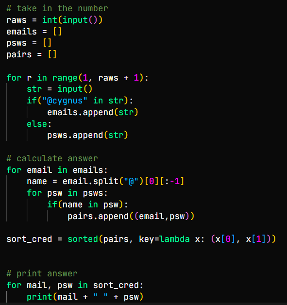

# Cred Hunter

Avviamo la sfida, ci viene detto che durante un'attività di red team abbiamo ottenuto accesso ad una piattaforma non sicura con dati sensibili in chiaro, come password e indirizzi email. Questi ultimi sono creati con lo stesso pattern, nome + prima lettera cognome + dominio. Ci viene detto che molti utenti potrebbero avere il loro nome all'interno della password e noi siamo incaricati di trovare quante più credenziali possibili. Le credenziali valide saranno formate dall'email e la/le password che contengono il nome dell'utente. Ci verrà fornito il numero di righe contenenti nel dump e le X righe del dump che possono essere email o password.

Scriviamo uno script in python che prenda il numero di righe, cicli gli input e li divida in due liste, una con le email e una con le password. Cicliamo le email e prendiamo solo il nome, controlliamo se è dentro delle password e nel caso aggiugiamoli ad una lista di tuple, finito, ordiniamo la lista prima per la mail e poi per la password e stampiamole in righe separate per ottenere la flag.

