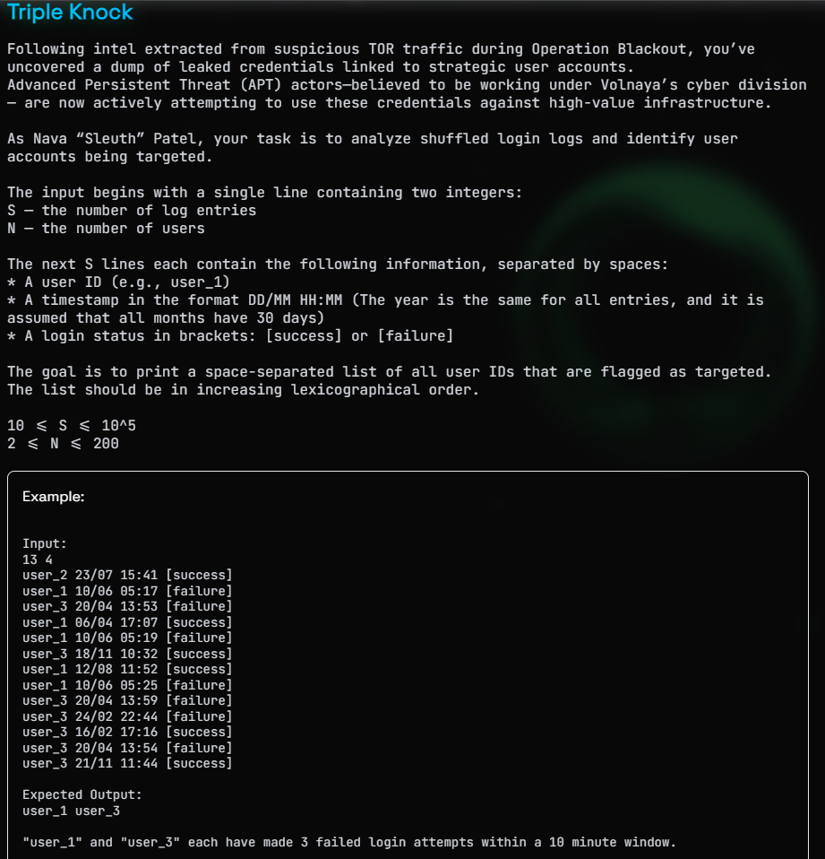
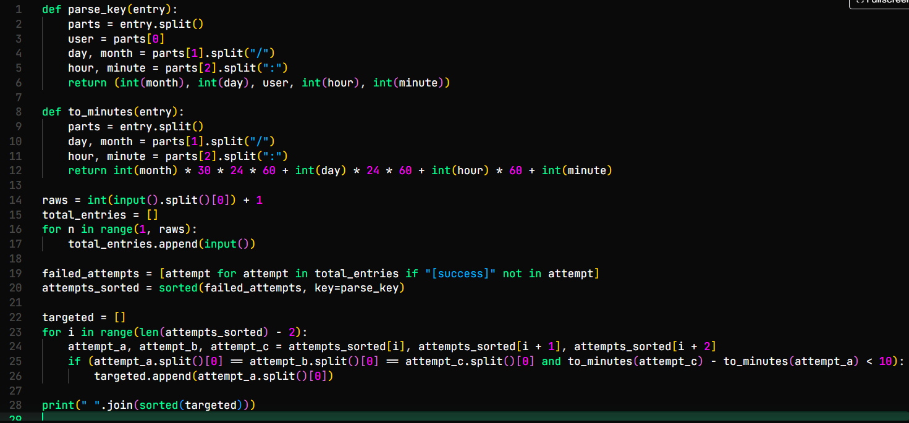

# Triple Knock

Connettiamoci a questa sfida, ci viene chiesto di controllare del traffico sospetto, sembra che qualcuno stia tentando di loggarsi con alcuni utenti su delle infrastrutture critiche. Abbiamo i log di questi tentativi con scritto il nome utente, il giorno, l'orario del tentativo e se è riuscito a loggarsi o meno. Come prima riga ci vengono forniti due numeri, quante righe ci sono ed il numero di utenti all'interno del log, dobbiamo mostrare quale/i utente/i ha/hanno fallito almeno 3 tentativi in meno di 10 minuti.

Scriviamo uno script che prenda il numero delle righe e crei una lista con tutte le righe, da questa lista prendiamo solo i tentativi falliti e ordiniamoli, prima per data, poi per utente ed infine per ora. Cicliamo quest'ultima lista prendendo i 3 tentativi consecutivi, controlliamo che siano dello stesso utente e che ci sia una differenza minore di 10 minuti, in caso positivo aggiungiamo questo utente ad una lista, infine creaiamo una stringa ordinata da mostrare a schermo come risultato

