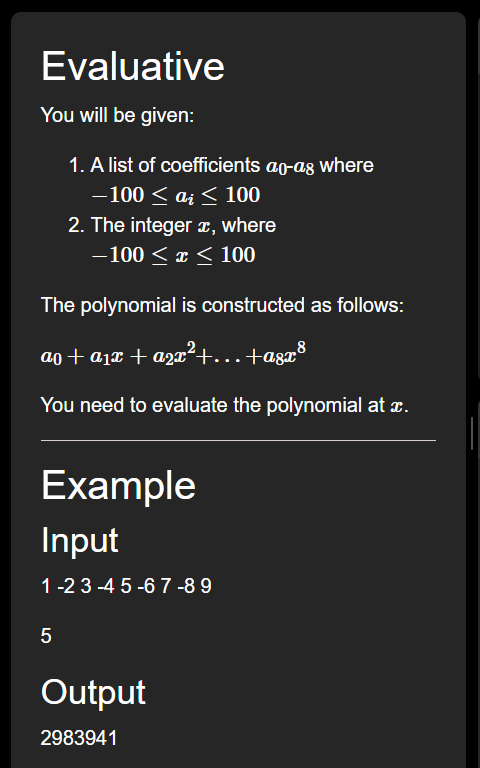
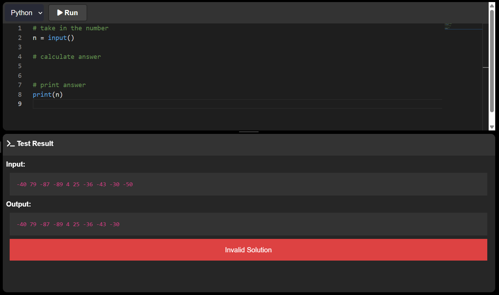
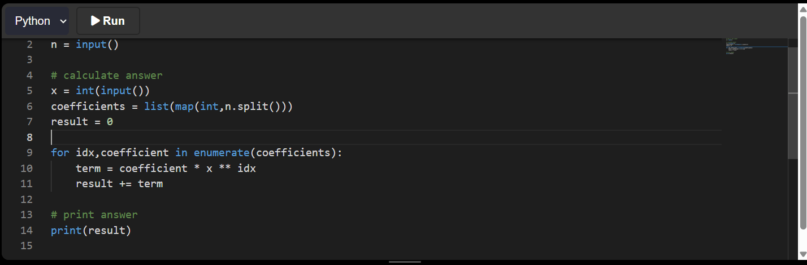
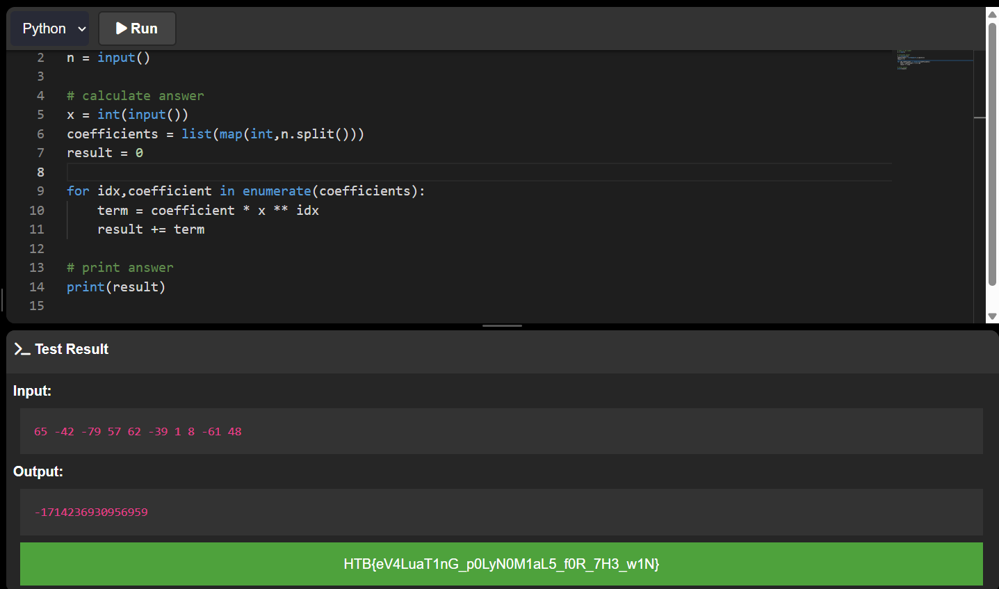

# Evaluative

Questa challenge consiste nel calcolare un polinomio, dati 9 coefficienti e la `x`.\
Un polinomio è una somma di termini, dove un termine è un coefficiente moltiplicato per x elevato alla sua posizione.\
Nell'esempio fornito il polinomio si calcola in questo modo:\
(1 * 5^0) + (-2 * 5^1) + (3 * 5^2) + (-4 * 5^3) + (5 * 5^4) + (-6 * 5^5) + (7 * 5^6) + (-8 * 5^7) + (9 * 5^8) 

Nello script iniziale vediamo che `n` contiene 10 numeri, i primi 9 sono i coefficienti e l'ultimo è la `x`

Scriviamo uno script che metta la `x` in una variabile di tipo int, i coefficienti dentro una lista di int e inizializziamo il valore del polinomio a 0. Cicliamo la lista dei coefficienti prendendo anche l'indice, calcoliamo ogni termine moltiplicando il singolo coefficiente per `x` alla potenza dell'indice, a ogni ciclo sommiamo questo risultato a `result`

Clicchiamo su 'Run' per ottenere la flag

