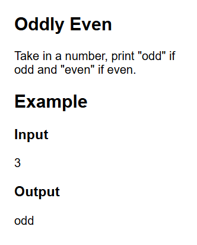
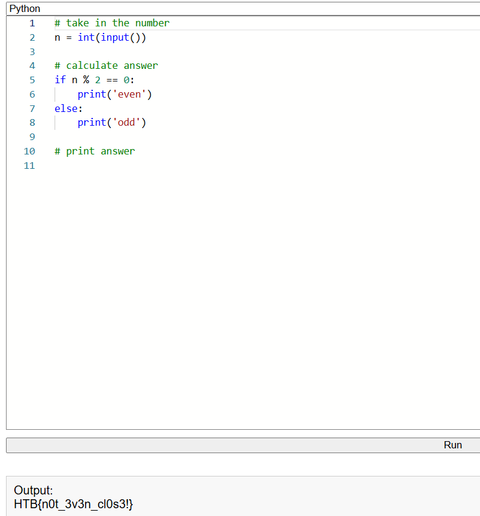

# Oddly Even

Colleghiamoci a questa challenge e vediamo che ci chiede di controllare se un numero è pari o dispari e stampare la scritta 'even' o 'odd' a schermo.

Scriviamo uno script che calcoli il modulo (resto della divisione) del numero dato per due, se questo è 0 allora il numero è pari, altrimenti è dispari.
Clicchiamo su 'Run' per ottenere la flag.

