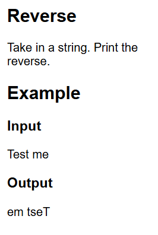
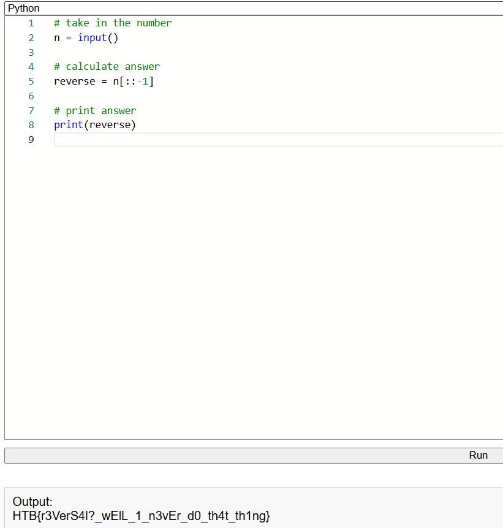

# Reversal

In questa sfida ci viene fornita una stringa e noi dobbiamo riscriverla al contrario

Scriviamo uno script che usi la sintassi degli slice per invertire la stringa, funziona in questo modo:\
`n[x:y:z]`, `x` è dove iniziare, `y` è dove finire e `z` indica di quanti caratteri avanzare, omettendo `x` e `y` si dice di usare tutta la lunghezza della stringa e scrivendo un numero negativo al posto di `z` si dice di partire dalla fine e andare al contrario, in questo caso di un carattere per volta. Clicchiamo su 'Run' per ottenere la flag

