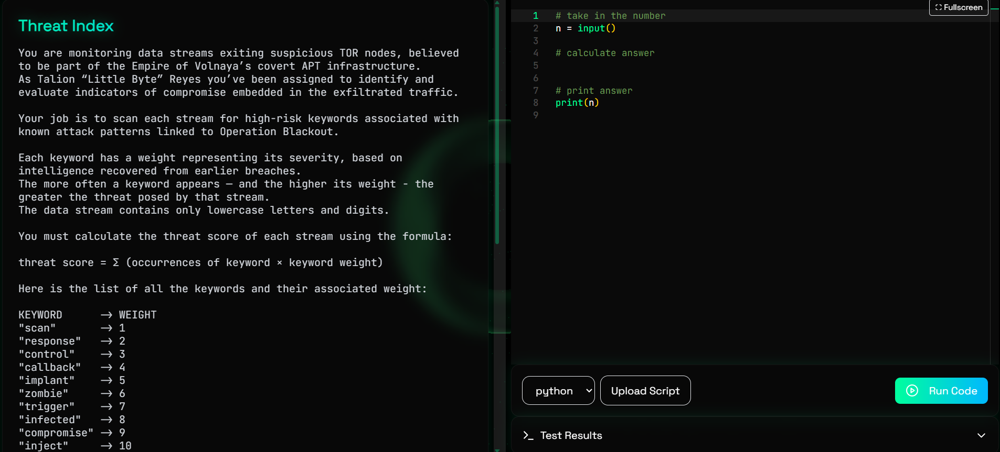
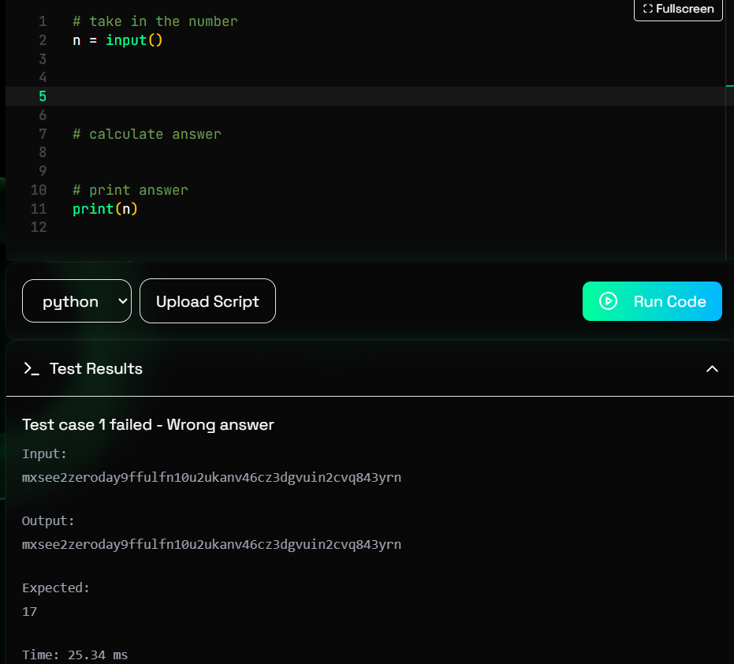
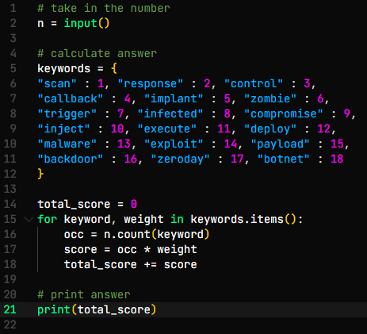
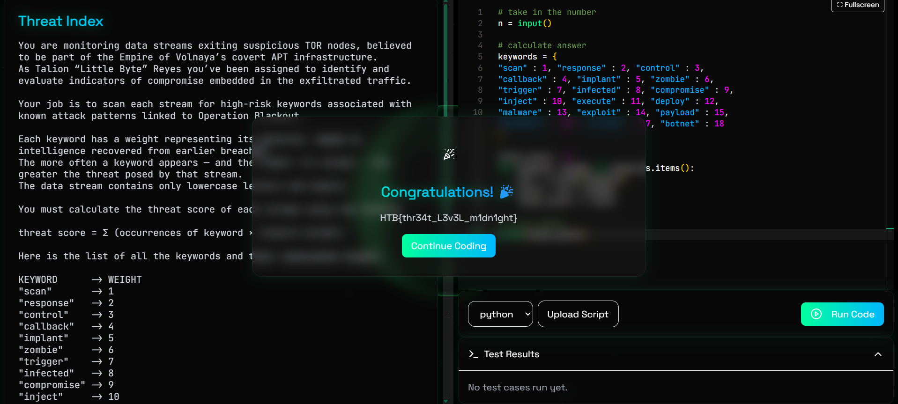

# Threat Index

Avviamo la sfida e accediamoci dal browser, ci spiega che dobbiamo monitorare un flusso di dati proveniente da nodi di TOR sospetti, questo flusso contiene delle parole chiave, ogni parola ha un suo peso, più volte una parola appare, più contribuisce al punteggio finale. Ci viene data una lista di parole con il loro rispettivo peso e dobbiamo moltiplicare il loro peso per il numero di occorrenze, infine sommare tutti i risultati ottenuti per avere un punteggio di rischio.

Nello script iniziale abbiamo già `n` che è il flusso di dati e print, dove metteremo il risultato finale.

Per superare questa challenge creiamo un dizionario con le parole chiave ed i loro valori, inizializziamo il punteggio di rischio totale a 0 e creiamo un loop sul dizionario dove cerchiamo tutte le occorrenze di una certa parola, calcoliamo il rischio per ogni parola e aggiungiamolo al totale. Alla fine stampiamolo con print. Cliccando su 'Run Code' otteremo la flag.

