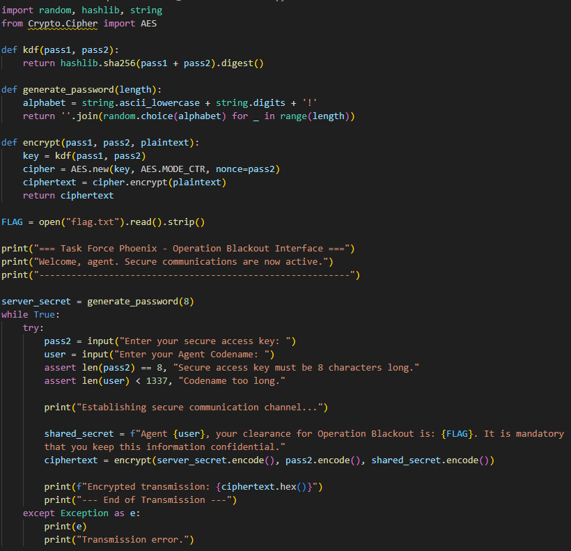
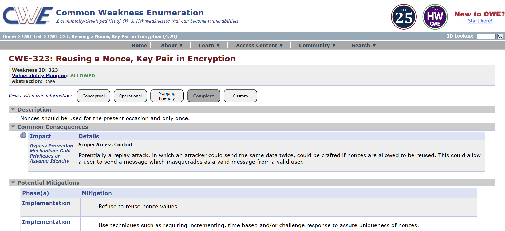
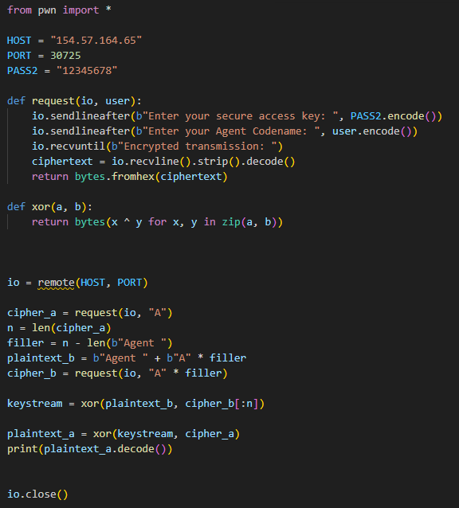
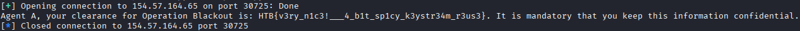

# Hidden Handshake

Scarichiamo il file e ne troviamo uno in python. All'avvio viene generato un server_secret di 8 caratteri fisso per tutta la sessione, poi entra in un loop che, ad ogni giro, prende in input due stringhe, pass2 che deve essere lunga esattamente 8 caratteri e user che può essere fino a 1336 caratteri. Con questi due dati costruisce un messaggio da cifrare, shared_secret. Questo messaggio viene cifrato con AES in modalità CTR e il risultato viene stampato in esadecimale.\
La modalità CTR trasforma AES in un cifrario a flusso che funziona in questo modo:

- si costruisce un blocco formato da un nonce + un contatore che è un numero che parte sempre da 0
- AES cifra questo blocco di 16 byte con la chiave, in questo caso SHA-256 di server_secret + pass2, producendo 16 byte pseudo-casuali (un blocco della keystream)
- il contatore viene incrementato e si ripete finchè la keystream non è lunga quanto il messaggio (se c'è una parte in eccesso viene tagliata)
- infine il ciphertext si ottiene con uno XOR (⊕) tra la keystream e il plaintext

Il nostro obiettivo è di decifrare il ciphertext che ci viene restituito, basterebbe fare keystream ⊕ ciphertext, il problema è che non abbiamo la keystream.
La vulnerabilità (Keystream reuse - CWE-323) sta nel fatto che la keystream dipende dalla chiave e dal nonce, ed entrambi derivano da pass2, la chiave è SHA-256(server_secret + pass2) mentre il nonce è pass2. server_secret è costante per tutta la sessione e pass2 lo scegliamo noi (quindi possiamo non cambiarlo). Avendo questi due valori fissi la keystream sarà sempre la stessa. Poichè lo XOR è reversibile:\
ciphertext = keystream ⊕ plaintext => quello che fa il server\
keystream = ciphertext ⊕ plaintext => quello che faremo noi\
Noi conosciamo il ciphertext mentre del plaintext conosciamo solo le parti fisse ("Agent ", ", your clearance for Operation Blackout is: ", ecc.) e ne controlliamo direttamente una parte, user. Quello che non conosciamo è la flag.\
Il punto è che con una sola richiesta a user corto (es. "A") non possiamo ricavare la keystream nelle posizioni in cui si trova la flag, perché lì il plaintext ci è ignoto. Servono quindi due richieste nella stessa sessione, con la stessa pass2:

1. User corto ("A"): il ciphertext risultante contiene la flag, in una posizione per noi non decifrabile. Chiamiamo 'n' la lunghezza del ciphertext.
2. User lungo ("A" ripetuto n-6 volte): i primi 6 byte del messaggio sono noti "Agent " che è seguito dalle nostre "A" e questo ci copre esattamente le posizioni che ci interessano.

Dalla seconda richiesta ricaviamo keystream = plaintext_noto ⊕ ciphertext. Questa sarà lunga abbastanza da coprire tutto il ciphertext della prima richiesta. A quel punto applichiamo questa keystream al primo ciphertext e recuperiamo l'intero messaggio, flag inclusa.

Scriviamo un exploit in python che si colleghi all'host una volta sola e mandi due richieste con lo stesso pass2. Nella prima richiesta manda un user di un solo carattere 'A' e misura la lunghezza del ciphertext, che chiamiamo n, che è la lunghezza della keystream che ci serve per decifrarlo tutto. Poiché il messaggio inizia con "Agent " (6 byte) seguito da user, sottraendo questi 6 byte da n otteniamo quanto lungo dovrà essere il secondo user. Nella seconda richiesta inviamo un user di n-6 caratteri 'A', in questo modo conosciamo interamente i primi n byte del plaintext ("Agent " + le nostre "A") e, con plaintext_noto ⊕ ciphertext, ricaviamo n byte di keystream. Infine facciamo keystream ⊕ primo_ciphertext e otteniamo il plaintext con la flag.

