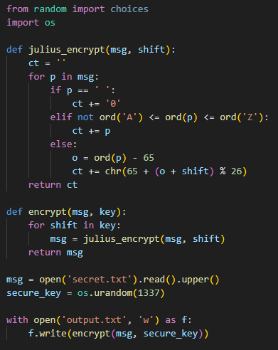
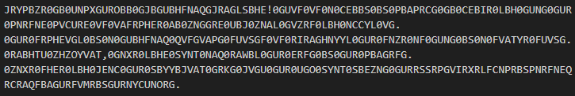
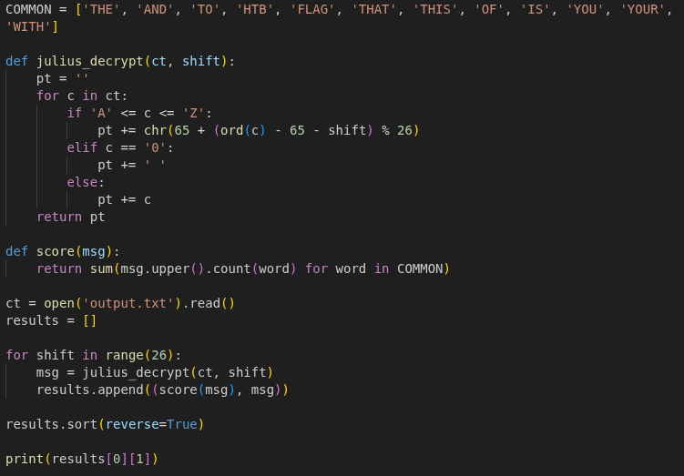
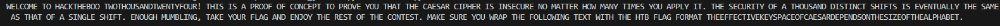

# Sekur Julius

Scarichiamo i file e ne troviamo due, il file Python è quello che dobbiamo risolvere, questo prende il file secret.txt, tutto in maiuscolo, crea una chiave di 1337 byte casuale e scrive il contenuto di secret.txt criptato dentro output.txt (il secondo file scaricato). Dobbiamo capire come questo testo viene criptato per riuscire a decriptarlo. La prima funzione che viene chiamata è encrypt, che fa un ciclo sulla chiave e per ogni byte chiama julius_encrypt passando il messaggio e il valore intero del byte (iterando su un oggetto bytes, Python restituisce direttamente l'intero 0-255). Questa funzione cripta ogni carattere del messaggio con ogni byte della chiave in questo modo:
- se il carattere è uno spazio lo sostituisce con uno zero '0'
- se è una lettera maiuscola calcola l'indice nell'alfabeto (0-25) `o = ord(p) - 65` e applica lo shift sommando il valore del byte modulo 26 e la trasforma in lettera maiuscola con `ct += chr(65 + (o + shift) % 26)`.
- altrimenti lascia il carattere invariato
Questo si chiama cifrario di Cesare, cioè uno spostamento fisso di tutte le lettere lungo l'alfabeto. La funzione encrypt lo applica 1337 volte, una volta per ogni byte della chiave.

Il punto debole è che comporre più cifrari di Cesare equivale ad uno solo, gli spostamenti si sommano tra loro, quindi la chiave da 1337 byte si riduce ad un unico shift compreso tra 0 e 25. Scriviamo uno script per risolvere questa challenge, quello che dobbiamo fare sono gli stessi passaggi ma al contrario per tutte le 26 possibilità e controllando quale sia quella giusta in modo da vedere solo il risultato corretto. Prendiamo il file output.txt e proviamo tutti gli shift da 0 a 25 caratteri, sostituiamo gli zeri con degli spazi e i caratteri che non sono lettere maiuscole lasciamoli così come sono. Mettiamo tutti i risultati dentro un array di tuple calcolando anche un punteggio di quanto l'output sembri una frase in inglese, contando quante volte alcune parole comuni appaiono all'interno del messaggio. Lanciando questo script otteniamo il messaggio in chiaro con la flag.

