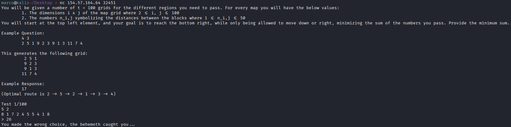
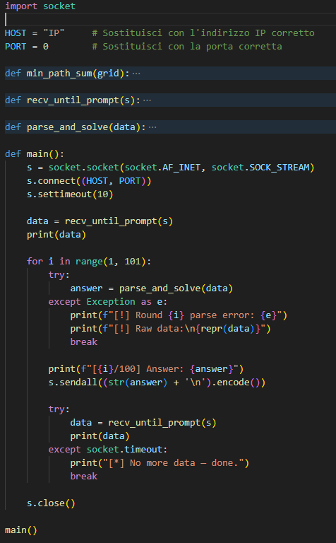
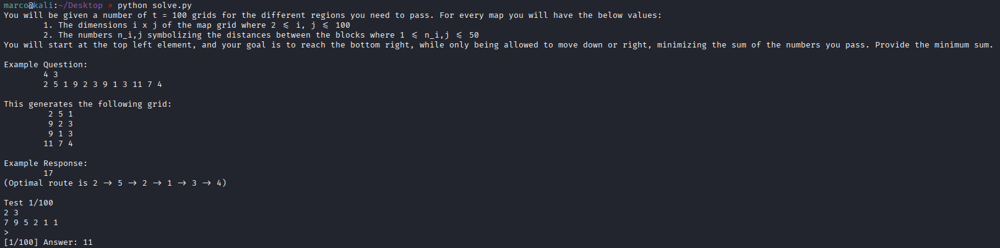
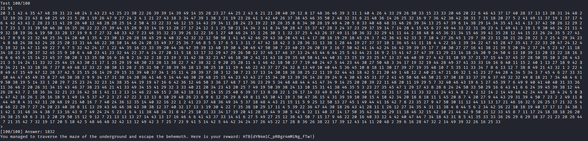

# Dynamic Paths

Colleghiamoci all'ip fornito, qui ci viene spiegata la challenge. Ci viene data una griglia di numeri con specificato quante righe e quante colonne ha e la lista dei numeri. Partiremo dal numero in alto a sinistra e dobbiamo arrivare al numero in basso a destra, sommando tutti i numeri per cui passeremo. Il percorso giusto è quello che da la somma più bassa. Ci saranno 100 griglie, quindi dovremo scrivere uno script per farle tutte, dato anche dal fatto che c'è un tempo limite entro il quale rispondere

In questo script partiamo dalla funzione main, colleghiamoci al servizio, prendiamo il suo output con recv_until_prompt() e creiamo un loop che giri 100 volte, per ogni ciclo passiamo l'output del programma a parse_and_solve(), prendiamo il suo valore di ritorno e inviamolo alla challenge fino a che non otteniamo la flag. Questa funzione prende le righe, le colonne e crea la griglia che passa a min_path_sum(). Quest'ultima funzione prende la griglia e la ricrea con lo stesso numero di righe e colonne ma al posto dei numeri dati, mette le somme minime per arrivare fino a lì ed infine ritorna l'ultimo numero dell'ultima riga, il nostro obiettivo

Lanciamo lo script per ottenere la flag alla fine dei 100 round

