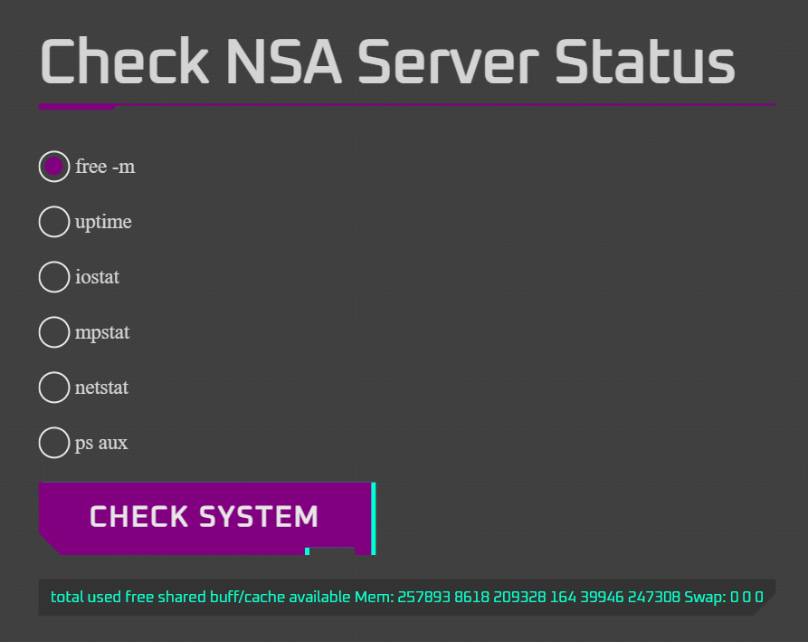
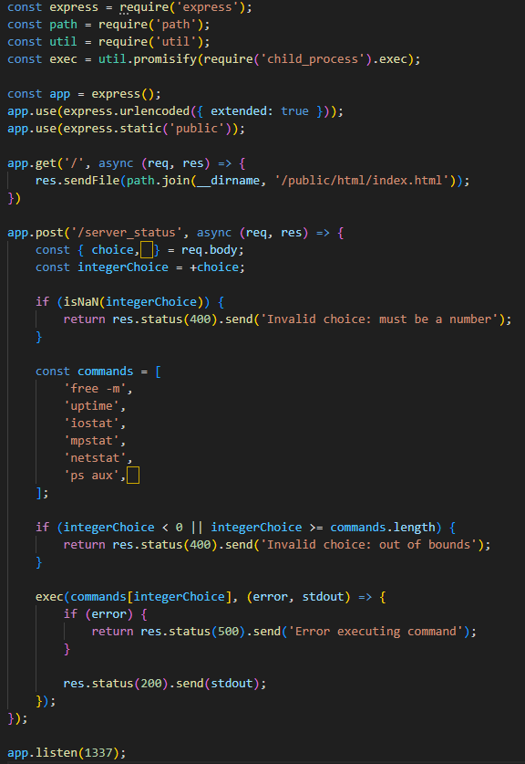
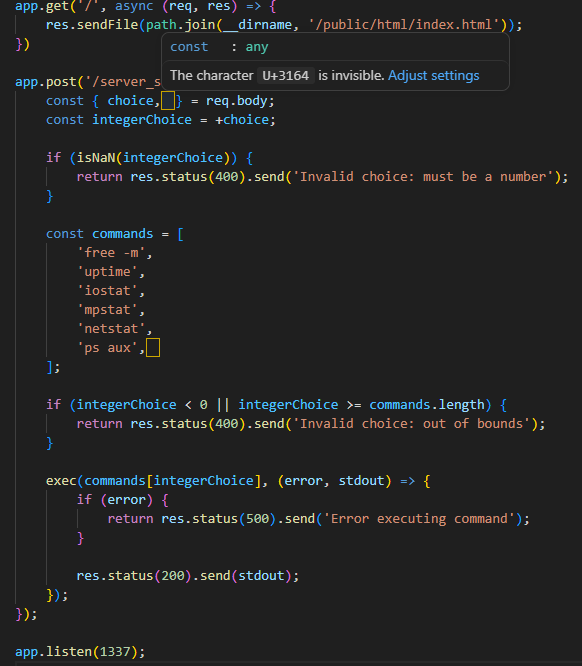
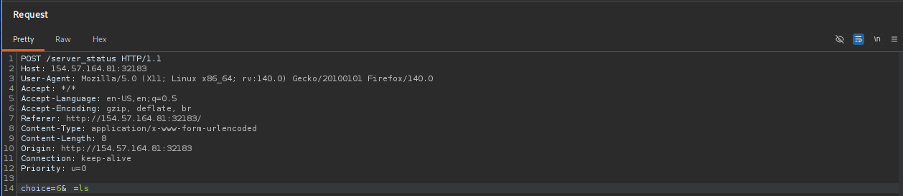
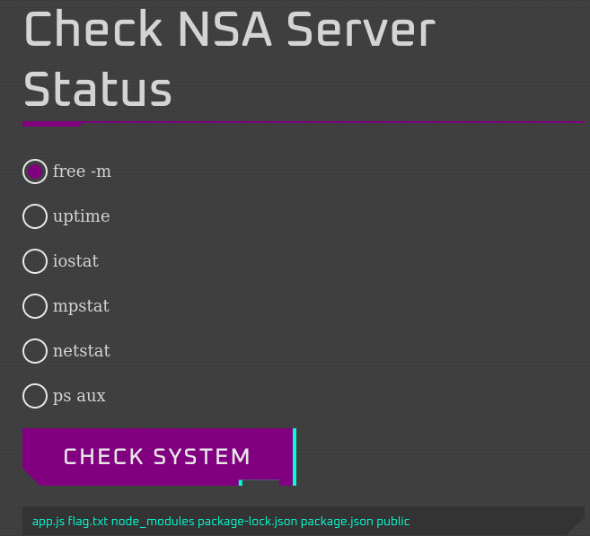

# Hidden Path

Avviamo la sfida e andiamo sulla pagina, questa è una web app per controllare lo stato dei server della NSA, provando alcune opzioni otteniamo risposta, ma non c'è nulla di interessante.

Diamo un'occhiata al codice sorgente e vediamo che questa è una app in node con due endpoint, uno che restituisce la pagina html che abbiamo visto prima e uno che invia l'indice dell'array del comando scelto, questo deve essere per forza un numero e prende il comando dall'array commands. Questo numero non può essere quindi più grande della lunghezza dell'array commands.

L'unica cosa strana è quello spazio dopo "choice," e "'ps aux'," Visual Studio Code mi dice che è il carattere U+3164. Facendo delle ricerche su internet questo carattere si chiama Hangul Filler ed è semplicemente uno spazio vuoto, questo vuol dire che possiamo passarlo come parametro e mettendo come valore un comando diventerà l'elemento dell'array con indice 6.

Intercettiamo la richiesta con burpsuite, copiamo il carattere Hangul Filler dal codice sorgente e aggiungiamolo dopo choice, provando il comando ls, vediamo subito il file della flag. Adesso sostituiamo 'ls' con 'cat flag.txt' per ottenere la flag.

\
