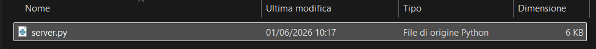
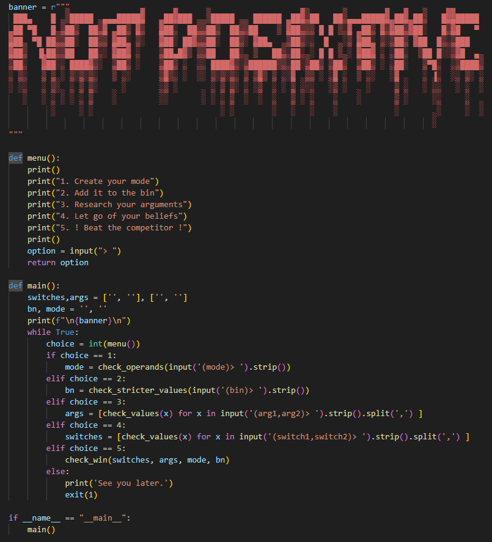
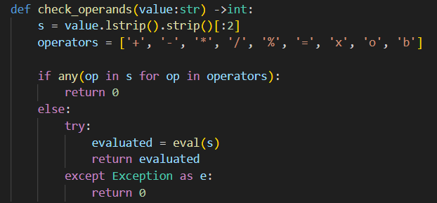
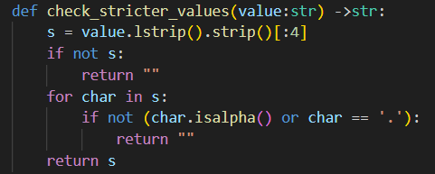
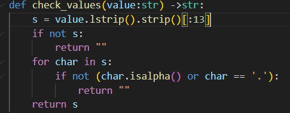
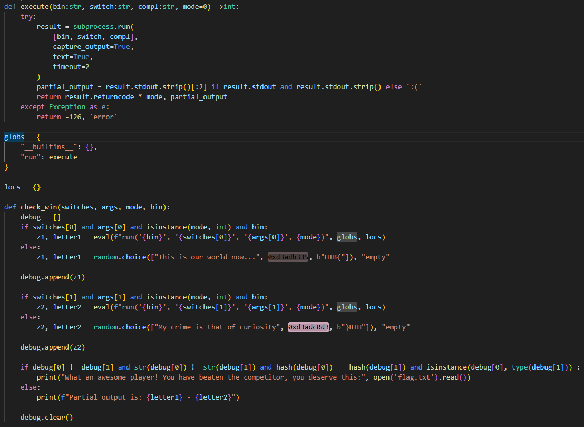
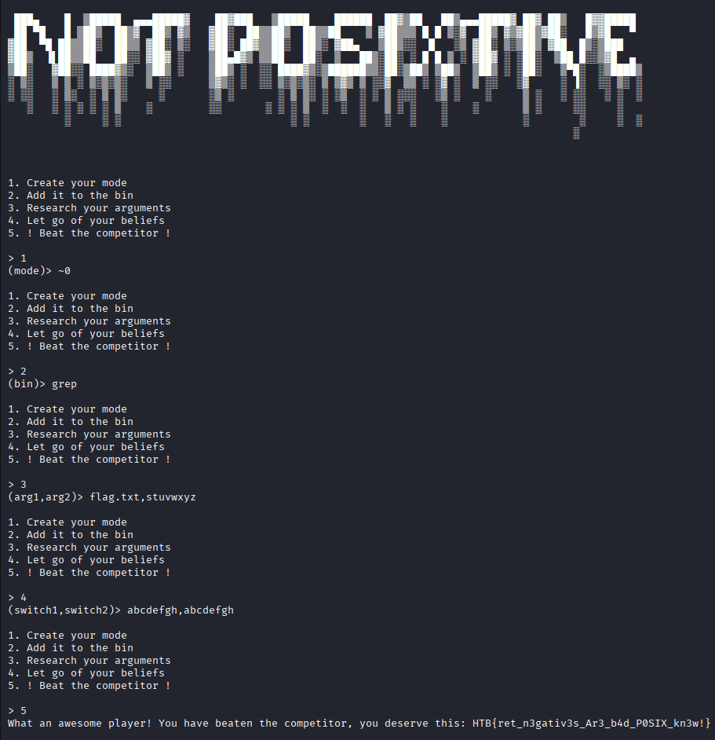

# Not Posixtive

Scarichiamo subito il codice sorgente e vediamo che abbiamo un solo file python, server.py

Partiamo dalla funzione main, questa definisce 2 array e 2 variabili, stampa il banner e in base al numero che scriviamo da 1 a 5 chiama una determinata funzione, la quale valorizza una delle 4 variabili, a parte la quinta che chiama una funzione passandogli tutti e 4 gli argomenti. In caso si scriva qualcosa di diverso di un numero da 1 a 5 il programma esce con errore, codice 1

Andiamo in ordine e vediamo una funzione per volta, la prima è check_operands, prende in input una stringa e restituisce un intero. Di questa stringa prende solo i primi 2 caratteri e controlla che ognuno di questi non sia contenuto in operands, dopodichè prova a trasformare la stringa in int, in caso non ci riesca ritorna 0

La funzione check_stricter_values prende i primi 4 caratteri di una stringa, controlla che non sia vuota e che ogni carattere sia una lettera o un punto, in questo caso ritorna i primi 4 caratteri della stringa, altrimenti una stringa vuota

La funzione check_values fa la stessa cosa di quella precedente ma prendendo i primi 13 caratteri

L'ultima funzione è check_win, alla quale vengono passate le 4 variabili. Questa, in due if diversi, controlla che i primi 2 item degli array, switches e args, e la var bin siano valorizzate e che mode sia un int. In caso positivo eval() passa questi valori alla funzione run, che esegue sulla macchina il comando: bin switch compl, escludendo tutte le funzioni di python con l'oggetto globs. Il metodo execute prende i primi 2 caratteri, se ci sono, e li ritorna insieme al exit code moltiplicato per mode, adesso entra nell'ultimo if e controlla che i due numeri siano diversi, come int e come stringhe, che siano dello stesso tipo e che abbiano lo stesso hash per ottenere la flag.

L'exploit per questa challenge sta proprio nel metodo check_win, nell'ultimo if, perchè deve ricevere due valori interi, diversi tra loro ma con lo stesso hash e questo ci porta alla hash collision. Questa è una particolarità di CPython, perchè il valore -1 è riservato come valore di errore e viene automaticamente rimappato a -2. Vediamo i passaggi da seguire:
- Nel primo metodo inseriamo '~0', questa è la funzione bitwise (~0 = -(0+1) = -1) che ritorna -1
- Nel secondo metodo inseriamo 'grep', il comando, di massimo 4 caratteri, che verrà eseguito
- Nel terzo metodo inseriamo 'flag.txt,stuvwxyz' saranno i due file dove grep andrà a cercare, uno deve esistere ed il secondo no
- Nel quarto metodo inseriamo 'abcdefgh,abcdefgh', i pattern che grep andrà a cercare e non dovranno esistere all'interno del file
- Quando lanciamo il quinto metodo, execute() lancierà due comandi: 'grep abcdefgh flag.txt' e 'grep abcdefgh stuvwxyz'. Il primo restituirà exit code 1, perchè il file esiste ma il pattern no, mentre il secondo restituirà exit code 2, perchè il file non esiste, moltiplichiamo questi due valori per -1 e otteniamo che debug[0] = -1 e debug[1] = -2. Questi sono due int diversi, che grazie alla hash collision hanno lo stesso hash, riusciamo quindi a soddisfare tutte le condizioni dell'ultimo if e a ottenere la flag

