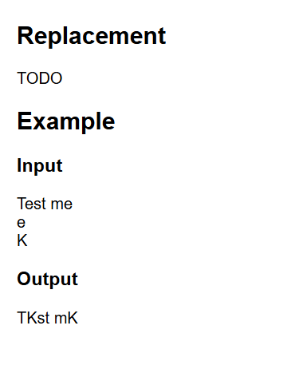
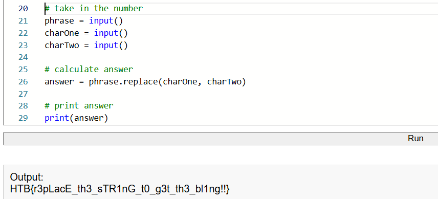

# Replacment

Avviamo la sfida e accediamoci da browser, ci chiede di fare un replace, ci viene data una frase e due lettere, la prima è una lettera all'interno della frase che andrà sostituita con la seconda

Scriviamo uno script che prenda i 3 valori in input, poi usiamo il metodo replace sulla frase mettendo come primo paramentro la lettera da sostituire e come secondo parametro la lettera da inserire, stampiamo la risposta e otteniamo la flag

