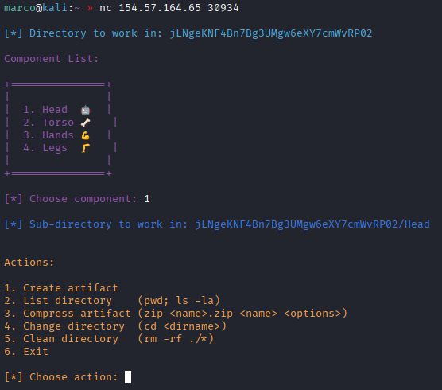
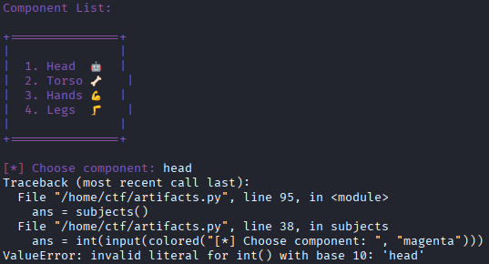
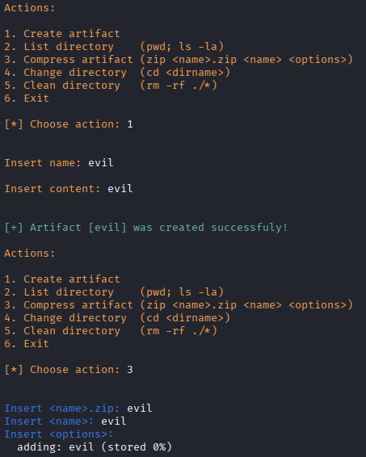
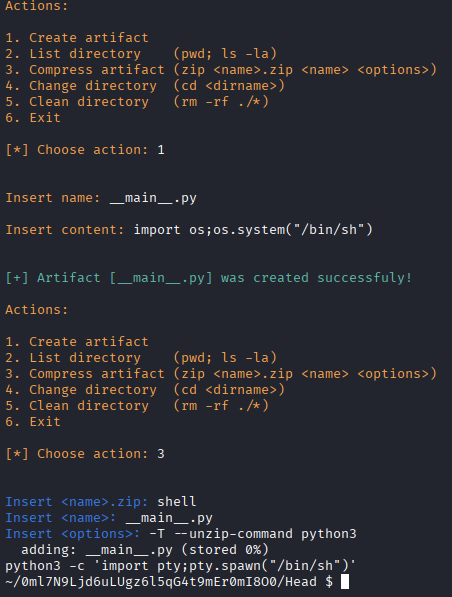
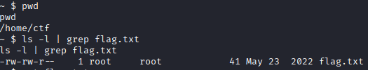

# COMPRESSOR

Collegandoci con netcat all'ip e porta forniti, vediamo che possiamo scegliere fra alcuni componenti e selezionandone uno abbiamo alcuni comandi disponibili

Facendo delle prove vediamo che questa app è scritta in python

Una volta scelto un componente possiamo vedere quali comandi verranno lanciati nella shell e l'unico interattivo è zip, il quale possiamo usare dopo aver creato un artefatto

Comprimiamo un file chiamato \__main__.py, dove al suo interno importiamo una shell, usando le opzioni -T per dire a zip di testare l'archivio appena creato
e --unzip-command per specificare con quale comando dovrà testare lo zip. Testiamo col comando python3, il quale supporta l'esecuzione di zip e, automaticamente, eseguirà il file \__main__.py. In questo modo otterremo una shell interattiva

Una volta ottenuta la shell troveremo la flag nella home directory del nostro utente

