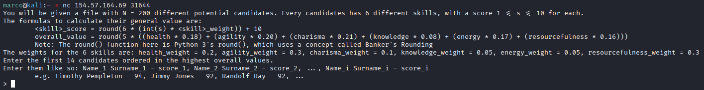
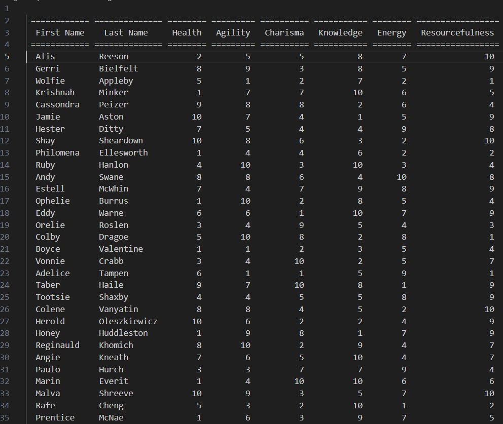
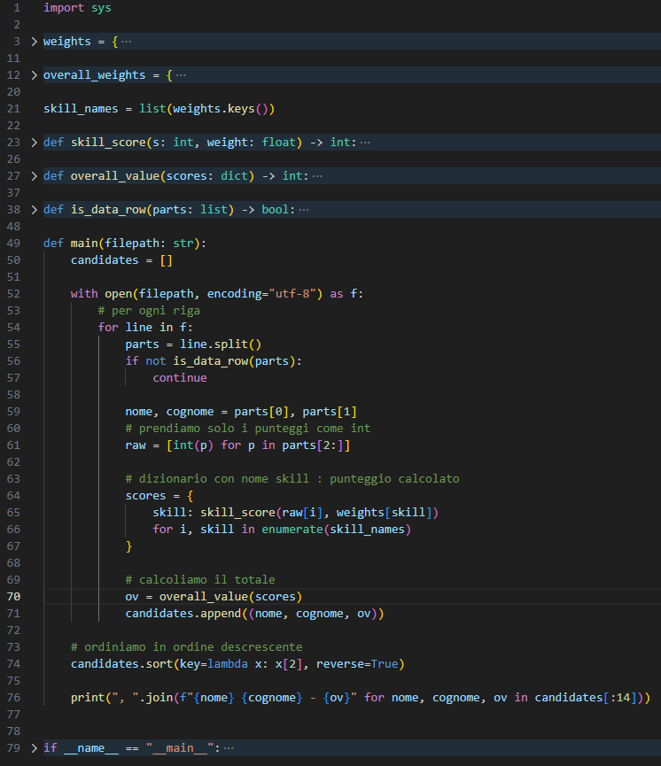
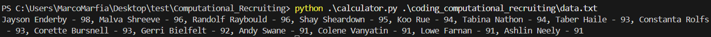
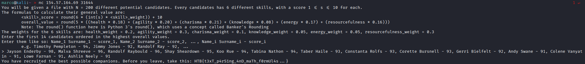

# Computational Recruiting

Connettiamoci all'ip e porta forniti, ci viene chiesto di scaricare il file in allegato e di calcolare le skills di 200 candidati e di dare come risposta il nome, cognome e punteggio dei primi 14. Ci viene dato anche il calcolo da fare

Scarichiamo il file e vediamo che è un txt ben formattato, possiamo calcolare i punteggi di tutti i candidati con uno script

Visto che la challenge dice che la funzione round() è presa da python 3's scriviamo uno script in python che prenda le righe del file con i nomi e punteggi, calcoli il punteggio per ogni skill poi il punteggio totale e li mettiamo tutti in una lista, dopodichè li ordiniamo in ordine decrescente e stampiamo solo i primi 14

Lanciamo lo script e stampa a schermo la stringa con i migliori 14 candidati

Copiamo la stringa sopra ed inviamola a questa challenge, per ottenere come risposta la flag

