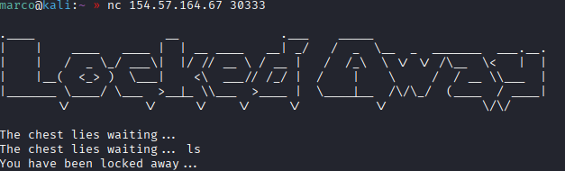
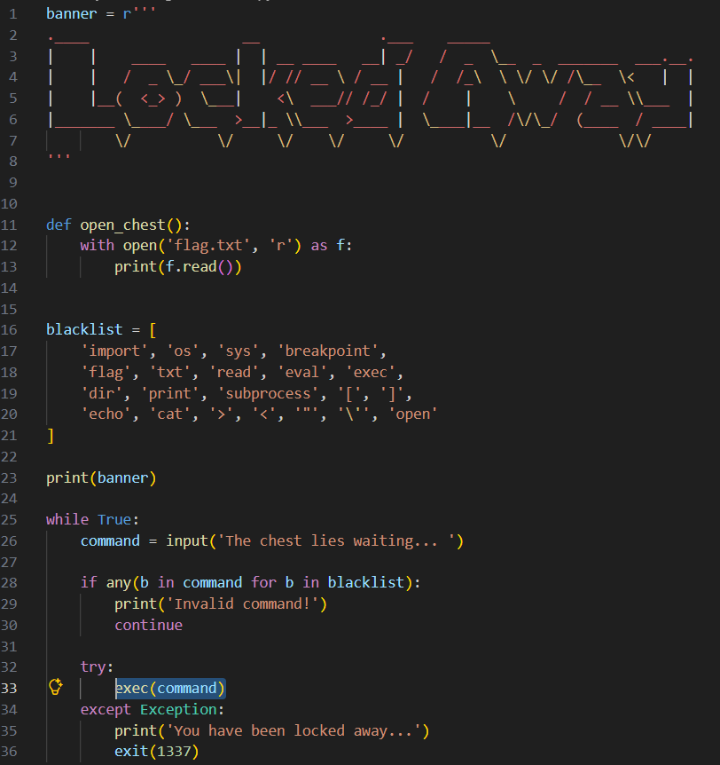
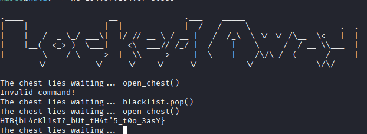

# LOCKED AWAY

Collegandoci all'ip fornito abbiamo una shell con la quale possiamo interagire, ma facendo una prova vengo buttato fuori

Possiamo scaricare il codice sorgente, qui si nota che per stampare a schermo la flag dobbiamo chiamare la funzione open_chest(), ma non possiamo chiamarla direttamente perchè la stringa 'open' è dentro la blacklist, come ultima parola

Quindi dobbiamo eliminare 'open' dall'array con la funzione pop(), la quale elimina l'ultimo item, e successivamente chiamare open_chest()

