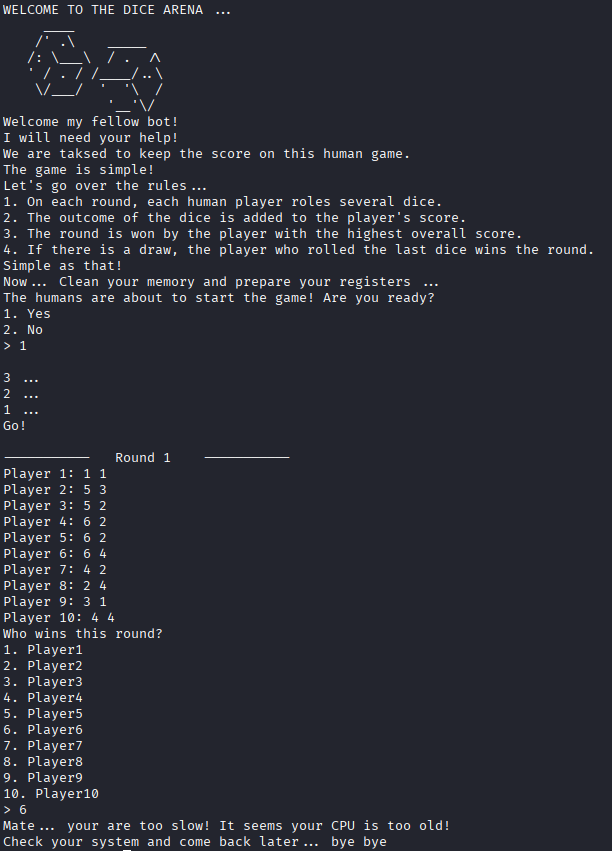
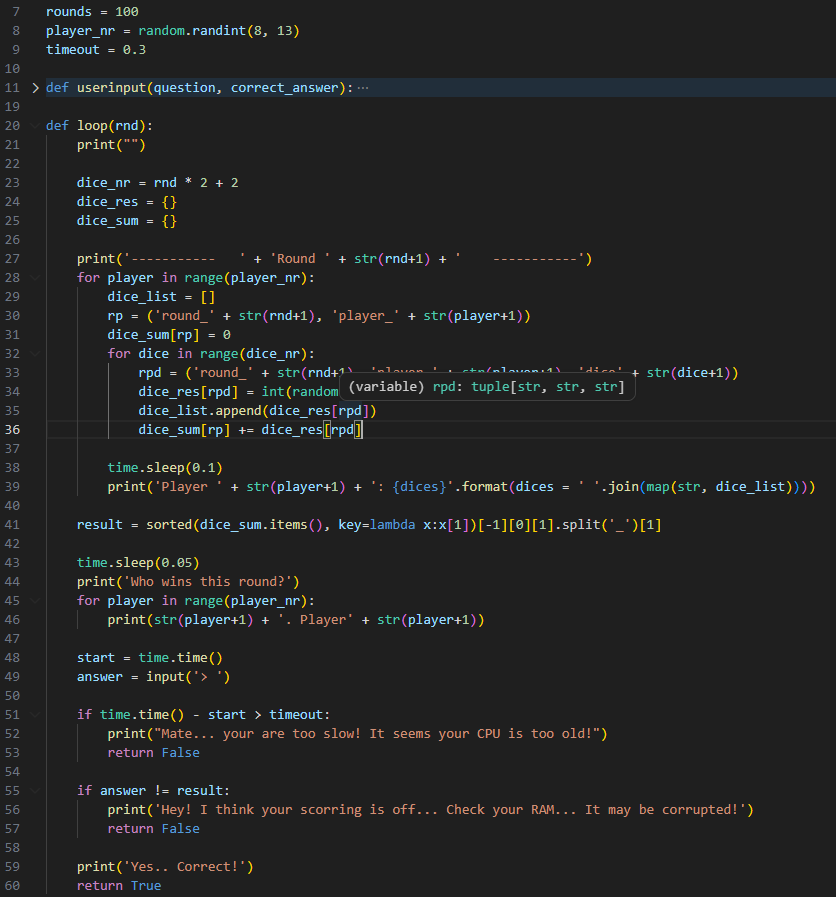
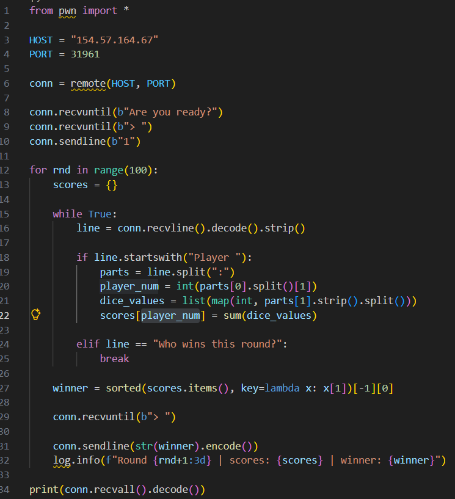
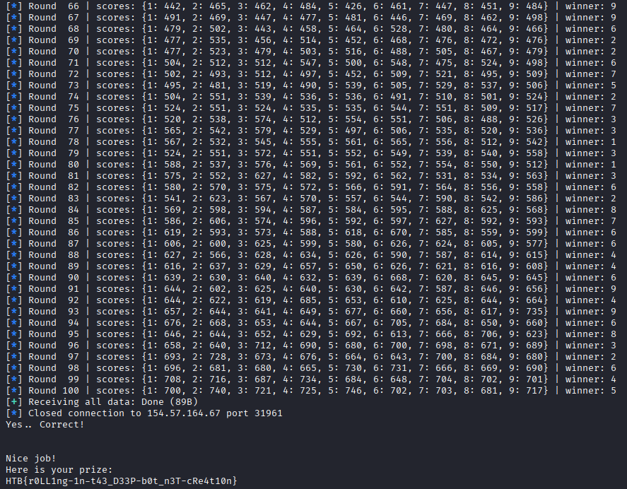

# LUCKY DICE

Collegandoci all'ip fornito vediamo che questo è un gioco, i giocatori lanciano i dadi e quello col punteggio più alto vince (i dadi vengono lanciati dall'app). Una volta ottenuti i risultati bisogna dire quale giocatore ha avuto il punteggio più alto ma anche rispondendo correttamente il gioco dice che siamo stati troppo lenti

Possiamo scaricare il codice sorgente, qui vediamo che la logica è dentro la funzione loop(), vengono creati fra gli 8 e i 13 giocatori. Per ogni giocatore vengono creati dei numeri random da 1 a 6, quanti sono questi numeri random dipende dal round e viene salvata la somma di questi che servirà per determinare il vincitore. Poi li mette in ordine crescente e prende l'ultimo, quindi quello col punteggio più alto. Per rispondere abbiamo 0.3s, un tempo troppo breve per riuscire a farlo manualmente

Bisogna scrivere uno script che si colleghi all'ip e porta forniti, aspettiamo il messaggio per rispondere che siamo pronti "1", poi prendiamo le righe che iniziano con "Player", sommiamo i numeri che troviamo sulla stessa riga e salviamo il numero del giocatore con la somma in scores. Quando il gioco chiede quale giocare ha vinto li ordiniamo come fa lo script originale, prendiamo l'ultimo e lo inviamo

Installiamo il modulo pwntools e lanciamo lo script, dopo i 100 round l'app ci restituisce la flag

