# Hydroadmin

Atterriamo su una pagina con 2 pulsanti, il primo, 'system diagnostic' fa un check interno e mostra il risultato nel terminale, nulla di interessante

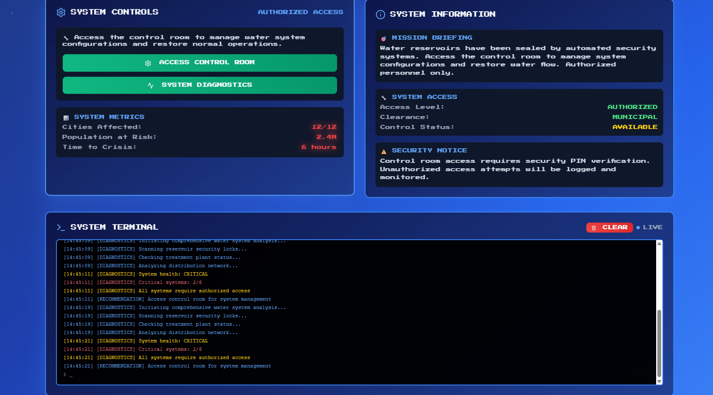

Mentre il secondo, 'access control room' porta ad una pagina che chiede un pin di 4 caratteri, vediamo anche a quale url fa la richiesta

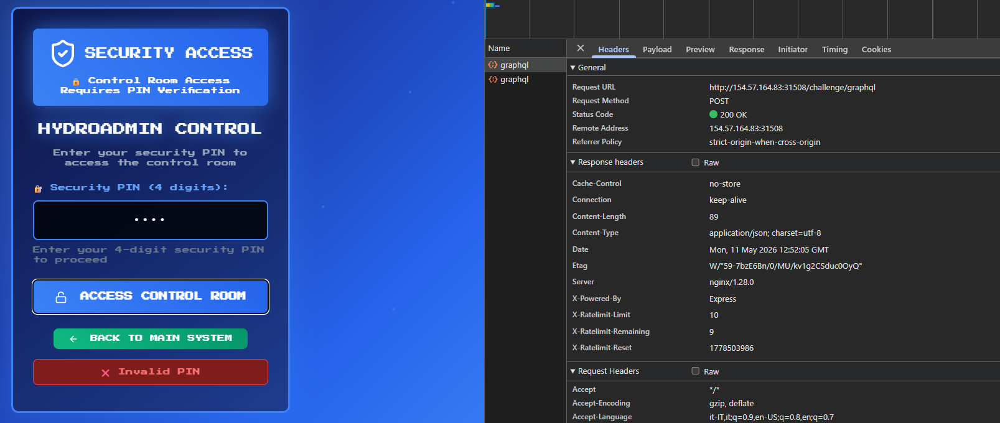

Cerchiamo di capire dove e come viene creato il pin. Al caricamento della pagina pin-access.html viene chiamato pin-access.js

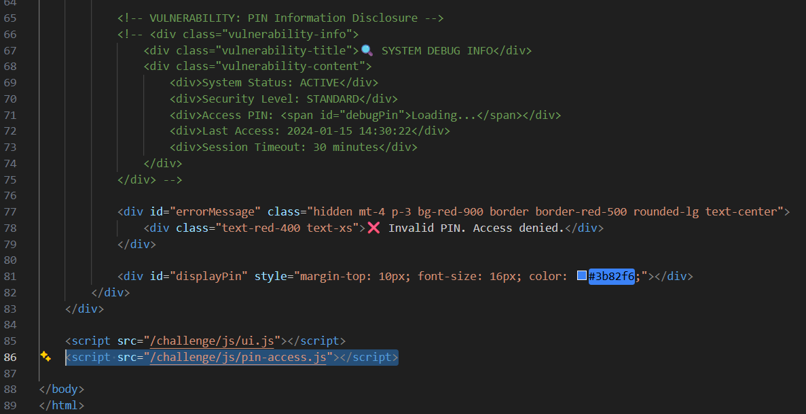

Nel file public/js/pin-access.js, al caricamento, chiama generatePinOnLoad(), la quale fa una fetch a /challenge/graphql con generatePin nel body

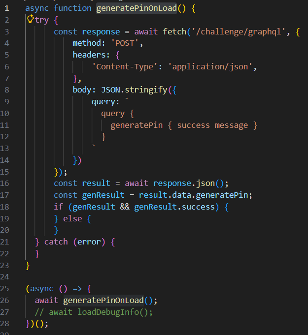

In index.js vediamo che viene usato Apollo server, una libreria che gestisce le chiamate http specificando un server, in questo caso /schema/resolvers.js

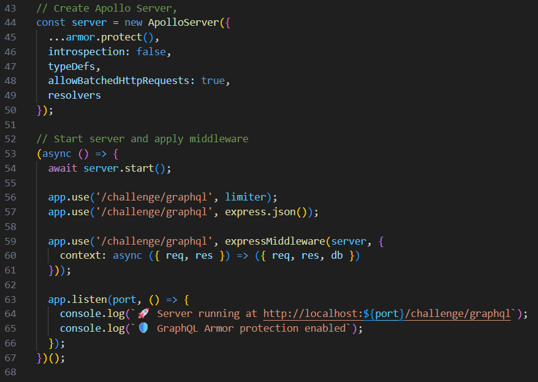

Dentro schema/resolvers.js viene chiamata generateNewPin() perché gli arriva la richiesta generatePin dalla fetch in public/js/pin-access.js

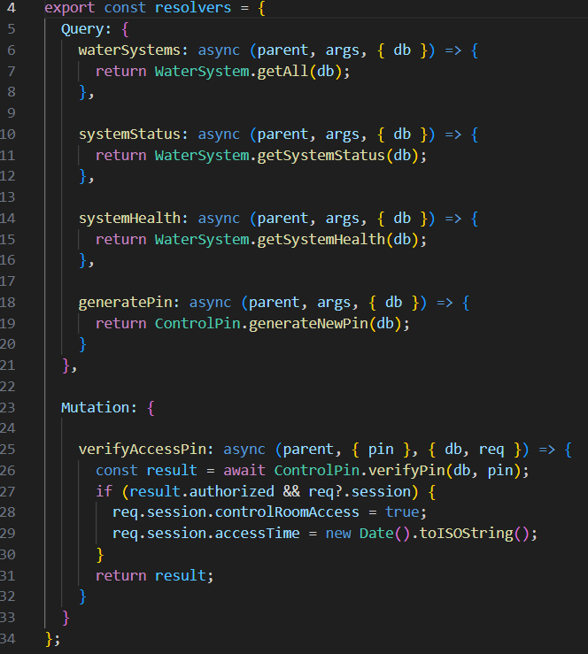

In models/controllpin.js, troviamo la funzione generateNewPin(), la quale crea un numero con un valore compreso fra 1000 e 9999, che scade dopo 3 minuti

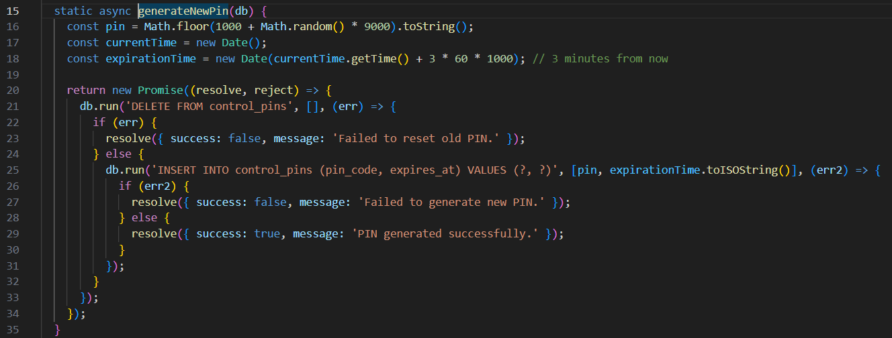

Dentro index.js vengono impostati dei limiti, i quali sono dentro utils/middleware.js e limitano le richieste a 10 al minuto, quindi non possiamo fare un bruteforce per trovare il pin

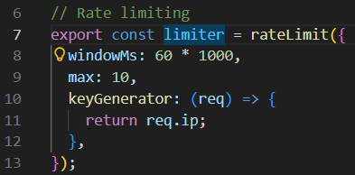

Vediamo che sempre dentro index.js, il server accetta richieste batch, questo significa che accetta un array di operazioni dentro una singola chiamata

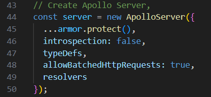

Scriviamo un exploit in python che faccia creare un nuovo pin a questo progetto, faccia delle richieste con 1000 pin per richiesta e mostri nel terminale il cookie che ha usato una volta trovato quello giusto

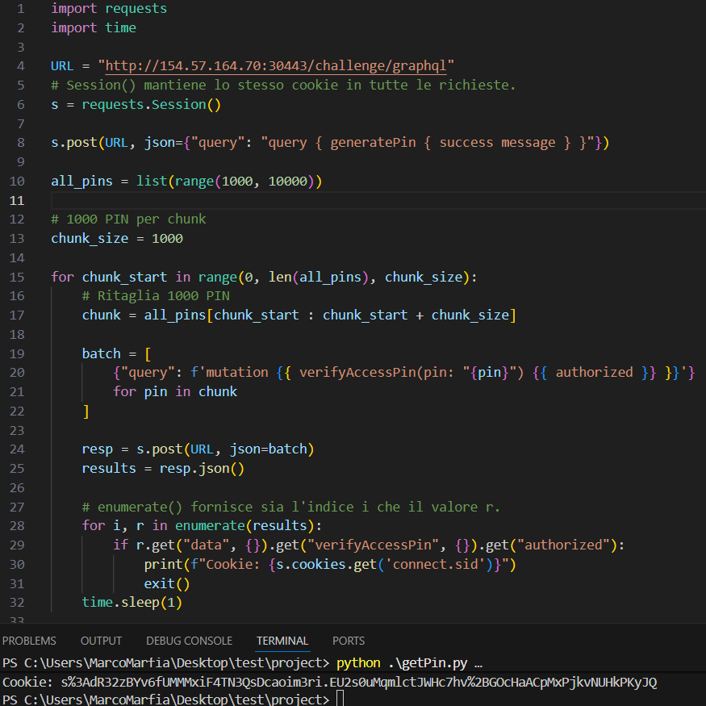

Copiamo il cookie, nei cookie del browser e possiamo vedere la pagina control-room

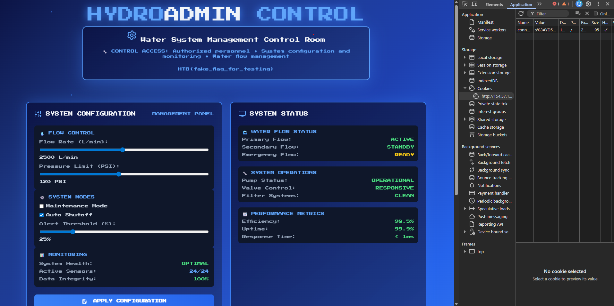

Per evitare questo tipo di attacco abbiamo già il limite di 10 richieste al minuto ma dobbiamo anche disabilitare allowBatchedHttpRequests in index.js, in modo da ricevere un comando per ogni richiesta

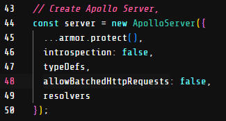