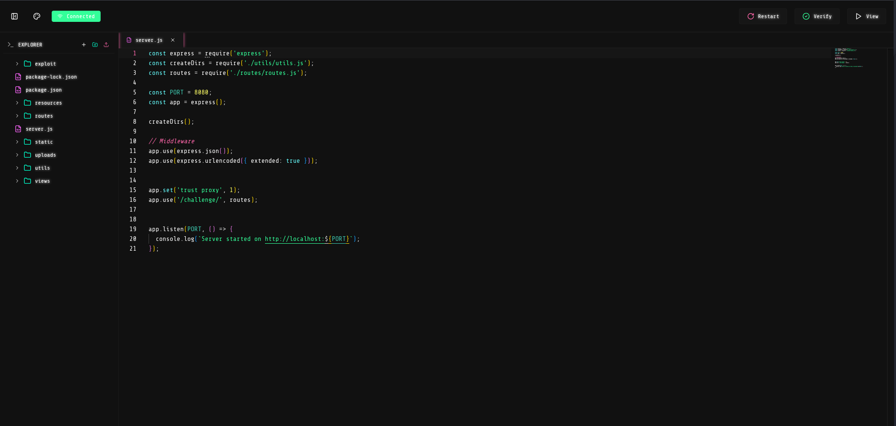
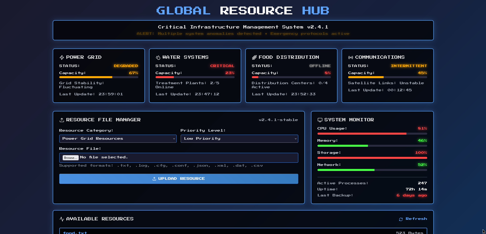
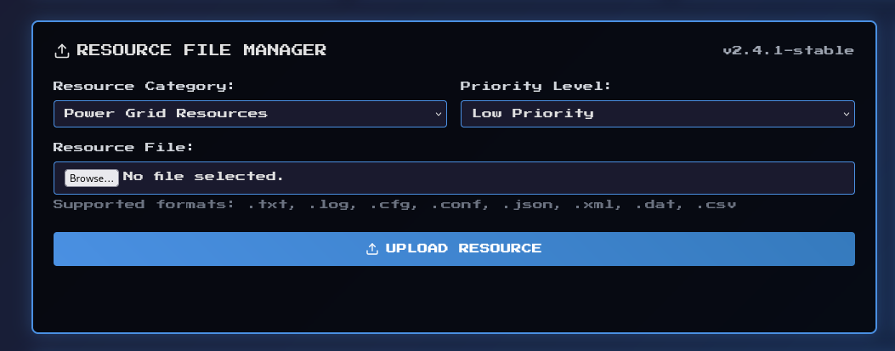
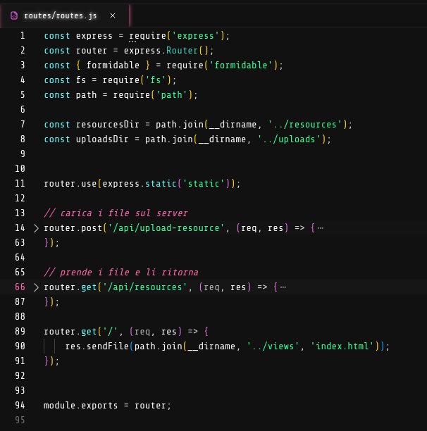
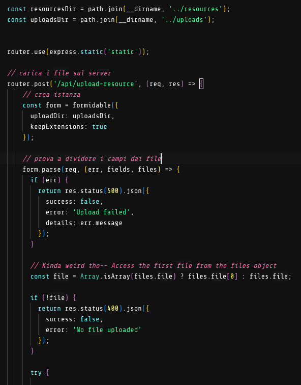
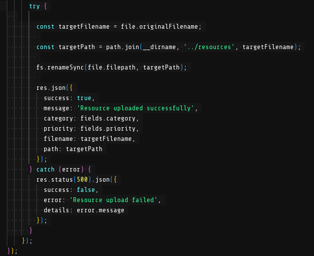
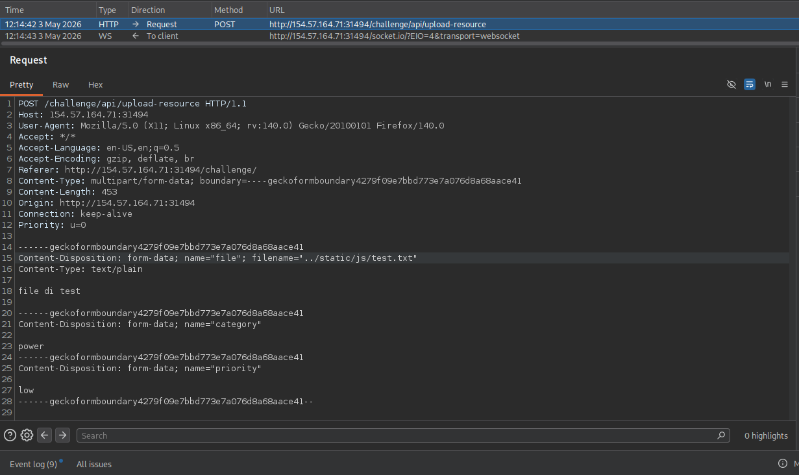
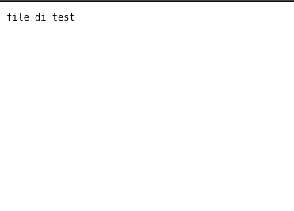
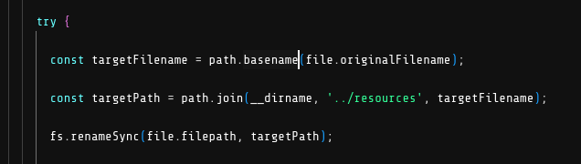

# Resourcehub Core

Appena avviata la sfida, apriamo nel browser l'ip fornito e possiamo vedere il codice sorgente e, cliccando su view in alto a destra, l'applicazione avviata

Dal sito notiamo subito una form per caricare dei file e dal codice sorgente, nel file routes.js, c'è l'endpoint che viene chiamato per caricare i file sul server

Analizzando la prima parte di questa funzione vediamo che usa la libreria formidable, per gestire il caricamento dei file, e crea un'istanza dove viene indicata la cartella dove verranno salvati i file, in questo caso temporaneamnte, e che l'estensione dei file caricati verrà mantenuta. Poi usa la funzione parse() per provare a separare i campi di testo da quelli file e siccome ritorna sempre un array di file viene preso solo il primo

Nella seconda parte prende il nome originale del file, crea il percorso dove verrà salvato e, con la funzione renameSync(), lo sposta dal percorso in cui l'aveva salvato formidable a quello scelto dallo sviluppatore

In questa funzione non c'è nessuna sanificazione degl'input, quindi possiamo modificare il nome del file con burpsuite, aggiungendo '../', e scrivere in un'altra cartella

Andando all'url \<ip>/challenge/js/\<nome file>, vediamo il nostro file, quindi sappiamo che possiamo scrivere in cartelle diverse da quella scelta dagli sviluppatori

Se volessimo mantenere il nome del file originale e patchare questo codice, dovremmo usare la funzione basename() che, prendendo un path, resitituisce solo l'ultima parte, nel nostro caso il nome del file, in questo modo anche passando '../../file.txt' questa funzione prende solo 'file.txt'

