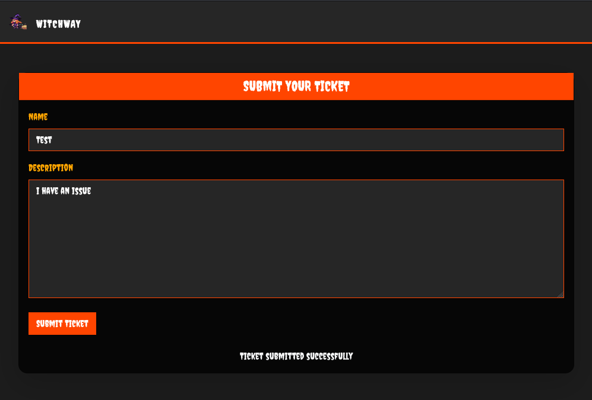
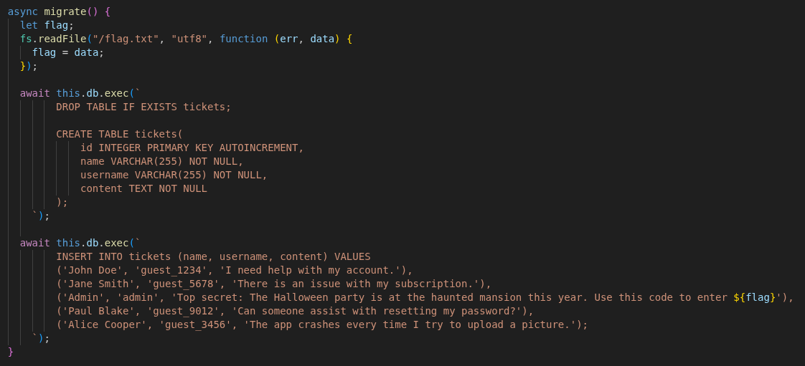
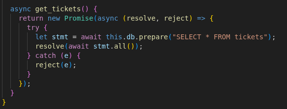
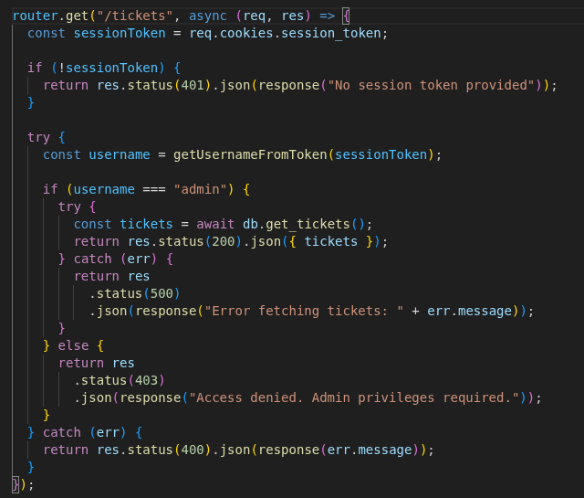
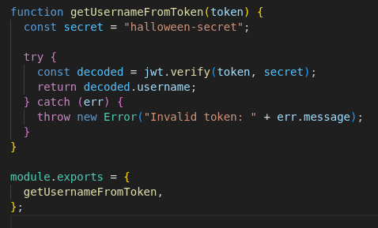
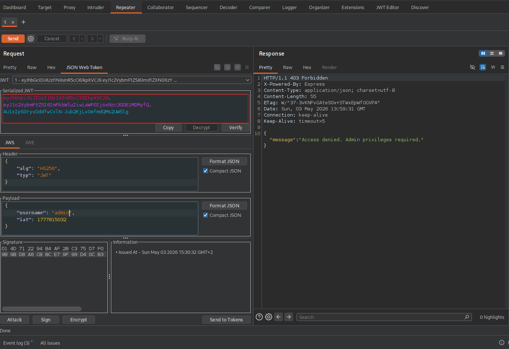
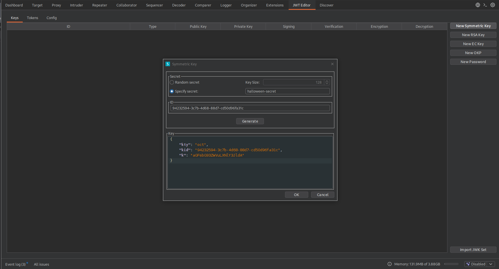
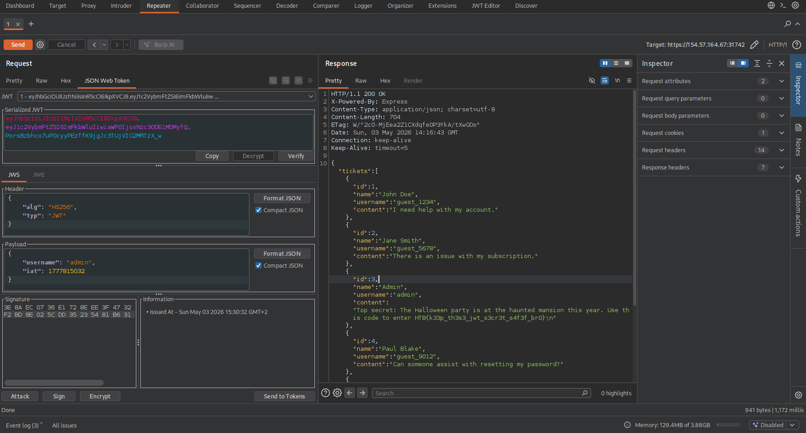

# Way Witch

Dal sito possiamo solo inviare dei ticket, niente di più

Nel codice sorgente, nel file database.js, viene creata una tabella, chiamata tickets, dove viene inserita la flag

Nello stesso file c'è anche una funzione che prende tutte le righe di quella tabella

Quella funzione viene chiamata in un solo punto nel progetto, durante una richiesta GET all'endpoint /tickets. Il token viene passato alla funzione getUsernameFromToken() che ritorna il nostro username, che per poter ottenere la flag, deve essere admin

la funzione getUsernameFromToken(), decodifica il token JWT e ritorna lo username, c'è anche scritta la chiave segreta

Intercettando con burpsuite la richiesta GET /tickets e mandandola al repeater si vede il payload del token dove c'è la prop username, cambiamola in admin

Poi nella tab JWT Editor creaiamo una chiave simmetrica con il secret trovato nel codice, visto che il token viene codificato e decodificato con la stessa chiave, e salviamola. Ci servirà per firmare il nuovo token

Ora nel repeater firmiamo il nuovo token cliccando su 'sign' ed inviamo la richiesta. In questo modo otteremo come risposta tutte le righe dentro la tabella tickets, compresa la flag
