# Breaking Bank

Avviando la sfida ci troviamo di fronte ad una pagina di login dove possiamo anche registrarci, creiamo un utente, e una volta entrati vediamo che questo è un sito che si occupa di criptovalute. Possiamo vedere l'andamento del mercato, aggiungere degli amici e fare delle transazioni, ma per motivi di sicurezza le possiamo fare solo a degli amici.

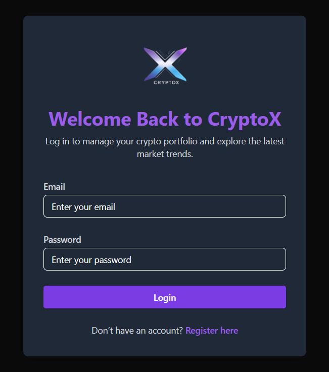\
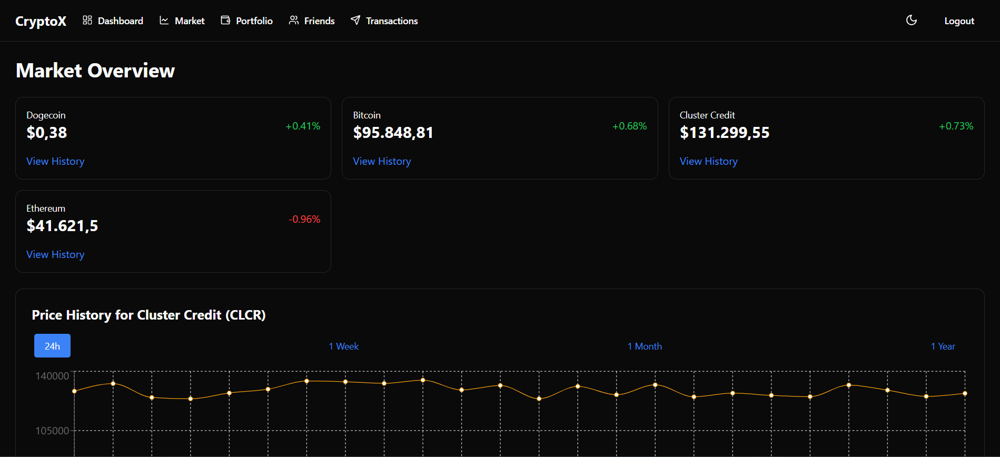\
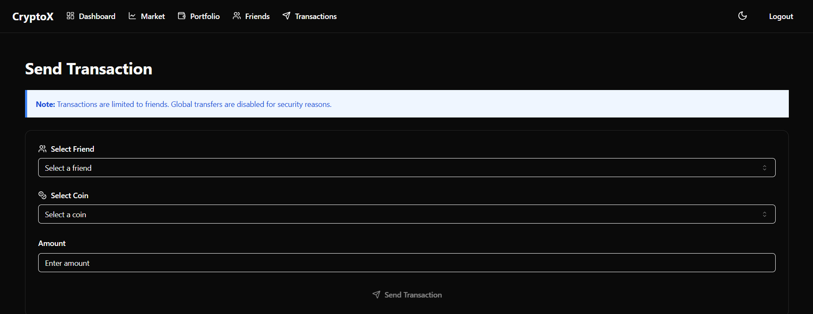

Scarichiamo e diamo un'occhiata al codice sorgente, dentro le routes della cartella server, nel file dashboard.js vediamo che la flag la otteniamo solo se la funzione checkFinancialControllerDrained ritorna drained a true.

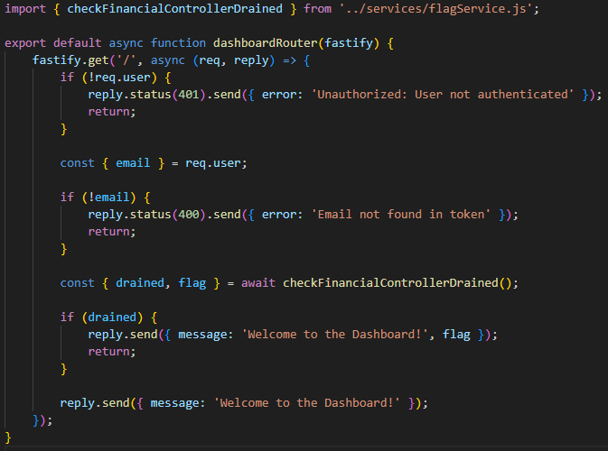

checkFinancialControllerDrained prende il bilancio dell'utente financial-controller e se il saldo della moneta CLCR non esiste o è minore o uguale a zero restituisce la flag.\
Per ottenere il bilancio, la funzione getBalancesForUser prende il wallet e controlla se esiste o se abbia delle chiavi. In caso negativo ritorna comunque una lista di valute ma tutte con saldo 0.\
La funzione hgetAllObject prende tutti i dati dell'utente da Redis, che è un database in memoria, se i dati dell'utente non esistono ritorna null, altrimenti li parsa. I valori restituiti da Redis sono stringhe quindi è necessario il parse per riottenere i tipi di dati originali.

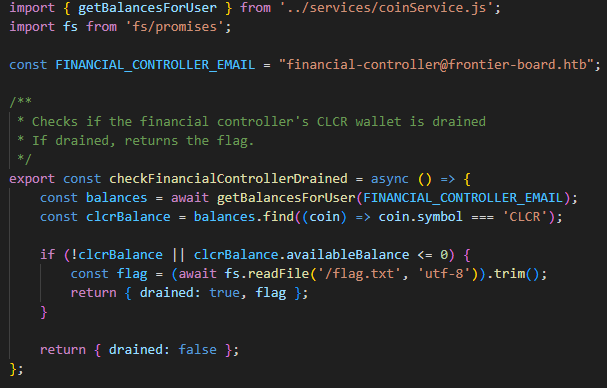\
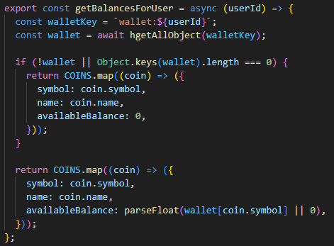\
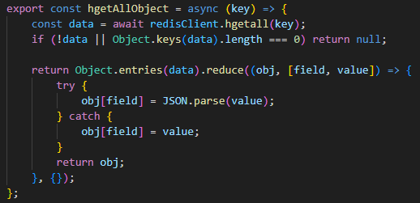

Abbiamo quindi capito che per ottenere la flag dobbiamo azzerare il saldo di CLCR nel wallet di financial-controller. L'unica funzione che fa transazioni è transactionByEmail dentro transactionService.js, questa viene usata durante la chiamata a /transaction che si trova dentro crypto.js, l'email viene presa dal JWT, quindi abbiamo bisogno di forgiarne uno valido.
L'endpoint /transaction è protetto da due middleware, quello che ci interessa di più è otpMiddleware, l'altro è solo un rate limiter. otpMiddleware richiede un OTP valido che è un codice di 4 cifre, il codice controlla che l'OTP dentro Redis sia contenuto nell'OTP che gli mandiamo nella richiesta, quindi, visto che non ci sono controlli sul tipo del valore ricevuto, se inviassimo un array con tutte le combinazioni possibili riusciremmo a passare questa condizione.

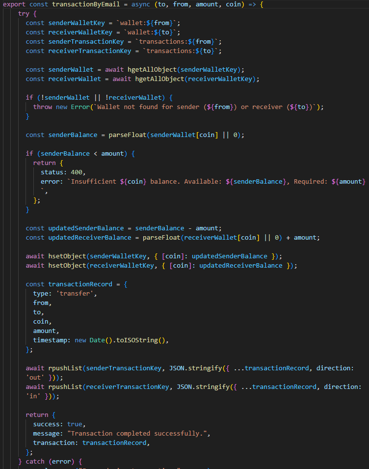\
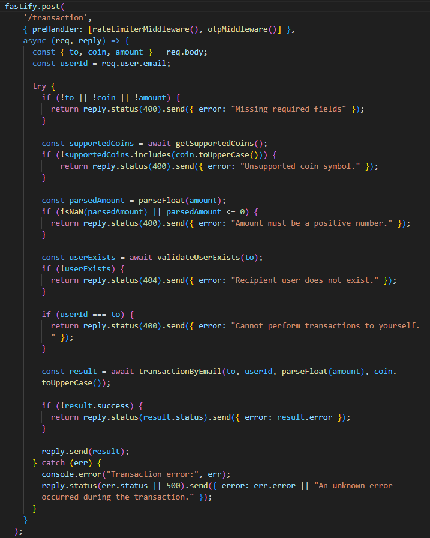\
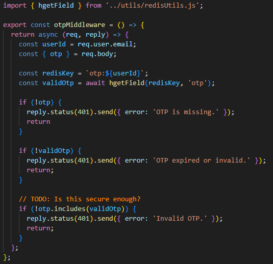

Tutto quello che ci serve è dentro jwksService.js, da qui vediamo che il JWT viene firmato con una chiave privata e la sua firma viene verificata con una chiave pubblica. Questa viene recuperata dal JKU, un url che espone un JWKS, un json contenente un array di chiavi pubbliche, ognuna è identificata da un KID che indica quale chiave dell'array scegliere.\
Il token viene creato da createToken() e firmato con una chiave privata. Negli headers viene aggiunto il KID e il JKU.\
La funzione verifyToken decodifica il JWT e prende il KID e JKU, vengono fatti due controlli, il JKU deve iniziare con http://127.0.0.1:1337/ e il KID che gli arriva dal JWT deve coincidere con quello del JWKS locale, il commento `TODO: is this secure enough?` è un indizio. Possiamo prendere il KID del server locale da http://127.0.0.1:1337/.well-known/jwks.json, come possiamo vedere dalla const JWKS_URI. Se potessimo far puntare il JKU ad un server controllato da noi potremmo esporre una nostra chiave pubblica e firmare il JWT con una nostra chiave privata, in modo da avere un JWT valido.

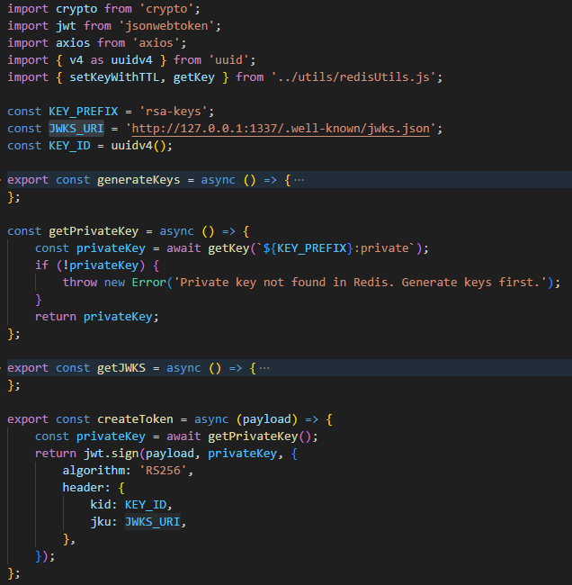\
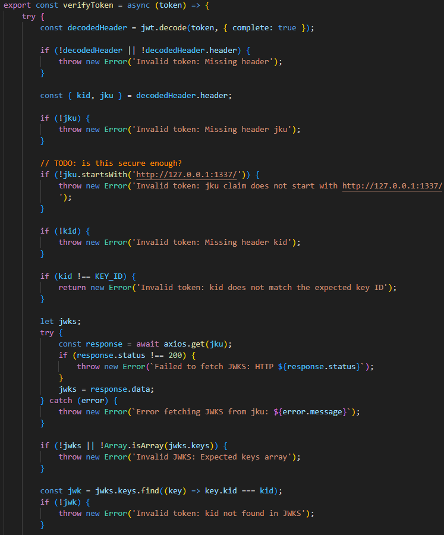

Cercando fra le routes del server c'è analytics.js con un endpoint che è un redirect a qualsiasi url, non essendoci controlli. Anche qui il commento `Should we restrict the URLs we redirect users to` è un indizio.

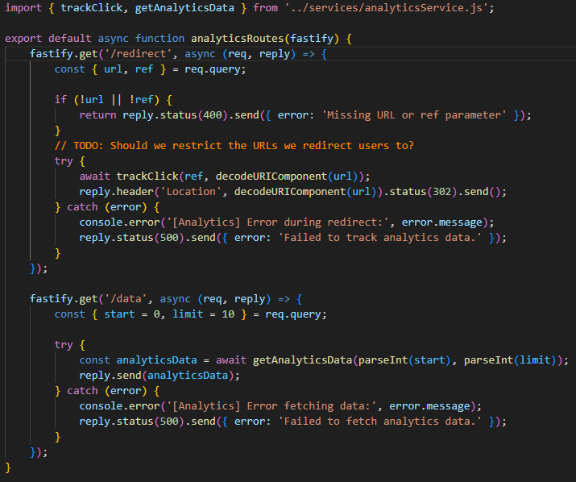

Ora che sappiamo che l'app è vulnerabile, possiamo partire con l'exploit, sarà necessario lanciare degli script in python, quindi possiamo creare un ambiente virtuale con `python -m venv venv`, avviarlo con `source venv/bin/activate` e installare tutto quello che ci serve con `pip install pycryptodome pyjwt flask requests`.\
Iniziamo con il leggere il KID del server, andiamo sull'ip di HTB IP:PORTA/.well-known/jwks.json e troviamo il valore della prop KID.\
Scriviamo uno script in python che generi la nostra coppia di chiavi e avviamo il server JWKS che esporrà il file json. Sarà necessario fare un tunneling di questo server verso l'esterno, con SSH, per fare in modo che il target riesca a raggiungerlo.

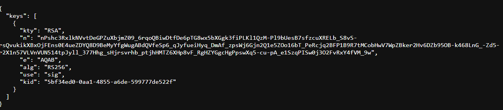\
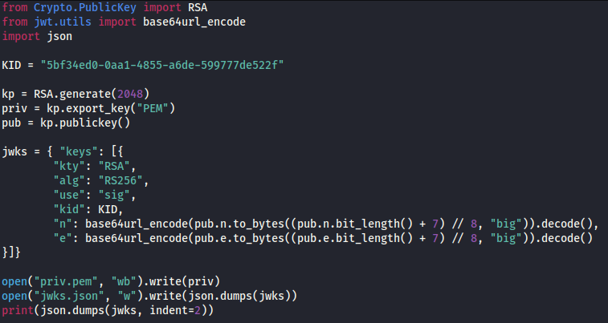\
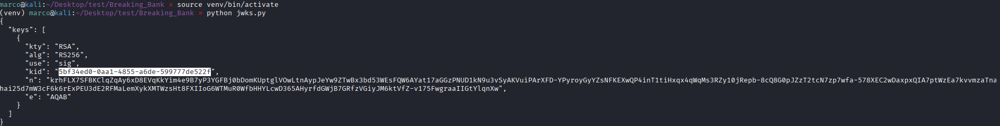\
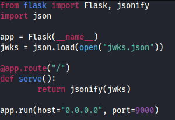\
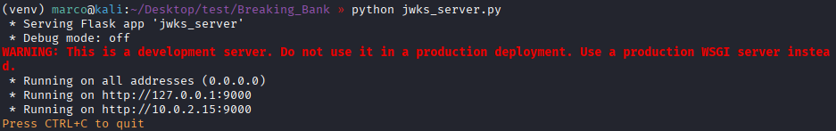\
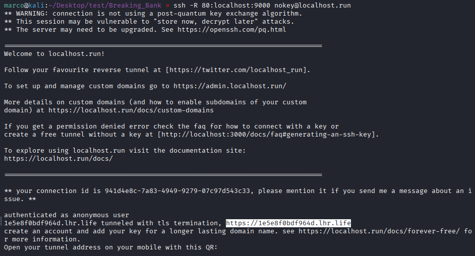

Forgiamo il JWT con la chiave privata creata precedentemente, usando l'email di financial-controller, mettendo come KID lo stesso del server e il JKU sarà quello del redirect più il nostro url pubblico che possiamo prendere dall'output di SSH, in questo modo superiamo il controllo perchè l'url inizia con http://127.0.0.1:1337/, ma il server seguirà il redirect e scaricherà il nostro JWKS.

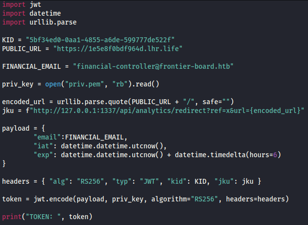\
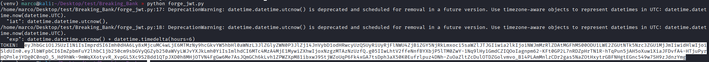\

Ora che abbiamo un JWT valido per financial-controller, scriviamo l'ultimo script che legga il saldo di CLCR, faccia una transazione sull'utente che abbiamo creato all'inizio portando il saldo a 0 (il controllo che i due utenti siano amici è solo lato front end, comunicando direttamente con le API si salta questo controllo) e creiamo l'array con tutte le combinazioni di OTP, infine facciamo una richiesta alla pagina dashboard con il nuovo token per ottenere la flag

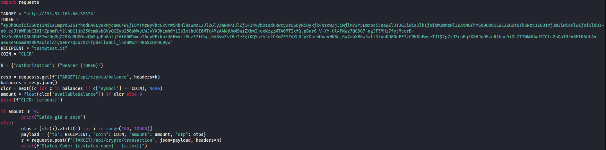\
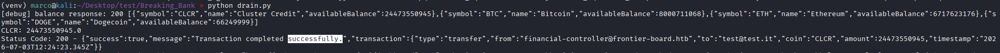\
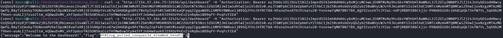
