# Dark Runes

Proviamo ad accedere alla challenge, ma vediamo che il path '/' non esiste, proviamo con le più note e con '/login' veniamo reindirizzati alla pagina di login dove possiamo anche registrarci.

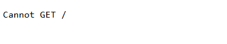\
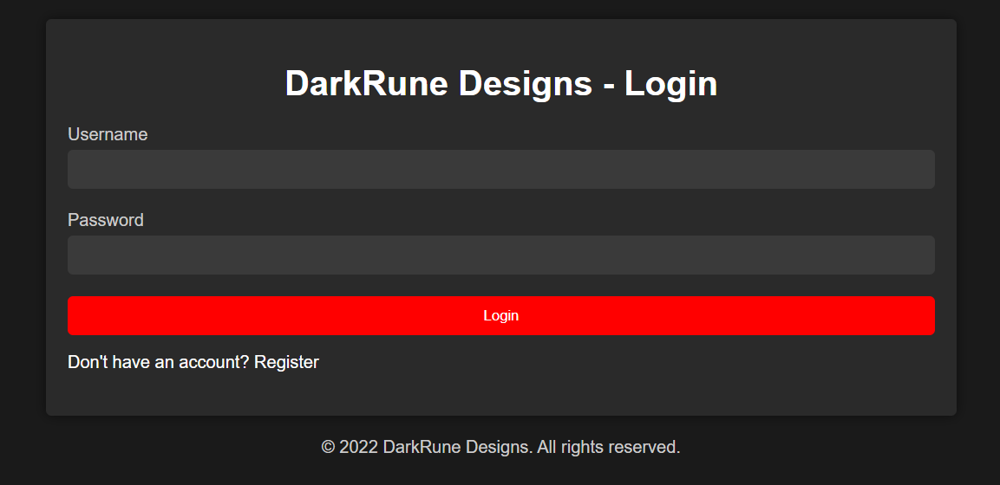

Una volta registrati veniamo reindirizzati alla pagina documents, qui possiamo creare un documento scrivendo direttamente nell'app e successivamente possiamo visualizzarlo o eliminarlo. Vediamo che viene anche creata una firma di questo documento.

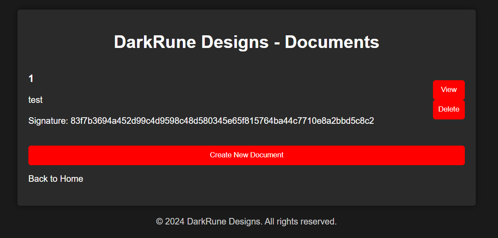\
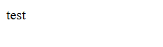

Guardiamo anche il nostro cookie, ha questa forma: \<base64 URL>-\<firma>, proviamo a decodificarlo e vediamo che contiene il nostro nome utente e l'id. La firma è probabilmente questo base64 firmato con un secret.

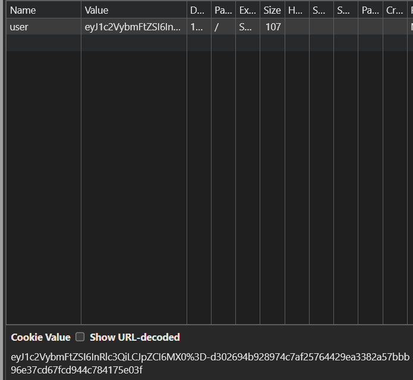\
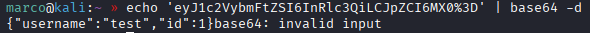

Analizziamo il codice sorgente, dal file package.json vediamo che è una app node e
fra le varie dependencies troviamo markdown-pdf alla versione 11 che è vulnerabile alla CVE-2023-0835 che porta ad una LFI, perchè questa libreria non valida correttamente il contenuto dei file markdown.

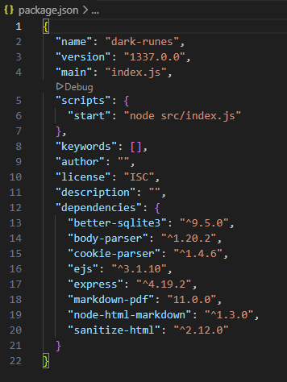\
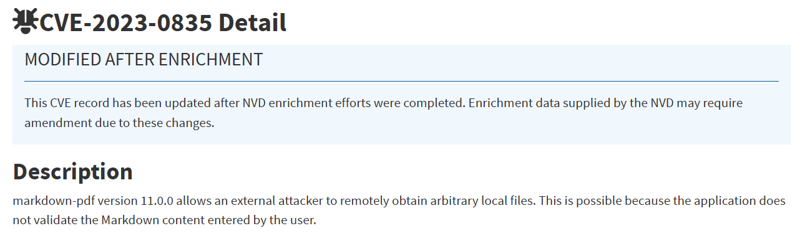

Concentriamoci prima su come viene forgiato il nostro cookie, dentro la cartella routes ci sono le chiamate al BE e nel file auth.js c'è la chiamata di quando ci loggiamo, il cookie viene generato dalla funzione generateCookie che usa signString e come possiamo vedere è anche dentro validate, quindi la stessa funzione che firma il nostro cookie potrebbe firmare anche qualcos'altro.

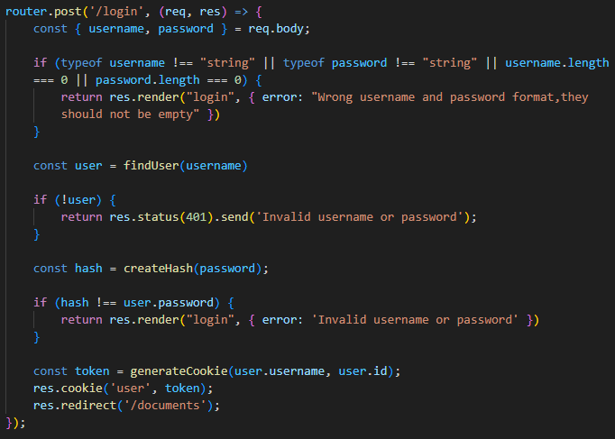\
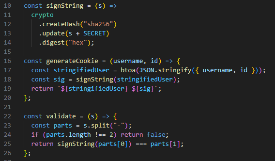

E' esattamente così, firma anche il contenuto dei documenti che inviamo ed è proprio la firma che vediamo nella pagina web, prendiamo la stringa '{"username":"admin","id":1}', codifichiamola base64 url e creiamo un documento per ottenerne la firma, in questo modo avremo un cookie come admin.

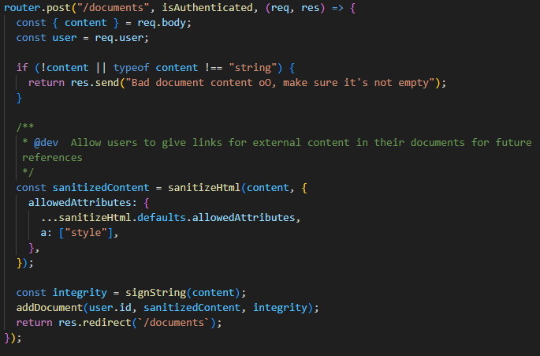\
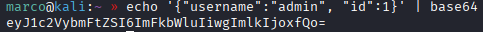\
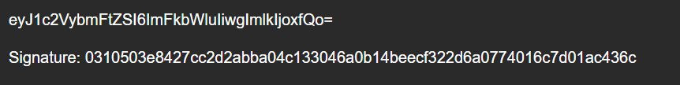

Sostituiamo gli uguali con dei %3D se ci sono e mettiamolo al posto del vecchio cookie, vediamo che siamo ancora loggati, quindi ora siamo l'utente admin.

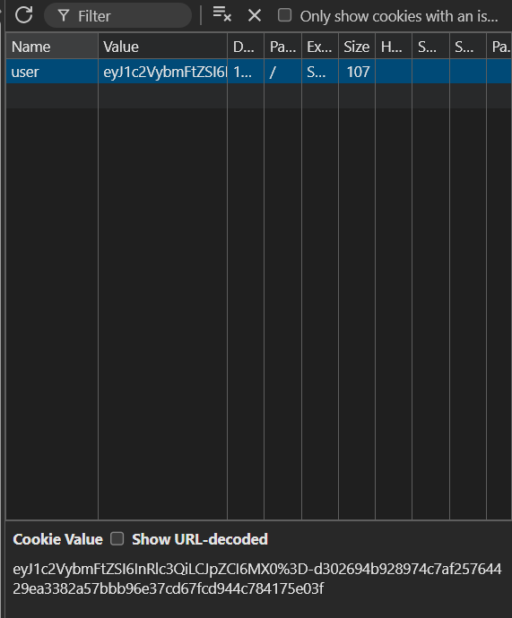

Ora torniamo alla CVE-2023-0835, markdown-pdf viene usato in questo progetto solo nella funzione generatePDF, la quale converte un file markdown in PDF. Questa funzione a sua volta viene usata due volte in /routes/generate.js, nella chiamata GET e POST, e dobbiamo essere admin per poterle sfruttare. La prima sanitizza il contenuto con nhm.translate(), la quale fa l'escape dei caratteri speciali markdown, il che rende impossibile l'exploit, quindi dobbiamo provare con la seconda.

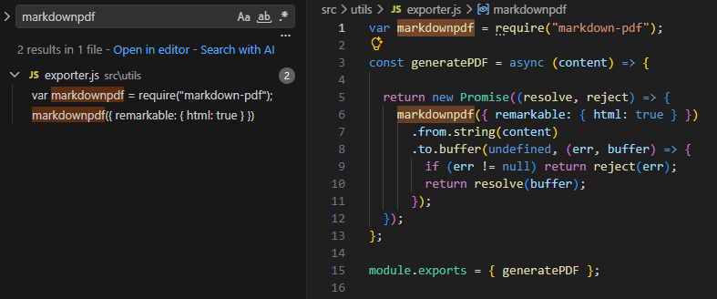\
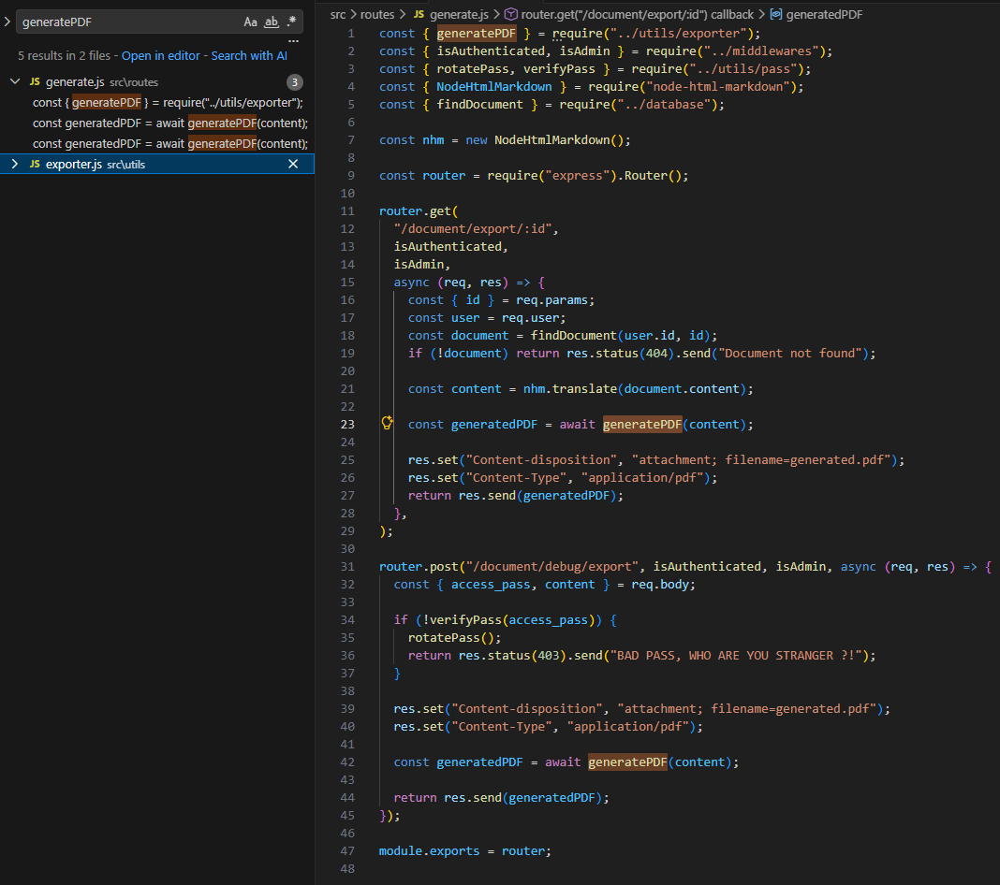

Questa chiamata richiede anche un access_pass, che viene passato alla funzione verifyPass. Questa funzione controlla se esiste un file con lo stesso nome di questa variabile, in caso negativo chiama la funzione rotatePass, la quale se esiste il file lo rimuove e ne crea uno usando la funzione generateAccessCode. Finalemente questa funzione ci dice come è fatto l'access_pass, un numero cauale, con modulo 10000, di 4 cifre, quindi tutte le combinazioni da 0000 a 9999.

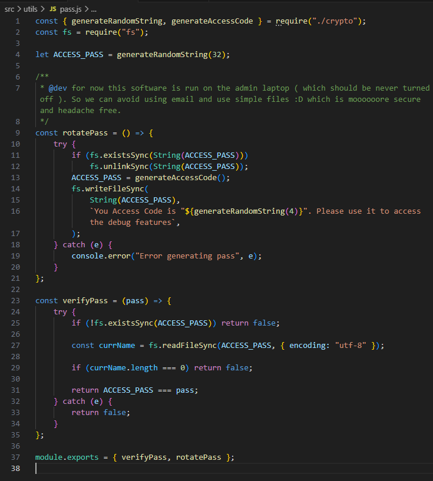\
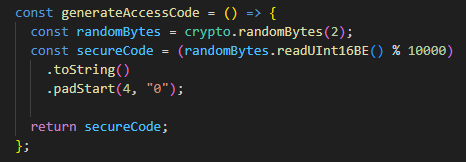

Il problema è che a ogni tentativo sbagliato viene creato un nuovo access_pass in maniera casuale, quindi con un brute force alla volta ci impiegheremo tanto tempo. Proviamo mandando 50 richieste in parallelo.\
Scriviamo uno script in python con l'ip del target, il cookie di admin ed il payload che dovrà puntare alla flag. Creiamo un pool di 50 thread paralleli e mettiamo in coda tutti i 10000 tentativi, in questo modo anche se le probabilità di inviare quello giusto sono le stesse, inviandone tanti contemporaneamente ci impiegheremo meno tempo. Prendiamo le risposte e se il server risponde con 200 e Content-Type: application/pdf, salviamo il PDF in locale.

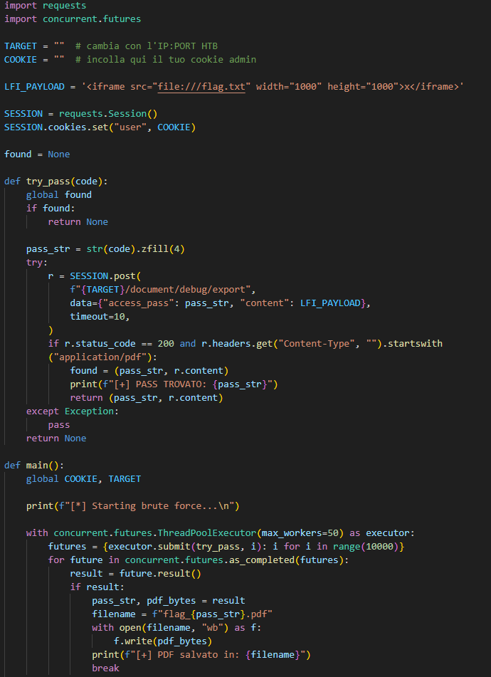\
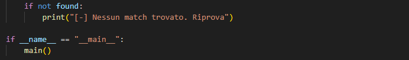

Lanciamo lo scritp e dopo un paio di tentativi riusciamo ad ottenere il pdf con la flag al suo interno.

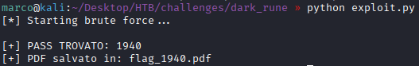
