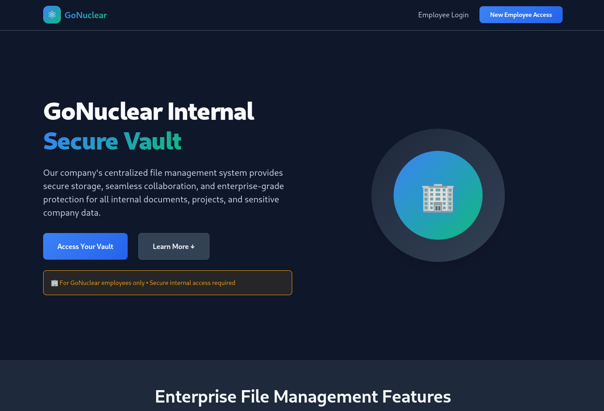
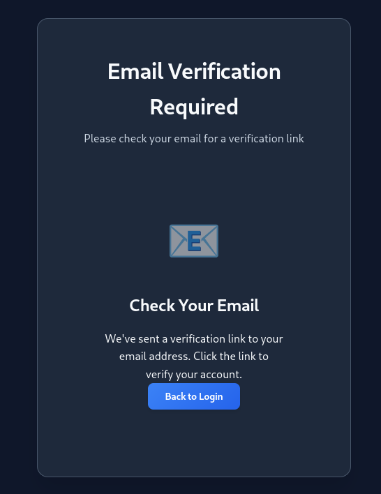
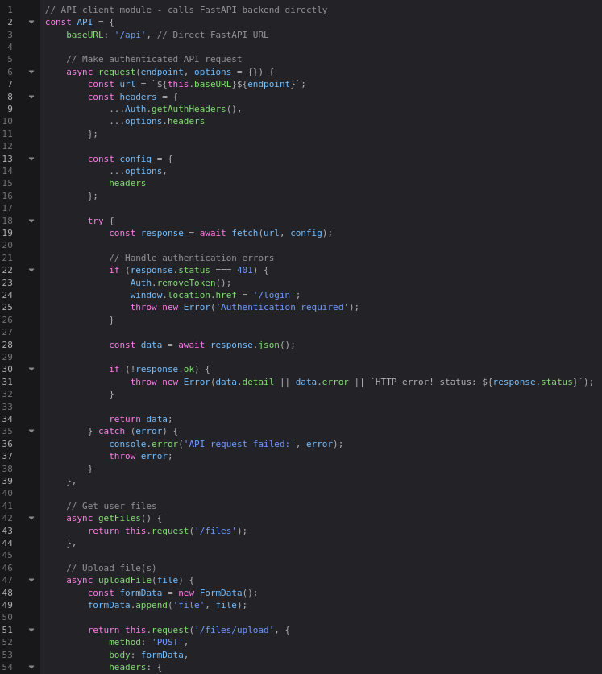
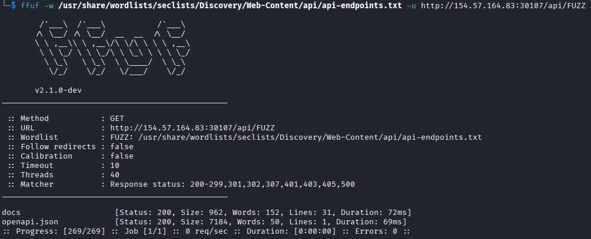
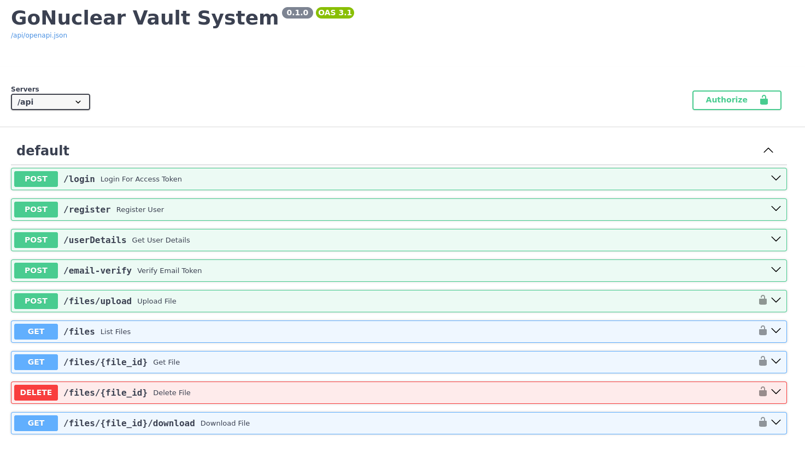
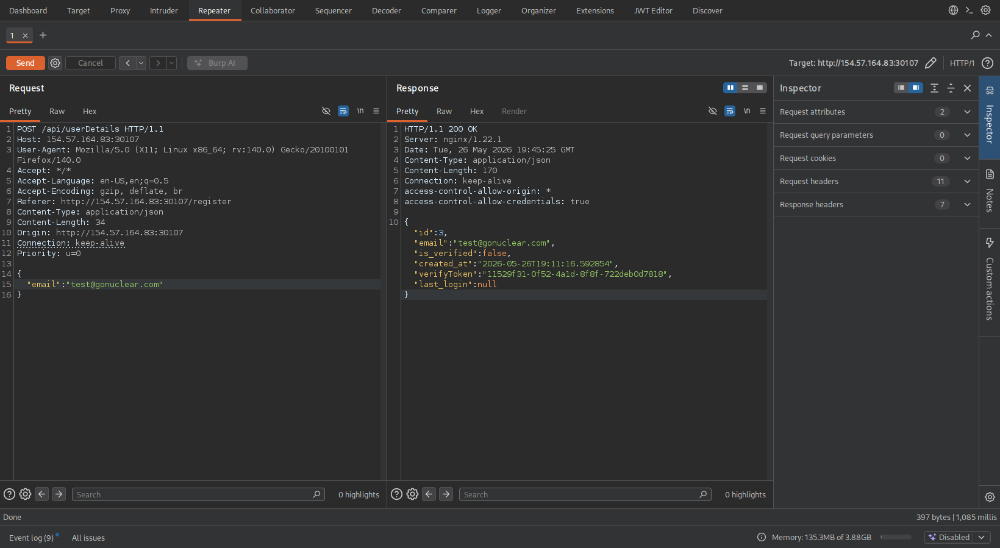
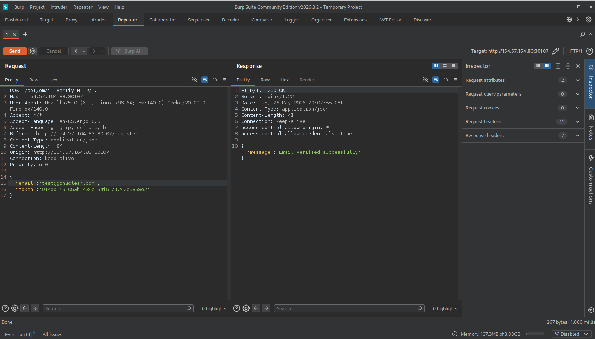
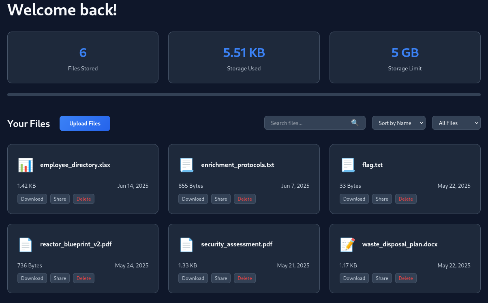

# NovaEnergy

Questa è una web app usata per la condivisione di file accessibile solo ai dipendenti di questa azienda

Proviamo a registrarci, ci forza ad usare un indirizzo mail col dominio gonuclear.com, ma invia una mail con un link per attivare l'utente, senza quel link non possiamo loggarci

Sulla pagina non c'è nient'altro, dando un'occhiata al codice js vediamo che in api.js ci sono diversi endpoint, ma serve il token, quindi dobbiamo essere autenticati

Proviamo un fuzzing sull'url delle api e troviamo 2 endpoint, concentriamoci sulla documentazione 

L'endpoint /userDetail non richiede il token, proviamo con la mail con la quale abbiamo provato a registrarci, ci dice che il nostro utente non è verificato, ma ritorna un token di verifica 

Adesso possiamo fare una richiesta a /verify-email, con la nostra email ed il token appena ottenuto, per attivare il nostro utente

Adesso che la nostra email è verificata possiamo loggarci, una volta dentro possiamo scaricare il file flag.txt

