# SpeedNet

Questa è una pagina web di un Internet Service Provider e noi siamo incaricati di fare bug bounty su questa app, ci viene detto che c'è un servizio di posta all'indirizzo /emails/ per l'email test@email.htb

Possiamo registrarci e loggarci e una volta dentro possiamo aggiornare il nostro profilo o vedere dei dati

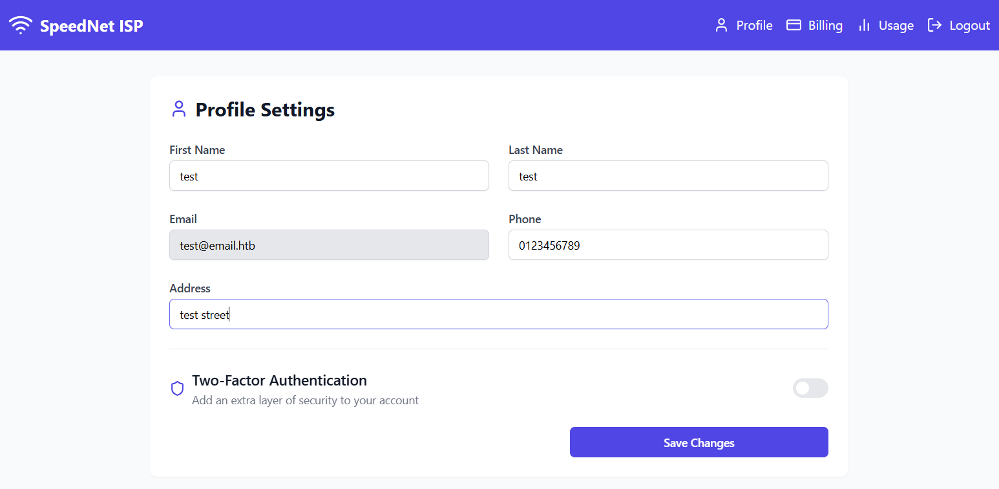

Proviamo diversi attacchi, directory e subdomain enumeration, template injection e SQLi, ma non portano da nessuna parte. Diamo un'occhiata al codice js e vediamo che è minificato, dev'essere scritto in React o comunque un'app con Vite

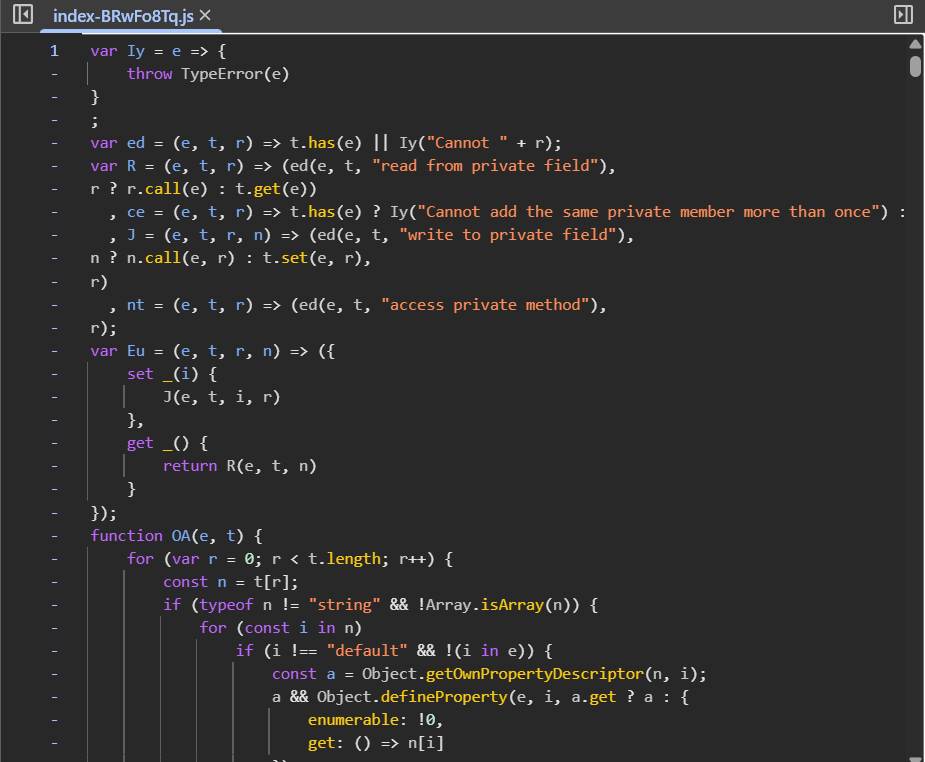

Intercettiamo una richiesta con BurpSuite e vediamo che il Backend usa Graphql, controlliamo se Introspection è abilitato, cioè gli chiediamo se può dirci tutte le chiamate disponibili con i dettagli di cosa accetta come parametri e cosa ritorna. La risposta è positiva

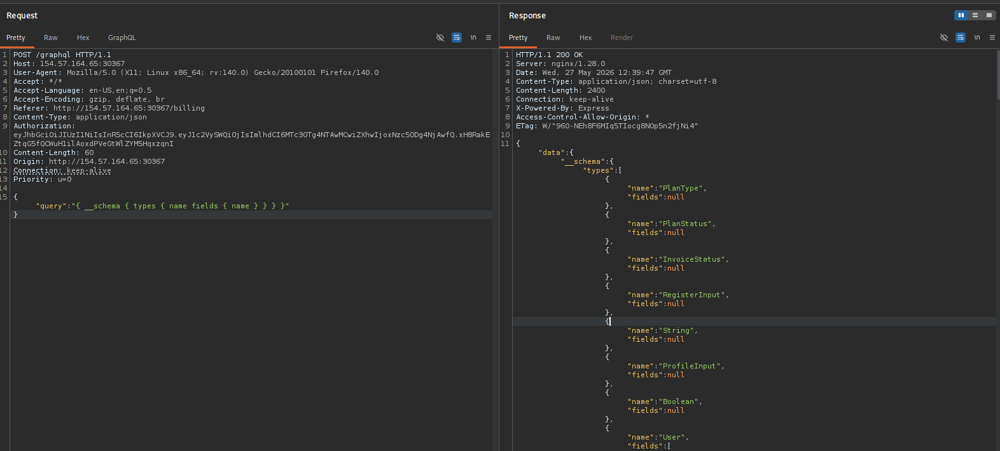

Scarichiamo l'estensione InQL di burpsuite, ci aiuterà a testare queste API

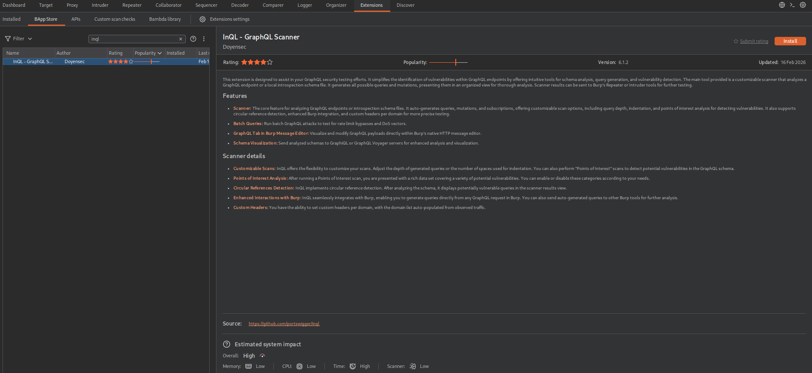

Ora inviamo una richiesta Graphqp a InQL per esaminarla

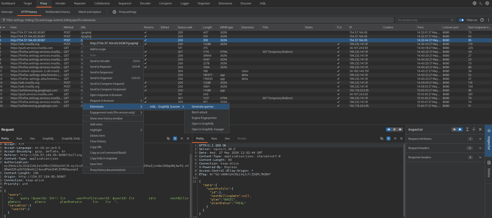

Analizziamola e ci ritroviamo un'alberatura con tutte le queries, l'equivalente di una GET, e mutations, l'equivalente di una POST, PUT o DELETE

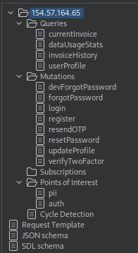

Una delle query che possiamo provare è userProfile, la quale vuole come input l'id dell'utente e ritorna i suoi dati, proviamo con id 1 e sembra essere un admin

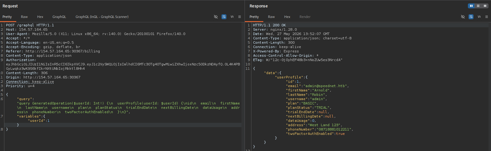

Notiamo che ha l'autenticazione a 2 fattori attiva, attiviamola anche sul nostro utente e loggiamoci per vedere com'è fatto l'OTP, è un numero a 4 cifre

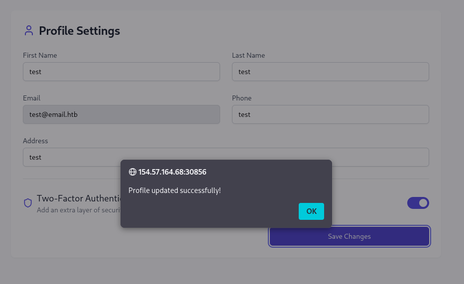
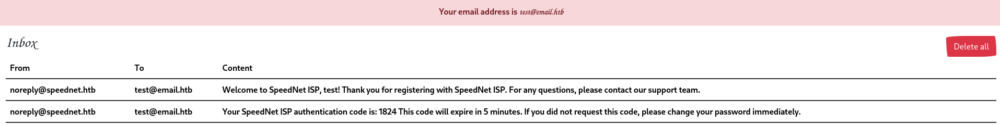

Adesso possiamo resettare la sua password, sfruttiamo devForgotPassword con la sua email per ottenere un token

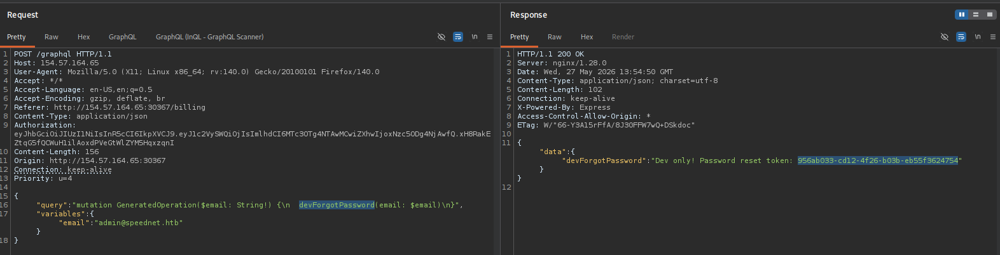

Successivamente usiamo resetPassword, con il token ottenuto e impostiamo una password a nostro piacimento

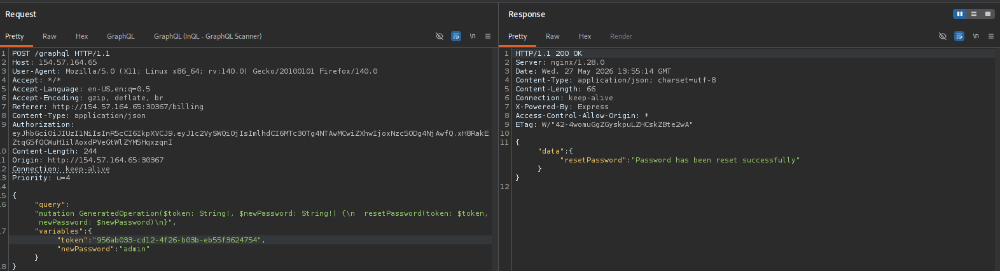

Adesso possiamo provare un attacco bruteforce sull'OTP, da burpsuite facciamo il login e prendiamo il token, mettiamolo nella richiesta verifyTwoFactor e mandiamola all'intruder, selezioniamo il payload e impostiamolo ad un numero di 4 cifre che parte da 0000 e finirà a 9999. Clicchiamo su 'Start attack' ma è troppo lento e dopo un certo numero le richieste vengono bloccate

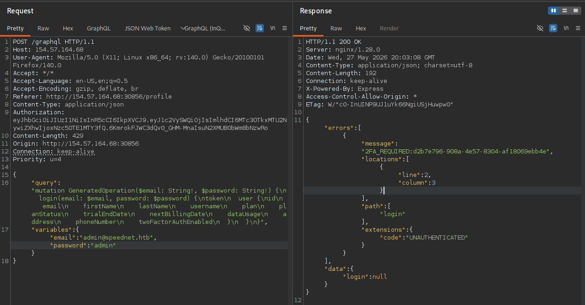
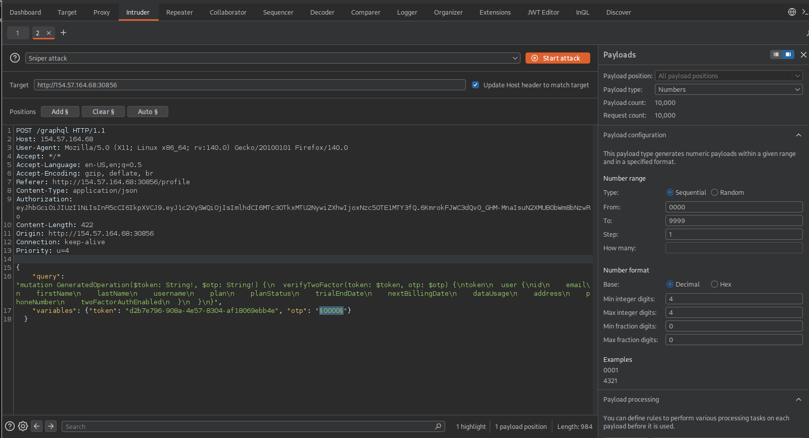

Controlliamo se Graphql supporta batch, più query in una solo richiesta e si, con 2 query ritorna due array errors

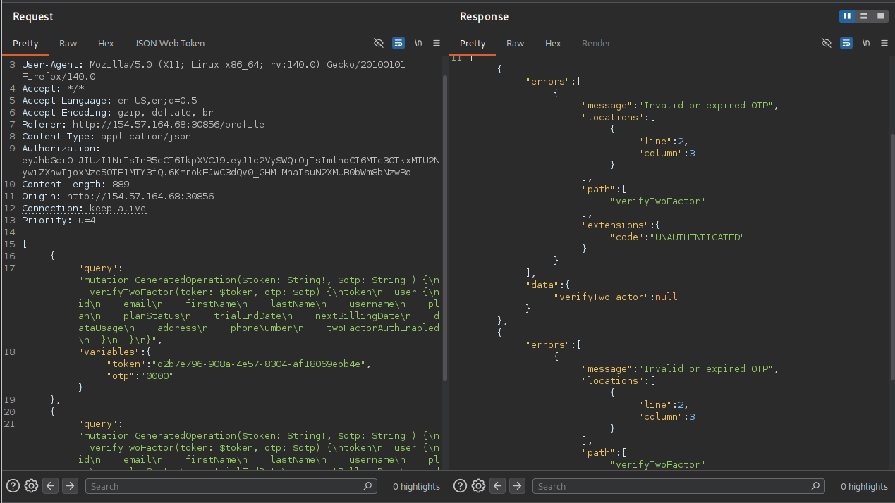

Scriviamo uno script in python che chiami la mutation verifyTwoFactor con un certo numero di  query in una richiesta per fare un bruteforce e scoprire l'OTP corretto

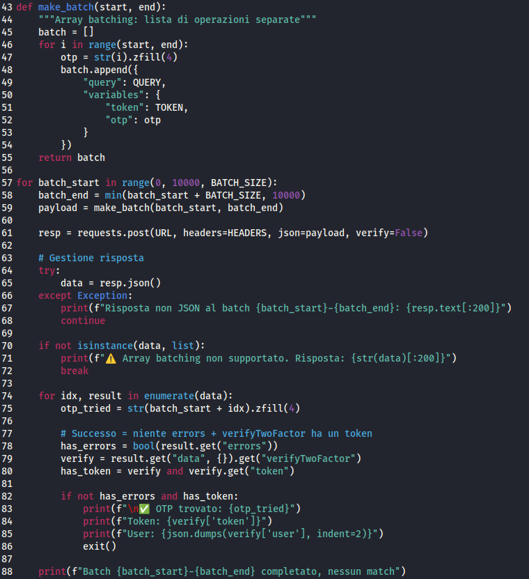

Ora andiamo nel browser e cerchiamo di loggarci come admin, intercettiamo la richiesta con burpsuite e copiamo il token da mettere nello script python

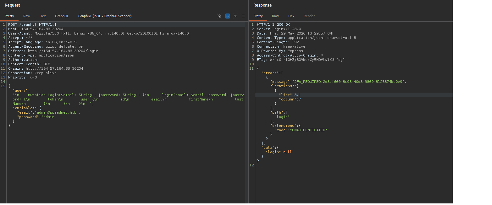

Lanciamo lo script, e dopo qualche tentativo, riusciamo ad ottenere il JWT di admin

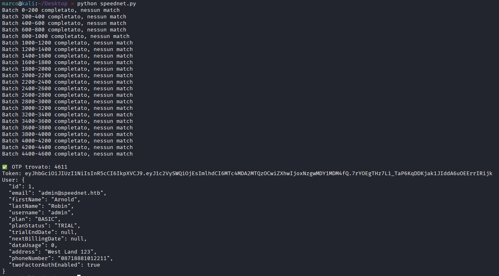

Andiamo nel browser, inseriamo il nuovo token ottenuto nel localstorage e ricarichiamo la pagina, troviamo la flag nella pagina billing

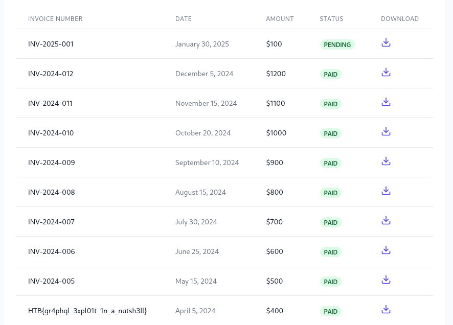
