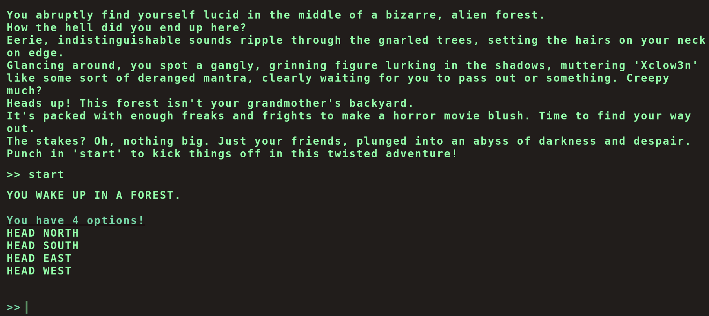
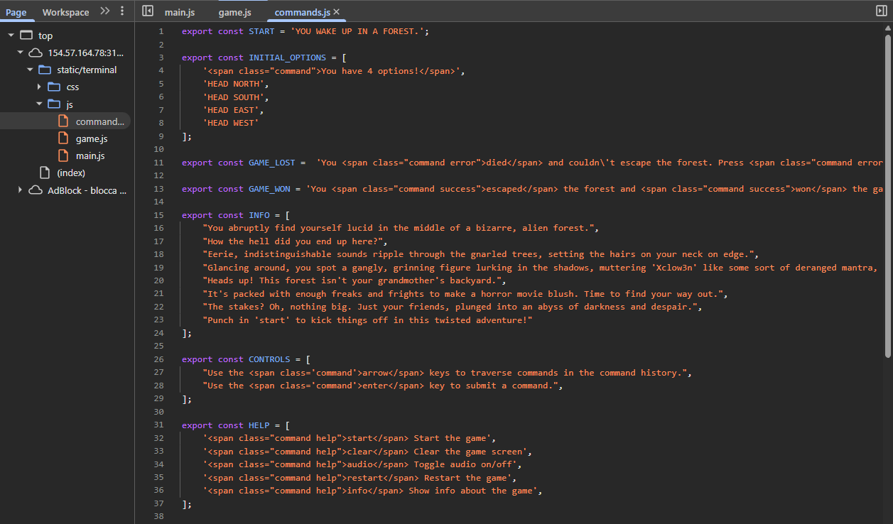
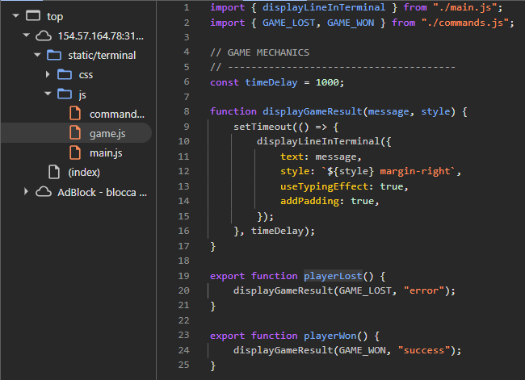
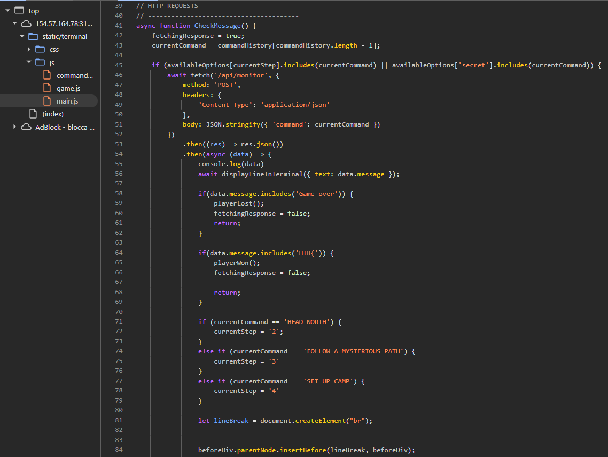
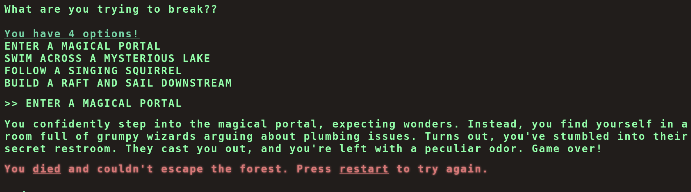
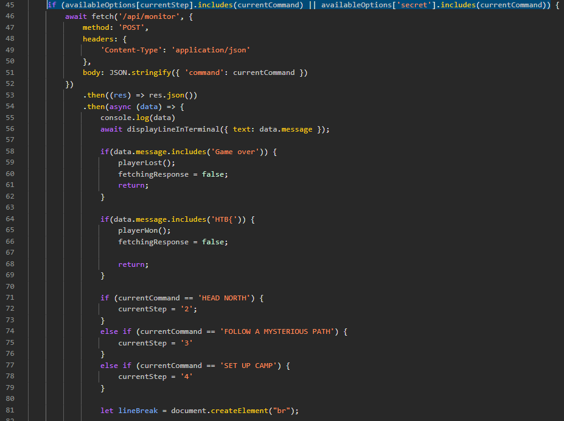
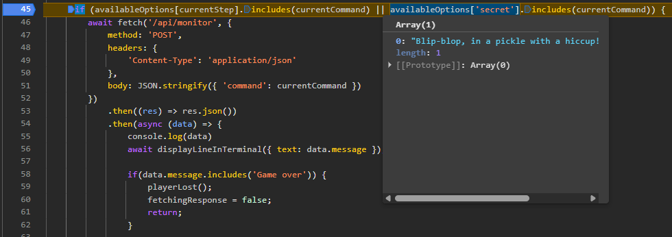
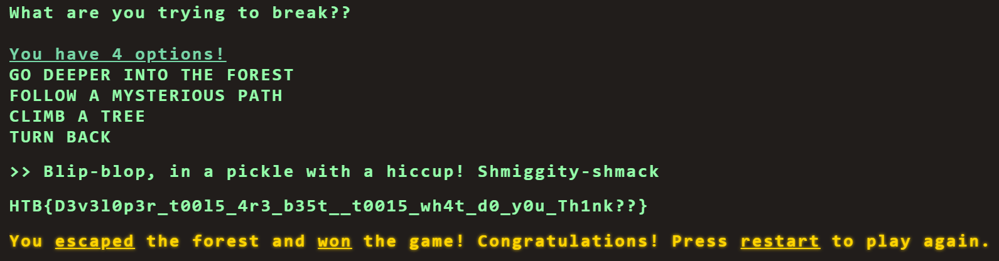

# FLAG COMMAND

Andando all'ip fornito, si vede che questo è un gioco a scelta multipla

Andiamo subito a dare un'occhiata al codice, ci sono 3 file js, commands.js esporta delle variabili, stringhe o array di stringhe con messaggi da mostrare a schermo, statici, nulla di interessante

Il secondo, game.js esporta due funzioni che mostrano un messaggio nel terminale con alcune opzioni come css o effetti sonori, anche qui, nulla di interessante

Il più interessante è il terzo file, main.js, sembra contenere le prime 3 risposte corrette da dare, proviamole

Queste 3 sono corrette e portano alla quarta domanda, ma provando a dare tutte e 4 le risposte, fa sempre ripartire da capo, questo è un vicolo cieco

Diamo un'altra occhiata a main.js, notiamo che le risposte che possiamo dare non sono quelle 4, le quali sono dentro availableOptions[currentStep], ma possono essere anche quelle dentro availableOptions['secret']

Non ho trovato questi secrets da nessuna parte nel codice, proviamo a mettere un punto di debug nel js, poi da terminale scriviamo una risposta ad una qualsiasi domanda, che sappiamo essere valida e clicchiamo invio, adesso possiamo vedere che è un'array con una sola stringa

Copiamo quella stringa ed inviamola, ad una qualsiasi domanda, per ricevere la flag come risposta

