# BABY

Associamo all'ip un nome host

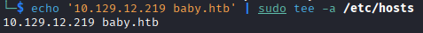

Scansioniamo il target con nmap, dalla porta 389 scopriamo che la macchina è all'interno di un dominio AD, aggiungiamo al file /etc/hosts anche il dominio baby.vl

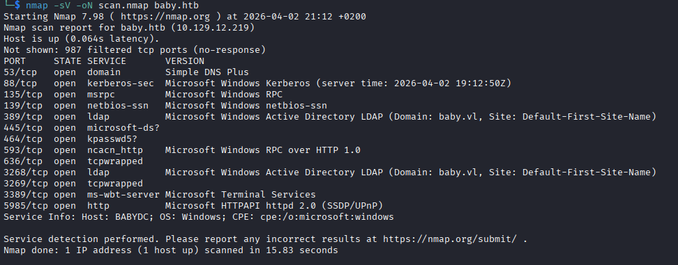

Possiamo interrogare ldap con ldapsearch, ottenendo diverse info relative al dominio, dando un'occhiata agli utenti vediamo che Teresa Bell nel campo descrizione ha scritto qual'era la sua password iniziale, provando smb, winrm e xfreerdp3 non funziona, ma essendo una password impostata inizialmente, potrebbero averla usata anche con altri utenti 

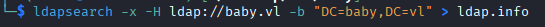
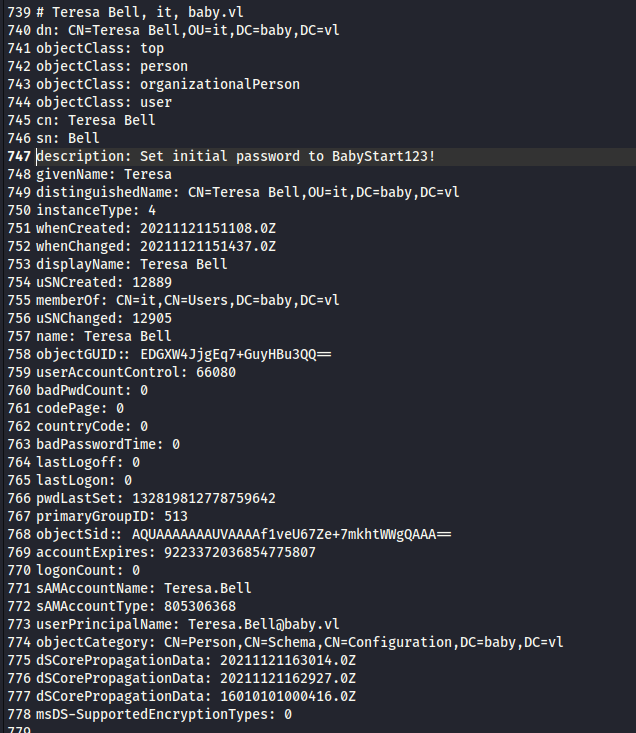

Mettiamo i nomi utente, sono quelli in sAMAccountName, dentro un file e proviamo un password spraying su smb e vediamo che l'utente Caroline.Robinson deve ancora cambiare la password

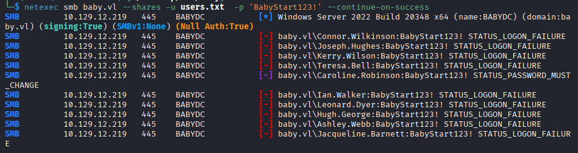

Con smbpasswd possiamo cambiare la password e metterne una a nostro piacimento

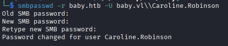

Ora possiamo entrare con questo utente e la nostra nuova password con winrm e prendere la prima flag

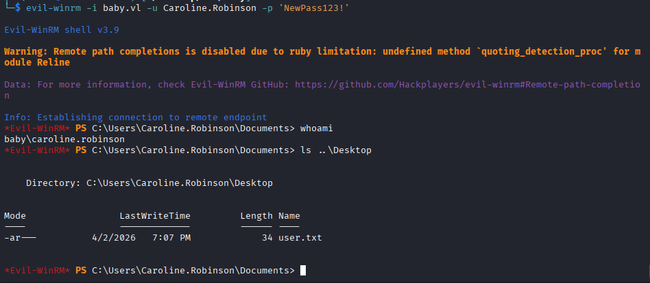

Essendo una macchina a dominio vediamo se c'è qualche path per una privilege escalation su bloodhound, usiamo bloodhound-python per ottenere tutte le info, i file json, questo comando comunica col target tramite ldap, riceve i dati via rete e li salva direttamente sulla nostra macchina. 
Purtroppo, cercando su bloodhound non troviamo nulla di interessante

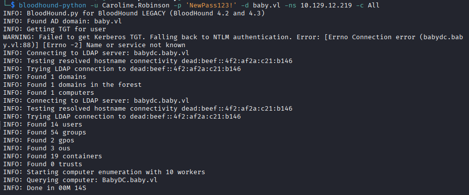

Diamo un'occhiata ai privilegi del nostro utente, abbiamo SeBackupPrivilege che ci permette di leggere il contenuto di qualsiasi file, possiamo entrare nella home directory di administrator ma non possiamo leggere la root flag. 
Quello che potremmo fare è ottenere il file criptato ntds.dit (il database di AD) e la chiave per decriptarlo, dentro la hive HKLM\SYSTEM. In questo modo potremmo leggere gli hash delle password di tutti gli utenti

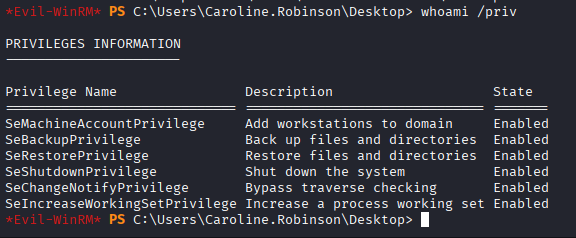

Ora creiamoci una cartella temporanea dove lavorare

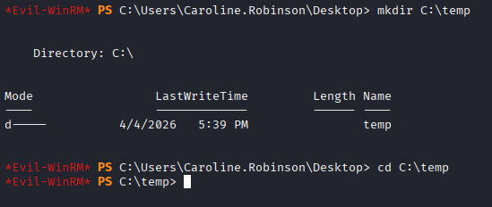

Salviamoci la hive HKLM/SYSTEM, che contiene la Boot Key che serve per decifrare i segreti dentro ntds.dit, e scarichiamola sulla kali

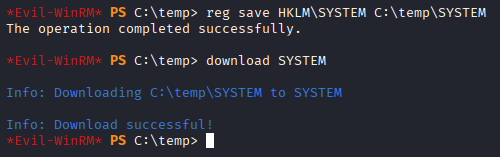

Non possiamo ottenere direttamente il file ntds.dit, pechè è un file sempre in uso, quindi dobbiamo fare una copia del disco, che possiamo fare perchè siamo nel gruppo Backup Operators, con diskshadow. Ci serve questo script che fa uno snapshot del disco e lo monta sul disco virtuale z:

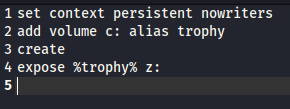
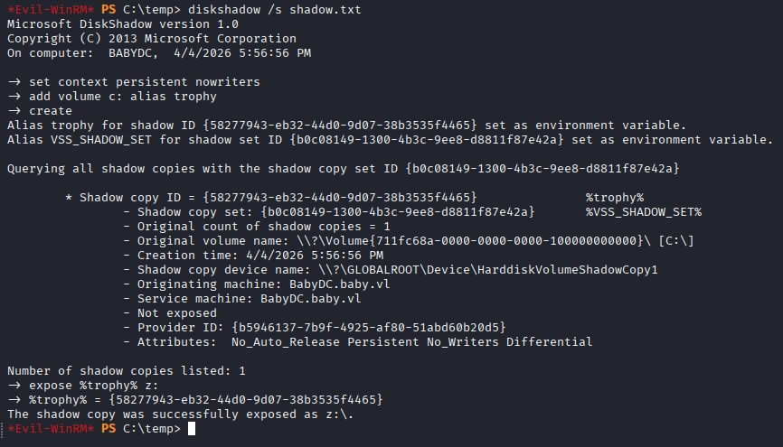

Per copiare il file ntds.dit abbiamo bisogno di robocopy in backup mode '/b', per raggirare i permessi, dopodichè scarichiamolo sulla nostra kali 

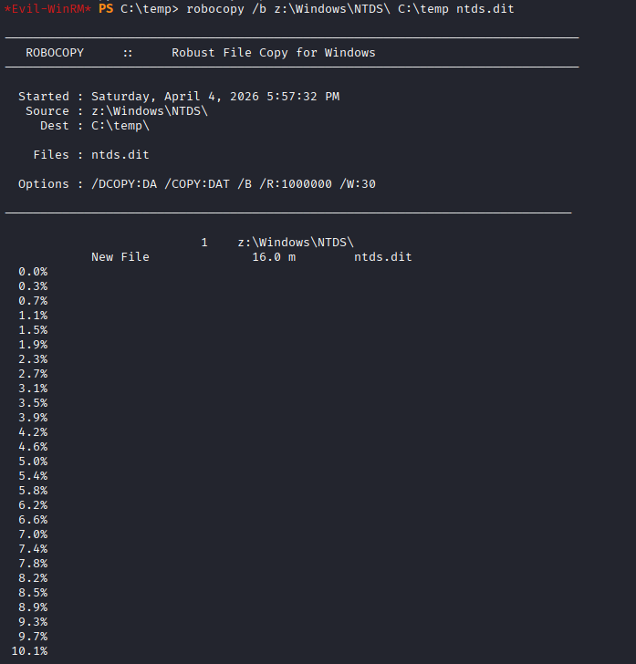

Con impacket possiamo prendere i file SYSTEM e ntds.dit per ottenere, fra le altre cose, gli hash delle password degli utenti

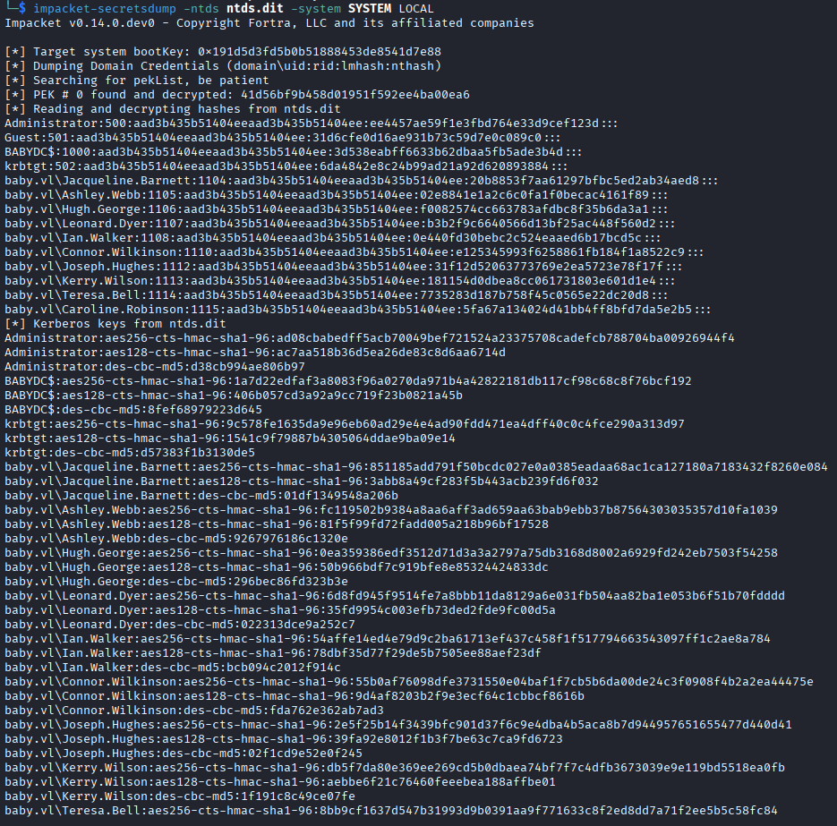

Usiamo l'hash di administrator per entrare con evil-winrm e prendere l'ultima flag

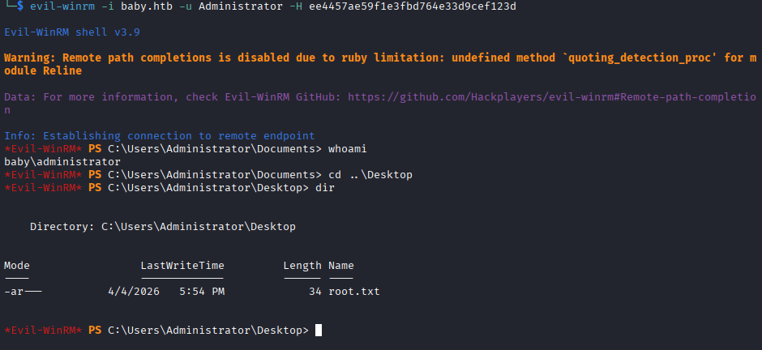