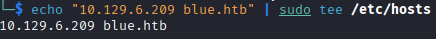
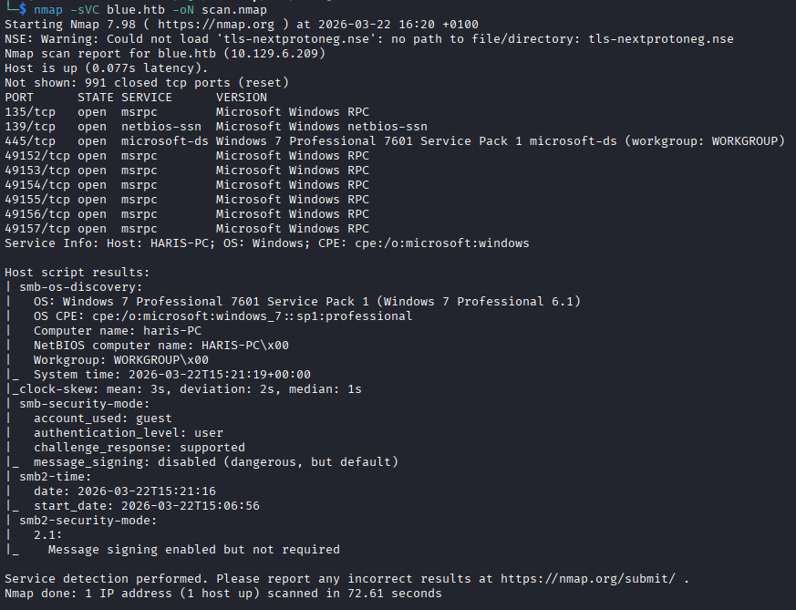
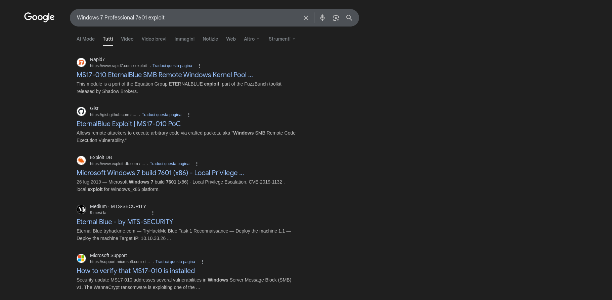
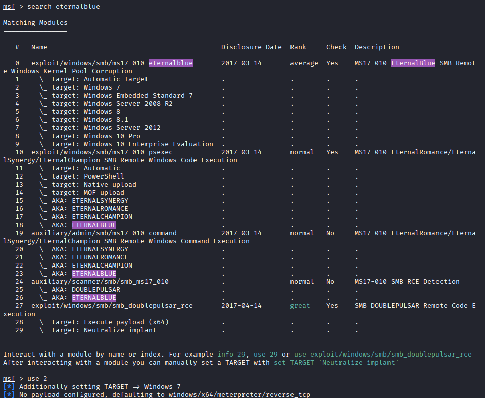
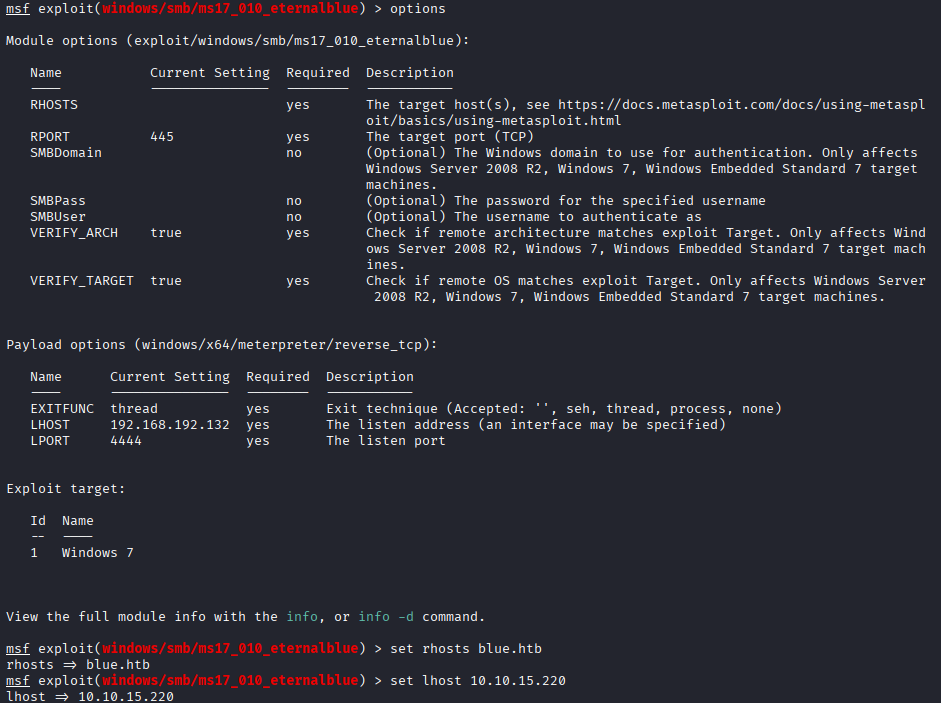
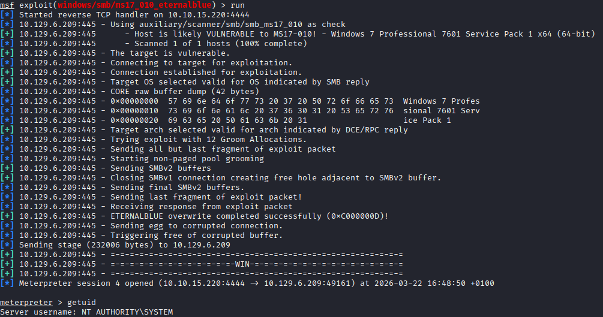
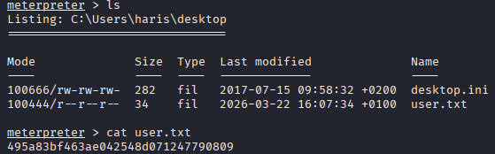
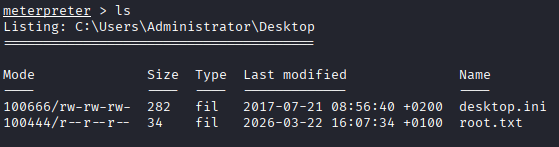

# BLUE 

Associato nome host a ip in /etc/hosts

Con una scansione nmap notiamo che abbiamo a che fare con una macchina Windows 7 con RPC, netbios e SMB

Cercando un exploit per Windows 7 Professional 7601 vediamo che potrebbe essere vulnerabile ad eternalblue

Cerchiamo su msfconsole un exploit per eternalblue per windows 7

Impostiamo gli hosts, remoto e locale

Lanciando l'exploit riusciamo ad ottenere una shell come system

Nella cartella C:\Users\haris\Desktop troviamo la user flag

Nella cartella C:\Users\Administrator\Desktop troviamo la root flag

