# CHEMISTRY

Associamo l'ip ad un nome host

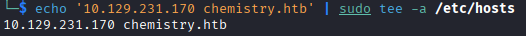

Con una scansione nmap, troviamo la porta 22 e 5000 con un servizio web

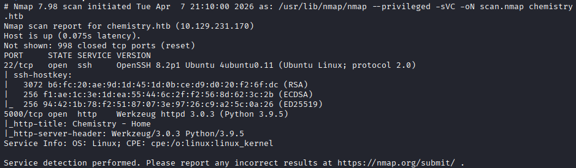

Su questo sito è possibile registrarsi e caricare dei file .cif, (Crystallographic Information Framework) i quali sono file che si usano per salvare le informazioni sulle strutture dei cristalli, utilizzati in ambito scientifico. Possiamo scaricarne uno e vedere se funziona

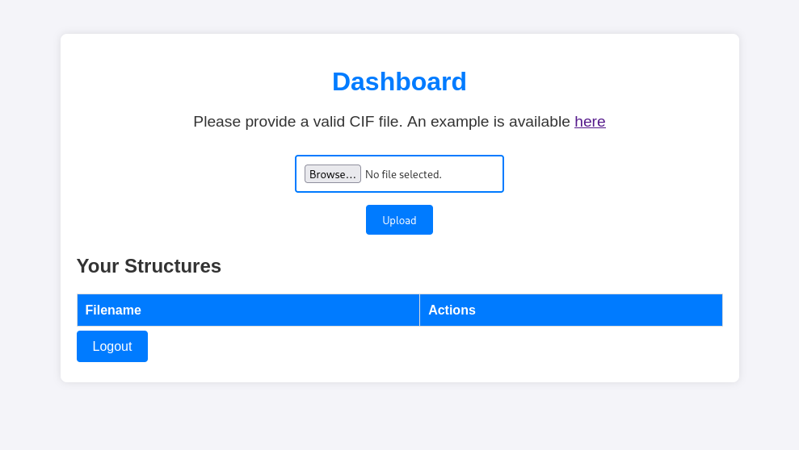
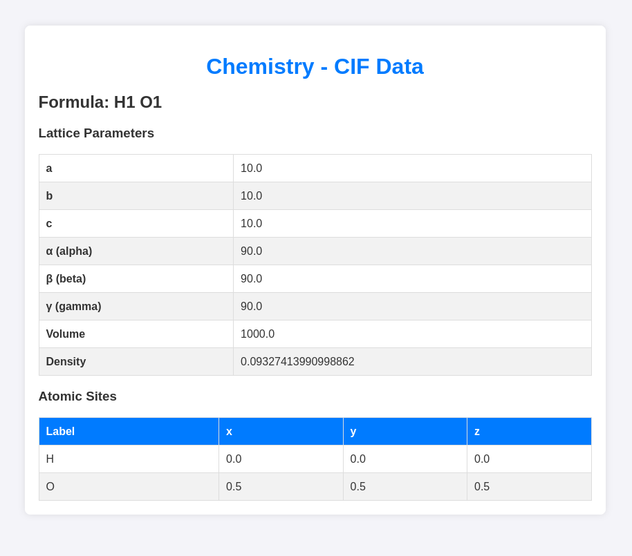

Cercando degli exploit per questi file ne troviamo uno su exploitDB, bisogna aggiungere le ultime 3 righe al file .cif, la rev shell trovata non funziona, ma provandone altre riusciamo a trovare quella giusta

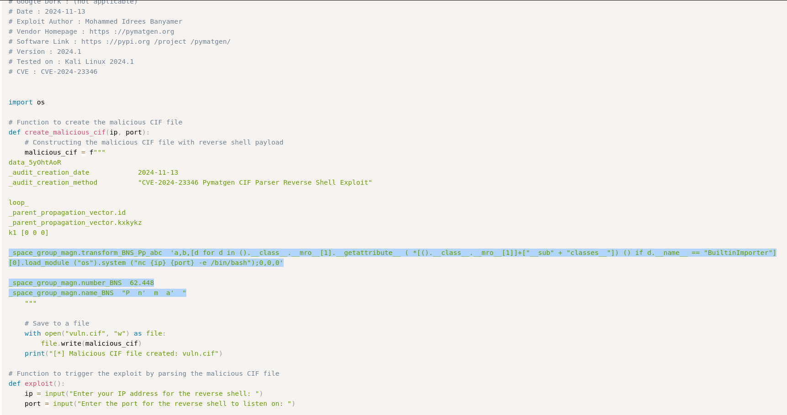
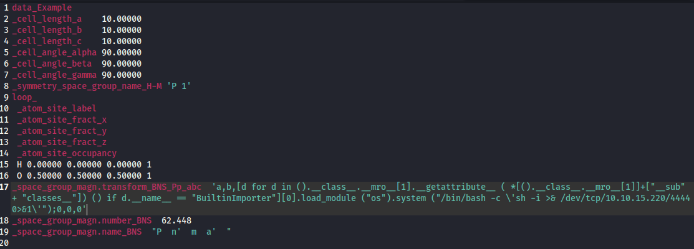

Ora possiamo caricare il file, ascoltare sulla porta scelta e cliccando su 'view' otteniamo una rev shell. Una volta dentro troviamo il  database, dove al suo interno ci sono delle credenziali

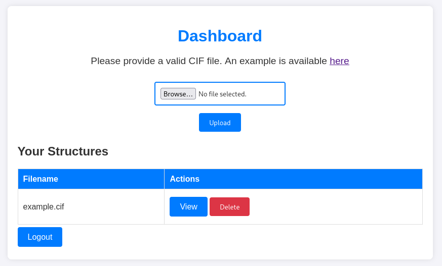
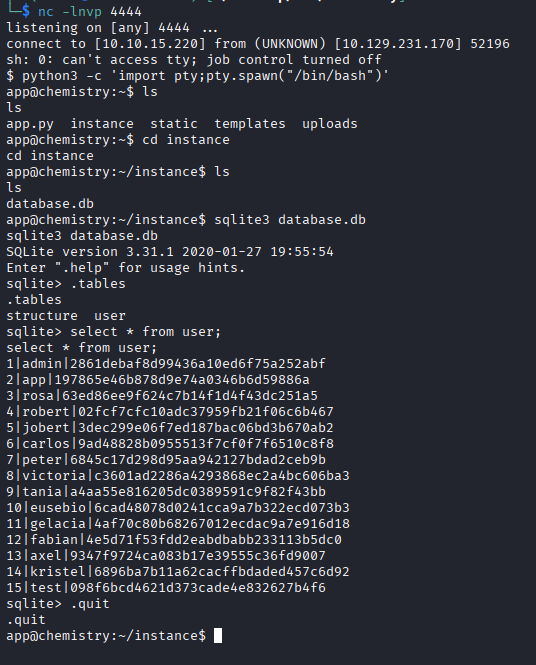

Salviamo le credenziali in un file e proviamo a crackare gli md5 delle password con hashcat e ne troviamo 5

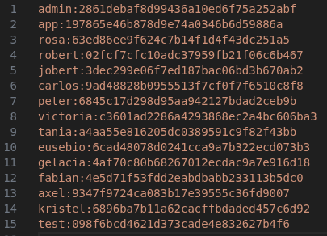
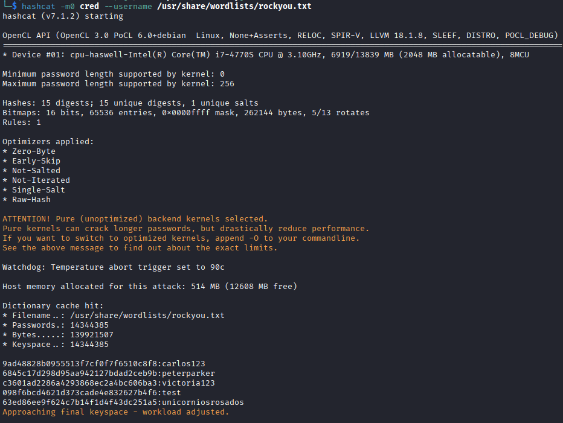

Proviamo le credenziali trovate per entrare con ssh e le uniche valide sono quelle dell'utente rosa, da qui possiamo ottenere la prima flag

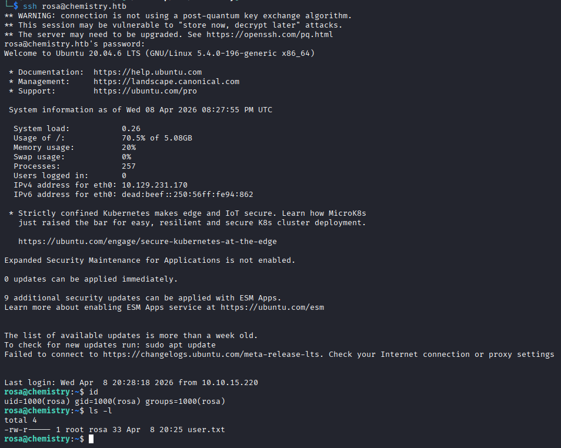

Dando un'occhiata ai servizi su questa macchina ne troviamo uno sulla porta 8080, solo locale, con un servizio http

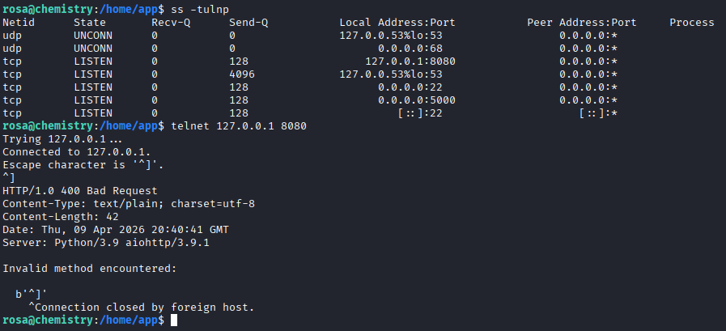

Facciamo un portforwarding con ssh per vedere questa pagina web sulla nostra macchina, sulla porta 80. Il sito mostra una lista di servizi, ma cercando informazioni sul target su di essi, non troviamo nulla

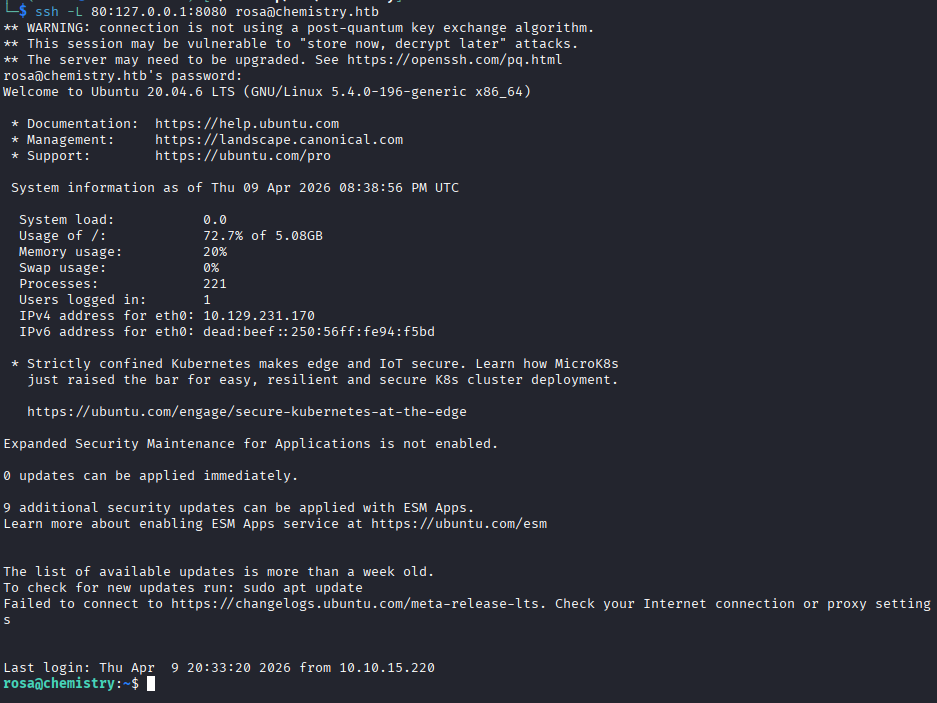
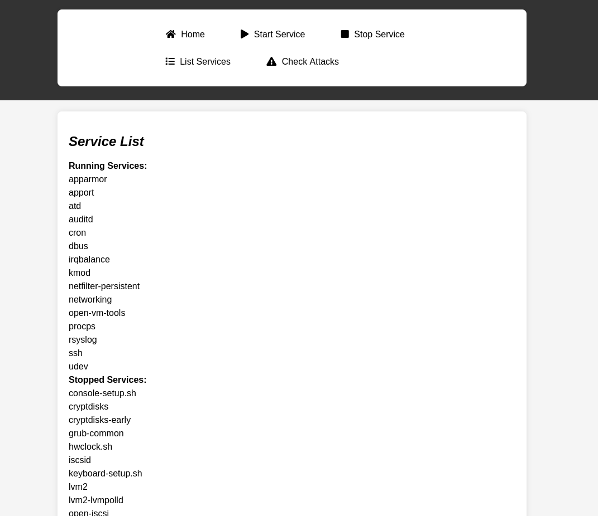

Allora analizziamo la pagina con whatweb e vediamo che usa la libreria python aiohttp alla versione 3.9.1, cercando su internet delle vulnerabilità per questa libreria a questa versione, vediamo che è vulnerabile alla CVE-2024-23334, si tratta di path traversal

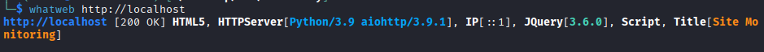

Per questo path traversal serve una directory da cui iniziare e guardando i file del sito vediamo che c'è la cartella assets, quindi inizieremo da questa

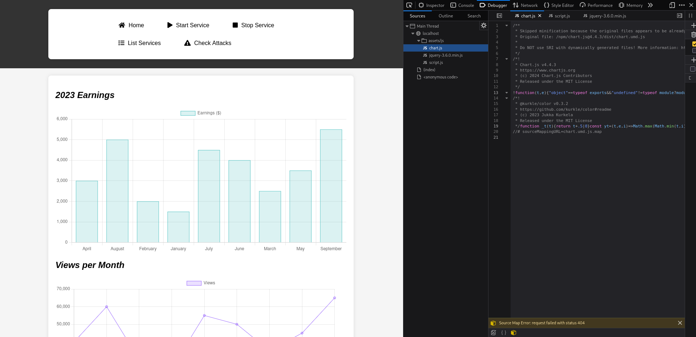

Troviamo un exploit su github già impostato per la directory che interessa a noi

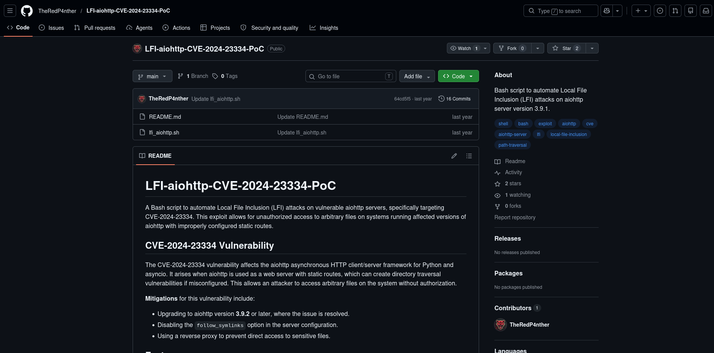

Cloniamo il progetto sulla nostra macchina, apriamo un server web con python per scaricarlo sul target, lanciamolo e troviamo l'url vulnerabile

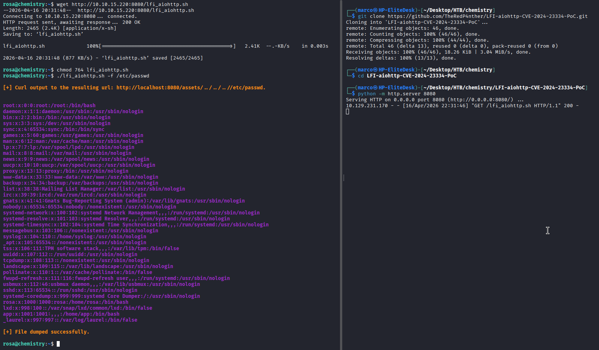

Navigando nel filesystem notiamo che possiamo entrare dentro /root, quindi prendiamo la sua chiave ssh, copiamocela e usiamola per collegarci al target in modo da ottenere l'ultima flag

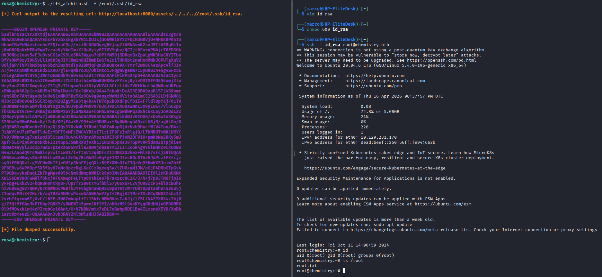