# CONVERSOR

Associamo l'ip ad un nome host in /etc/hosts

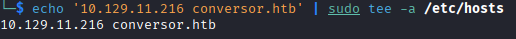

Scansioniamo con nmap la macchina e vediamo che ci sono 2 porte aperte, la 22 e la 80. Salviamo la scansione in un file XML, ci servirà per dopo

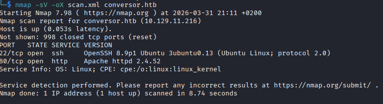

Visitiamo il sito web e vediamo che possiamo registrarci

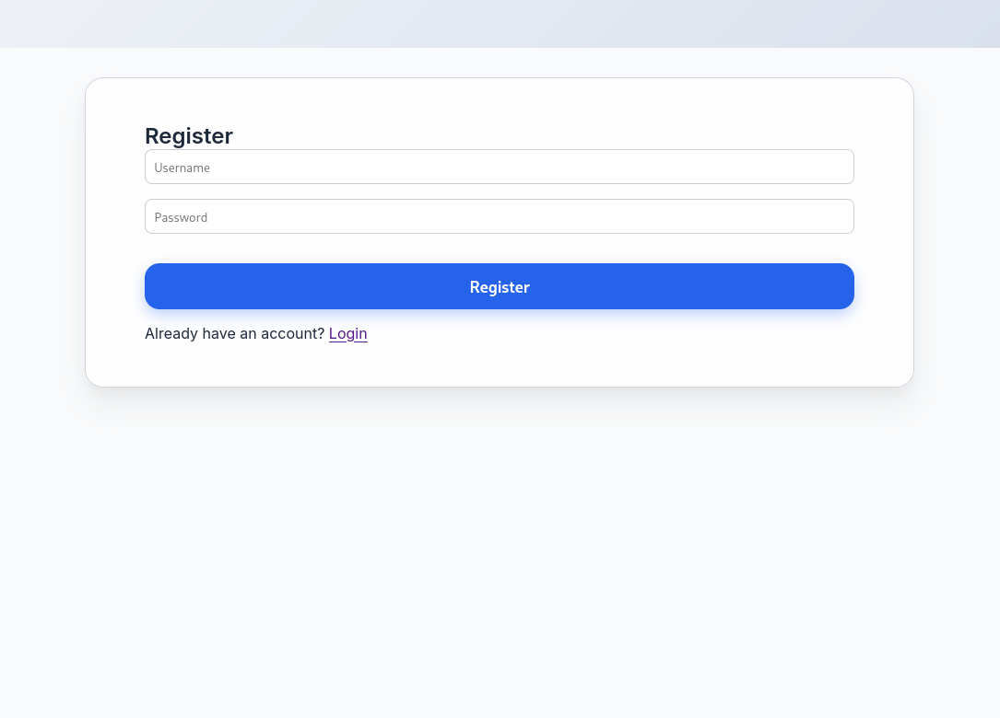

Una volta dentro notiamo che dalla pagina about si può scaricare il codice sorgente del sito

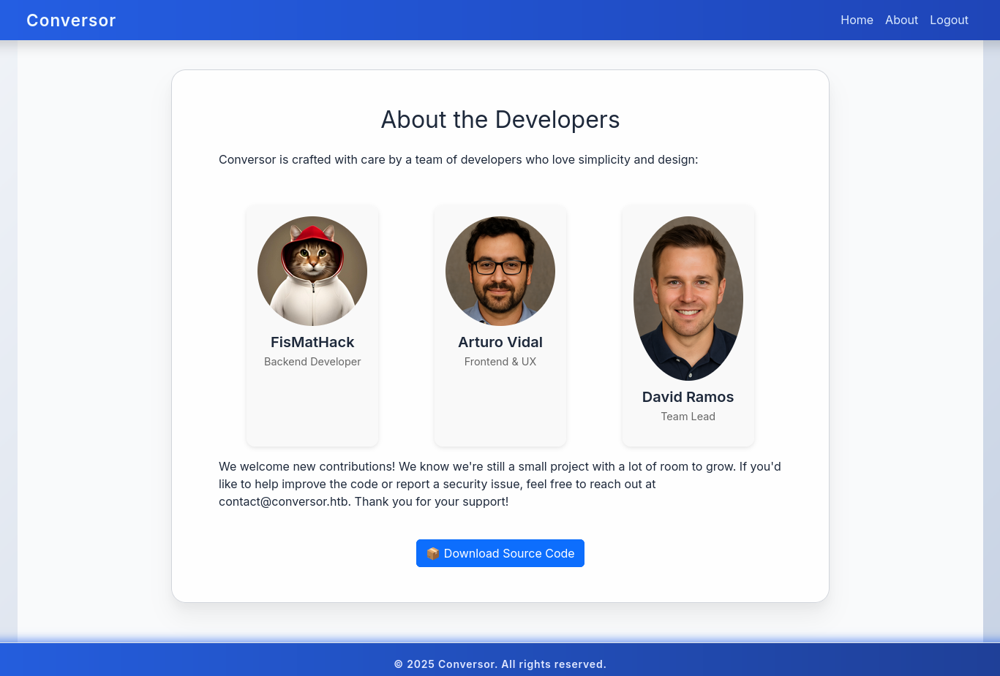

Una volta scaricato il .tar ed estratto vediamo che si sono 3 file interessanti:

1- install.md, che parla di un crontab che esegue tutti i file python dentro /var/www/conversor.htb/scripts/

2- app.py, dove dentro la funzione convert, c'è scritto come vengono importati i file. Quando il file XML viene elaborato dal parser gli viene impedito di: leggere file interni al server, fare richieste di rete e di caricare solo file XML con una sintassi corretta

3- instance/user.db, vuoto, ma potrebbe risultare utile una volta messe le mani sul target

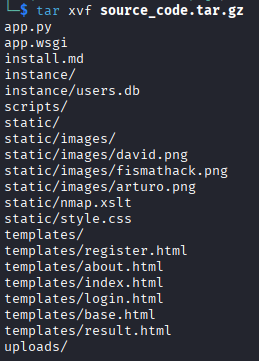
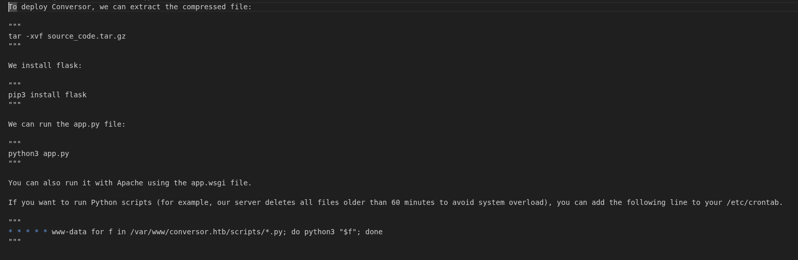
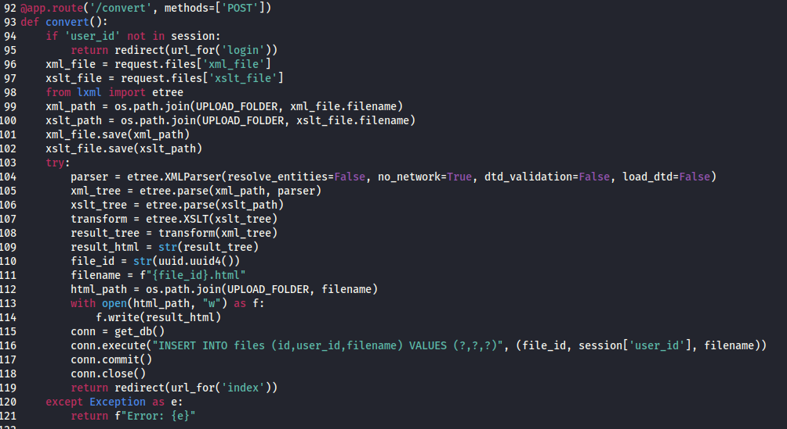

Partiamo con del fingerprinting, vediamo la versione ed il vendor del motore che trasforma questi file e facendo delle ricerche su internet notiamo che la versione è datata

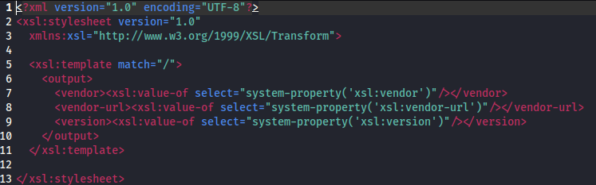

Come abbiamo visto non possiamo leggere file sul server, ma potremmo provare a scriverci. Ci serve un file XML, la scansione di nmap di prima è più che sufficiente e con le informazioni che abbiamo possiamo scrivere un file XSLT che crei un file python con una reverse shell nella cartella /var/www/conversor.htb/scripts/ visto che qui gli script python, probabilmente, vengono lanciati dal crontab

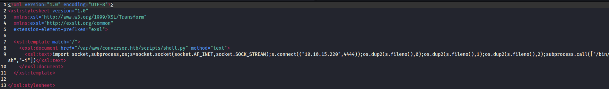

Avviamo un listener con netcat e convertiamo i due file dalla pagina web, dopo poco otteremo una shell come www-data

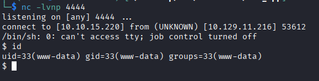

Importiamo una shell più stabile e andiamo a dare un'occhiata al file users.db che dicevamo prima, qui vediamo che abbiamo 2 credenziali, il nostro utente creato prima ed un altro

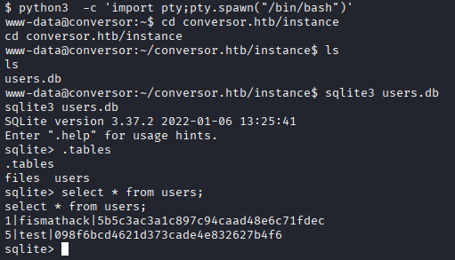

Ora mettiamo l'hash in un file per capire che tipo di hash è con hash-identifier, e crackarlo con hashcat, vediamo che è un MD5 e in questo modo troviamo la password per l'utente fismathack

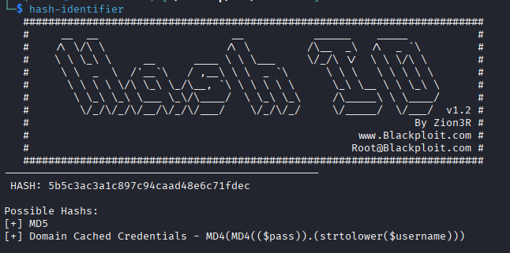

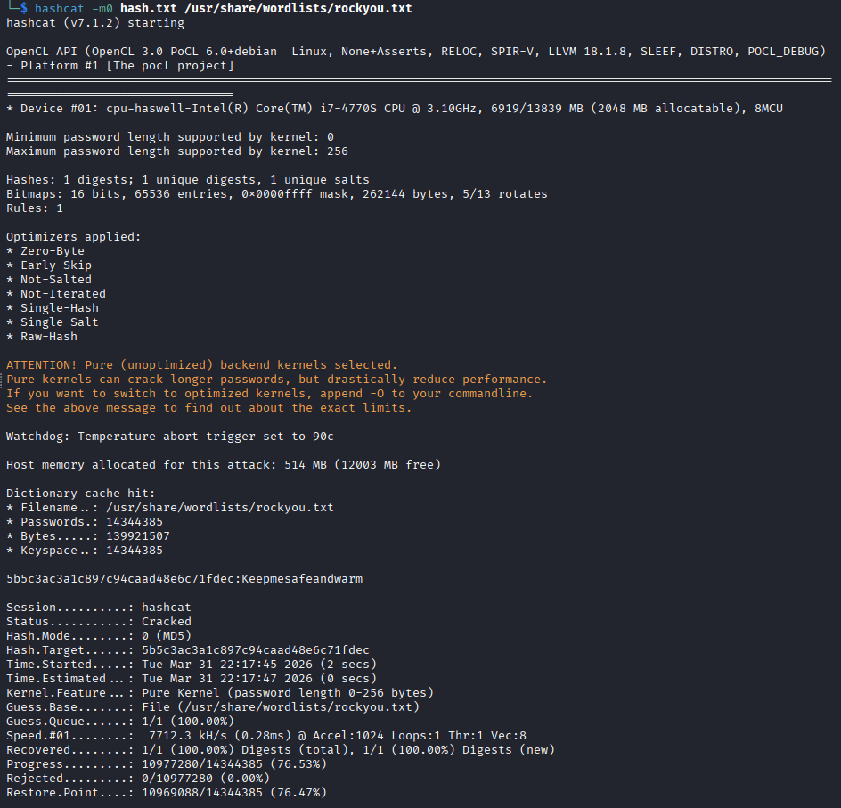

Con queste credenziali connettiamoci con ssh e troviamo subito la prima flag

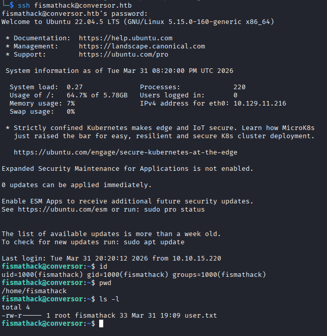

Iniziamo questa privilege escalation guardando quali comandi possiamo lanciare con sudo e vediamo che possiamo lanciare needrestart senza neanche bisogno della password.
Needrestart è un software che serve a riavviare i deamons dopo che ci sono stati degli aggiornamenti a delle librerie

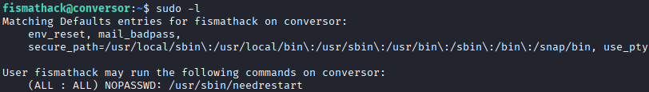

lanciamolo con l'opzione --help per vedere quali informazioni possiamo ottenere e notiamo che possiamo specificare un file di configurazione con -c

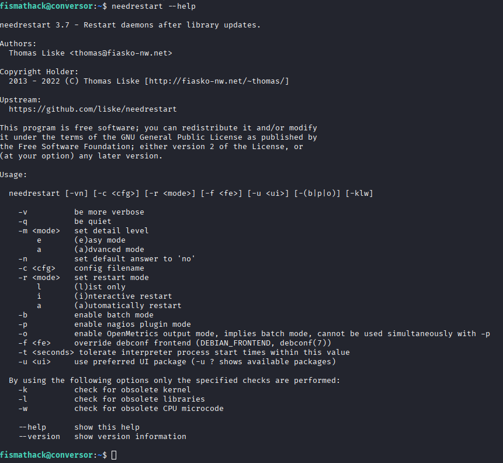

Diamo un'occhiata a come è fatto il file di configurazione originale e notiamo che è scritto in perl

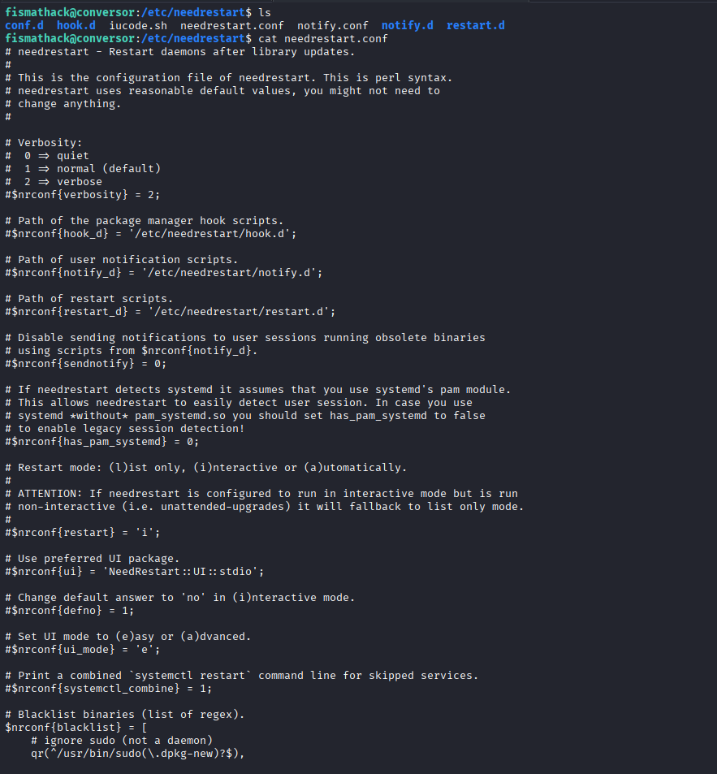

Possiamo creare un file in perl con una reverse shell, specificarlo come file di configurazione e lanciare il comando con sudo, se tutto andrà secondo i piani il file di configurazione verrà lanciato come root e otterremo una shell come quest'ultimo utente

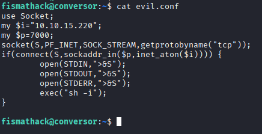

Lanciamo il listener sulla nostra macchina e poi needrestart con sudo e specificando il nostro file perl come file di configurazione ed otteniamo una shell come root e possiamo prende l'ultima flag

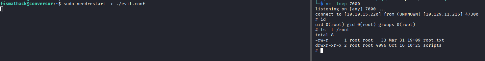

