# FOREST

Associamo l'IP ad un nome host

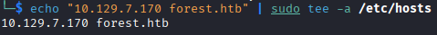

Con una scansione con nmap troviamo diverse porte aperte, una delle prime porte da testare è la 445. Comunque notiamo dalla porta 389 che questa è una macchina a dominio

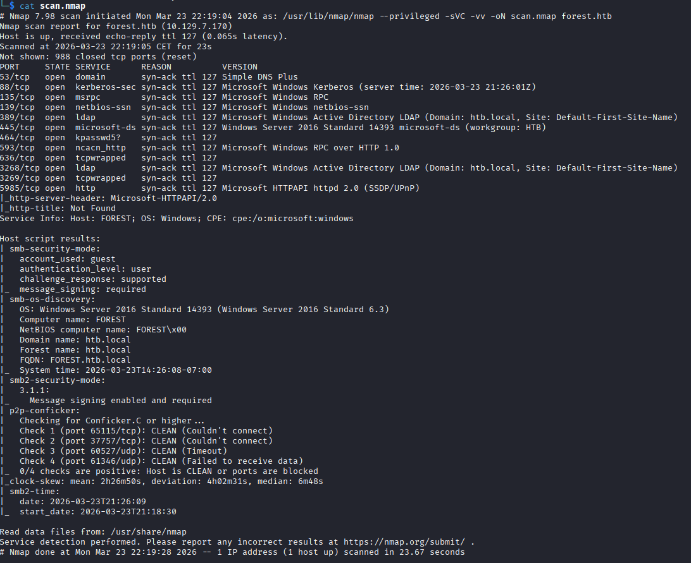

Possiamo lanciare enum4linux per enumerare il servizio SMB e troviamo una lista di utenti

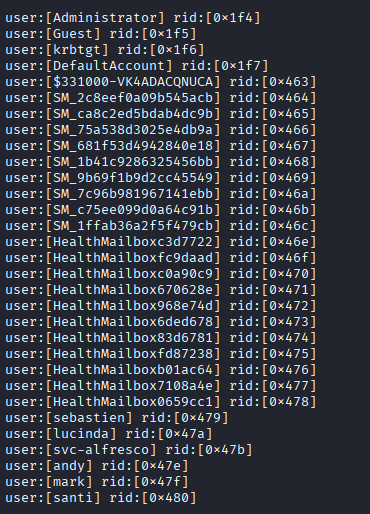

Con questa lista di utenti proviamo un attacco AS-REP Roasting, quindi cerchiamo se qualche utente non richiede pre-auth e possiamo quindi ottenere l'hash della sua password, riusciamo a farlo con l'utente svc-alfresco

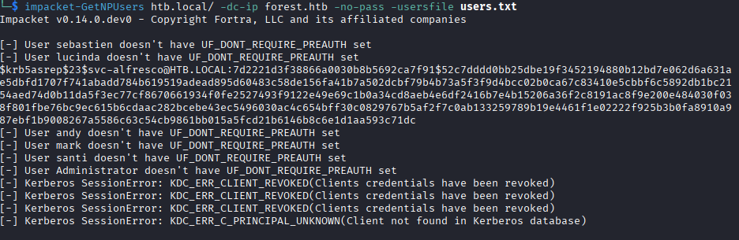

Vediamo che l'hash è in formato krb5asrep, con hashcat cerchiamo a quale mode corrisponde e vediamo che è la 18200

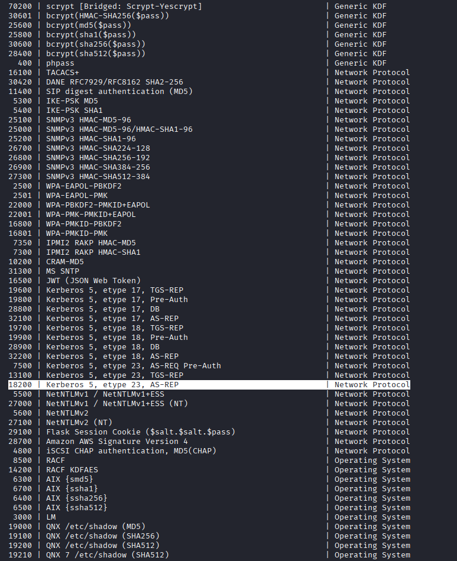

Mettiamo l'hash in un file txt per crackarlo con hashcat con la mode che abbiamo trovato prima, e troviamo al password in chiaro

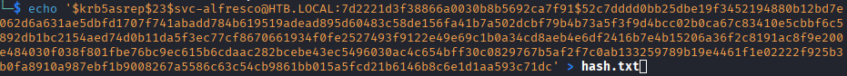
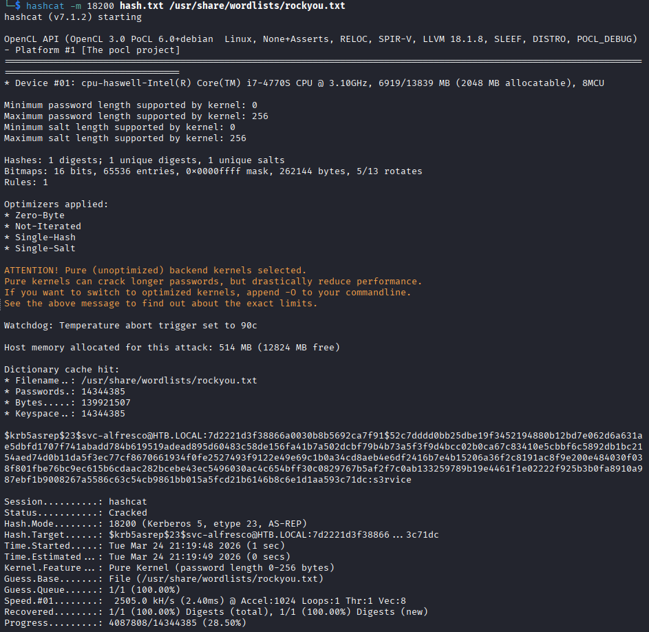

Entriamo con le nuove credenziali nel target con evil-winrm e otteniamo la prima flag

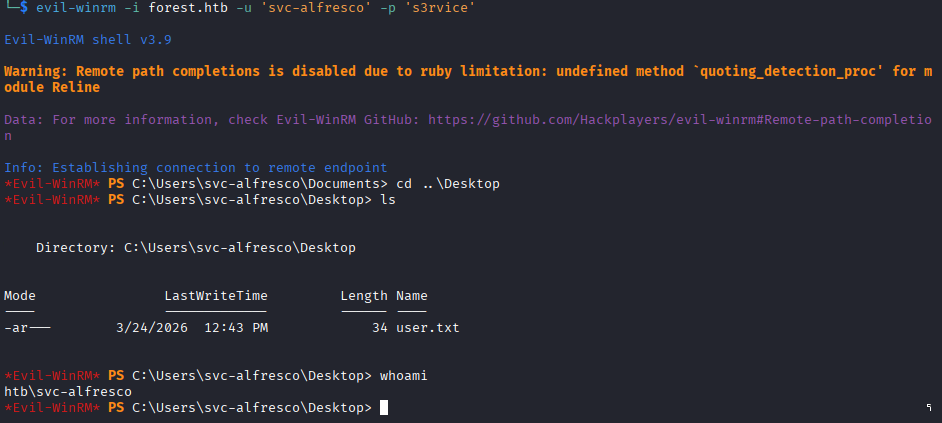

Siccome stiamo parlando di AD, usiamo bloodhound per ottenere tutte le informazioni, da controllare successivamente sulla nostra macchina

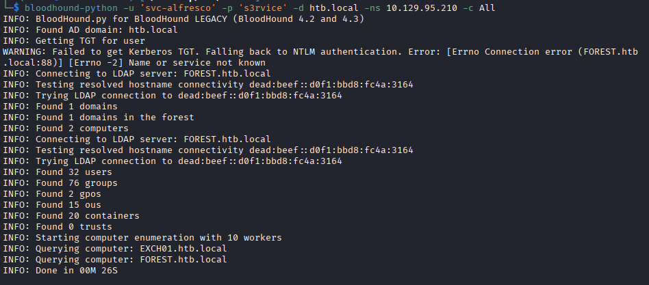

Importiamo tutti i json dentro bloodhound e cerchiamo un path per diventare domain admin partendo dall'utente svc-alfresco. Il nostro utente, grazie all'ereditarietà a tutti i privilegi del gruppo account operators, il quale ha il pieno controllo (generic all) sul gruppo exchange windows permissions. Questo gruppo può modificare tutti i permessi (writeDACL) sull'intero dominio, il quale contiene l'OU users che contiene domain admins

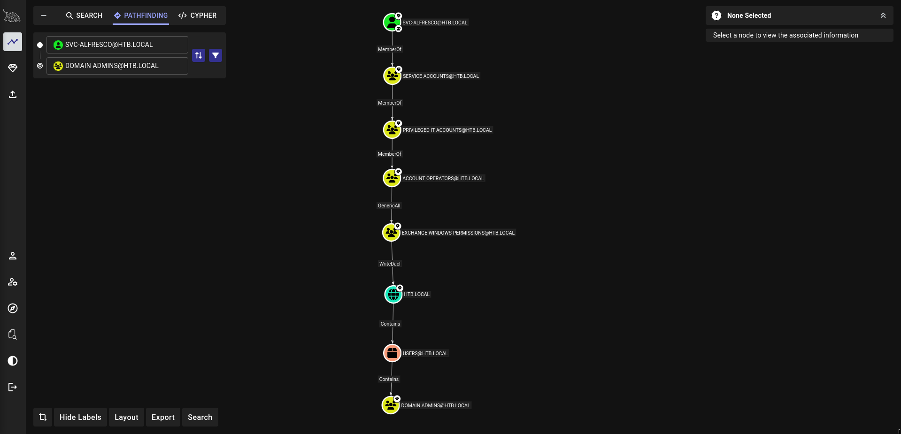

Inziamo col caricare powerview.ps1 sul target e mettiamo le nostre credenziali dentro la variabile $cred. Visto che abbiamo il pieno controllo su exchange windows permissions, aggiungiamoci al gruppo in modo da avere tutti i suoi privilegi, cioè modificare le ACL e assegnamoci il diritto DCSync, il quale ci permette di farci dare tutte le informazioni sugli utenti dal DC, tra cui gli hash delle password

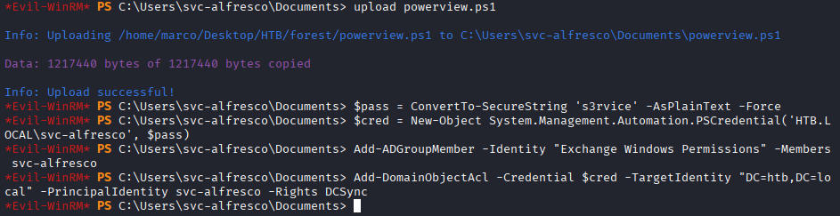

Ora con impacket possiamo ottenere l'hash della password di administrator

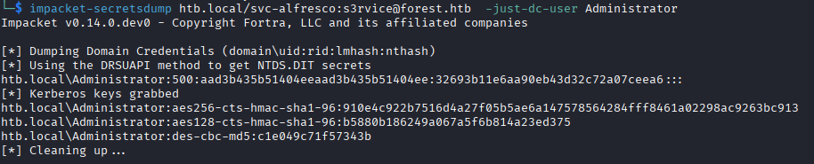

Sfruttiamo questo hash per entrare con evil-winrm come administrator e otteniamo l'ultima flag

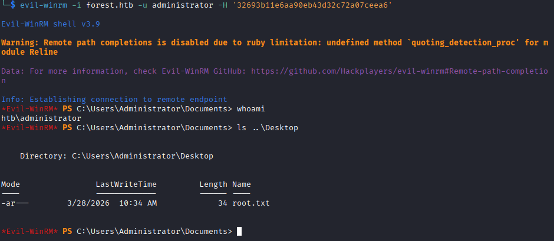