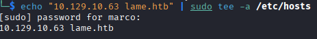
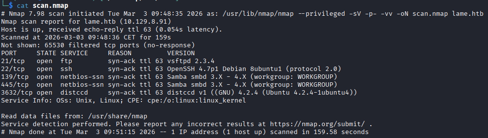
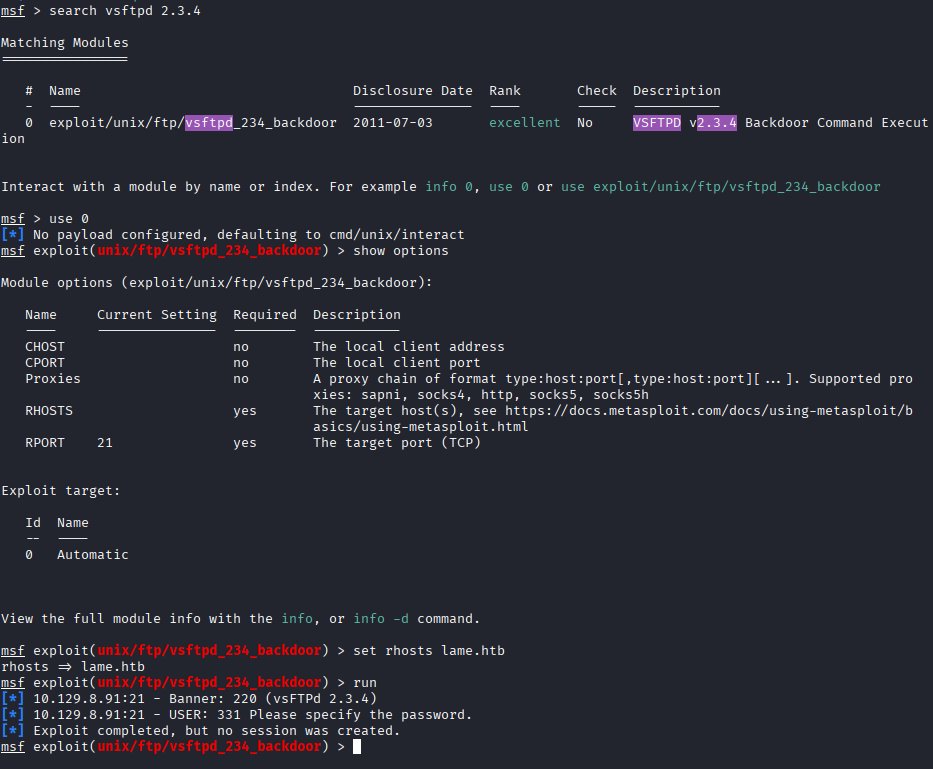
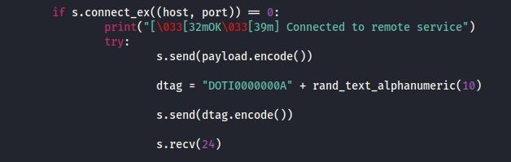
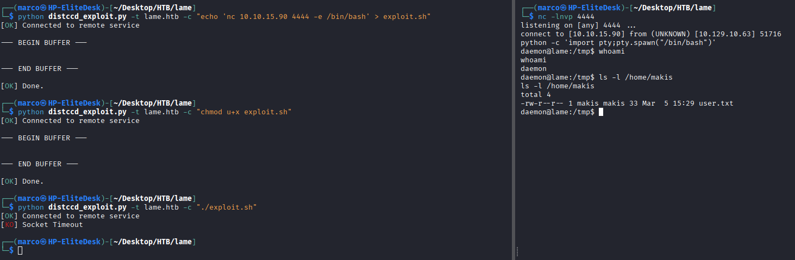
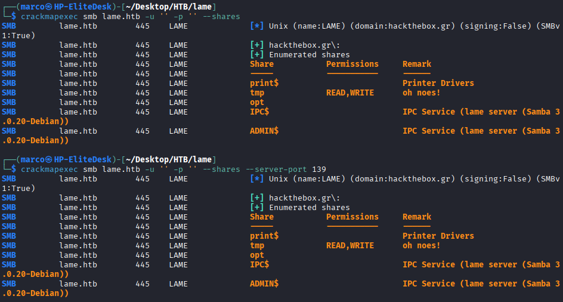
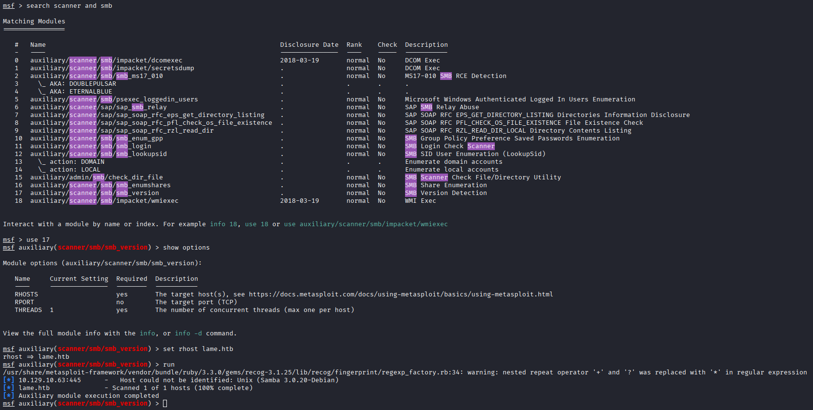
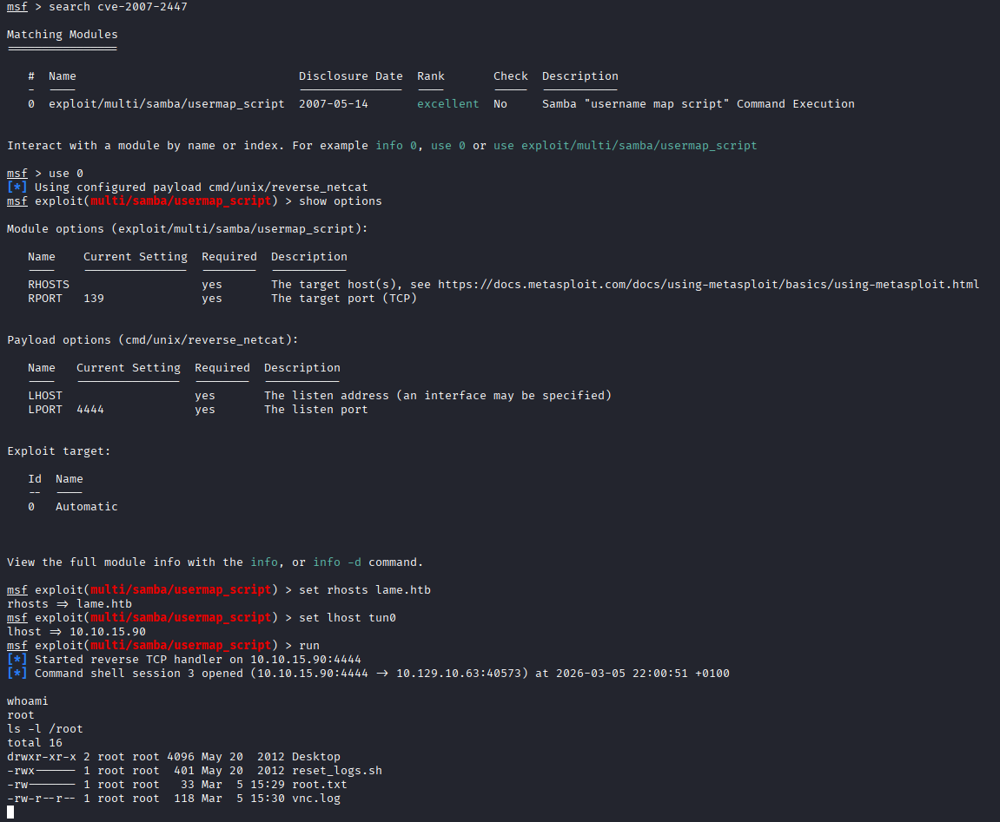

# LAME

Come prima cosa associamo il nome host al suo ip in /etc/hosts

Scansioniamo tutte le porte e ne troviamo 5 aperte, le più interessanti sono la 21, 139, 445 e 3632

Partiamo dalla porta 21 col servizio vsftpd 2.3.4, nota per una vulnerabilità tanto semplice da sfruttare quanto efficace, autenticandosi con una qualsiasi stringa con uno smile alla fine ':)' ed una qualsiasi password si apre una backdoor sulla porta 6200 come root, ma vediamo che in questo caso il servizio non è vulnerabile

Ora proviamo la porta 3632, il servizio distccd serve per compilare il codice C su questo server, evitando di sovraccaricare la RAM della propria macchina. Cercando su internet vediamo che questo servizio alla versione v1 è vulnerabile alla CVE-2004-2687 e troviamo un exploit in python su github, bisogna modificare i dati che si inviano al target perchè le socket accettano solo byte grezzi e non stringhe, questo si può fare col metodo 'encode()'

Caricando una rev shell e lanciandola, essendoci messi in ascolto sulla porta scelta, riusciamo ad entrare come utente daemon, possiamo vedere la user flag ma niente di più

Allora concentriamoci sul servizio samba, listiamo le shares con crackmapexec e vediamo che le porte 139 e 445 espongono le stesse, possiamo vedere /tmp, ma non c'è niente di interessante

Proviamo a controllare la versione del servizio, facciamolo con metasploit cercando uno scanner per smb, vediamo che la versione è Samba 3.0.20-Debian, e cercando su internet vediamo che è vulnerabile alla CVE-2007-2447

Cerchiamo un exploit sempre su metasploit e lanciamolo, impostando le opzione corrette, otteniamo una shell come root e possiamo prendere l'ultima flag

