# NIBBLES

Associamo il nome host all'ip

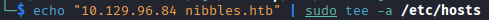

Con una scansione con nmap troviamo 2 porte aperte, 22 e 80

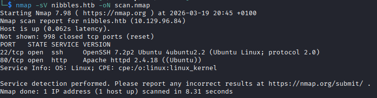

Nel codice html della pagina web troviamo nei commenti una directory, navigandoci troviamo una pagina ma non c'è nulla di interessante

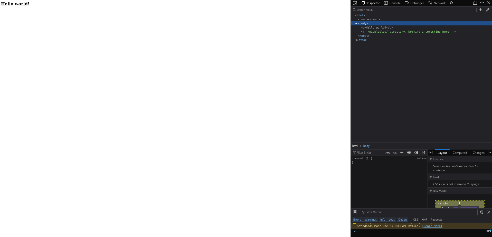

Proviamo un'enumerazione e troviamo diverse directory e file

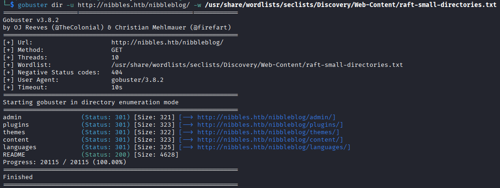

Dentro il file content/private/users.xml vediamo che esiste l'utente admin ma non c'è scritta la password

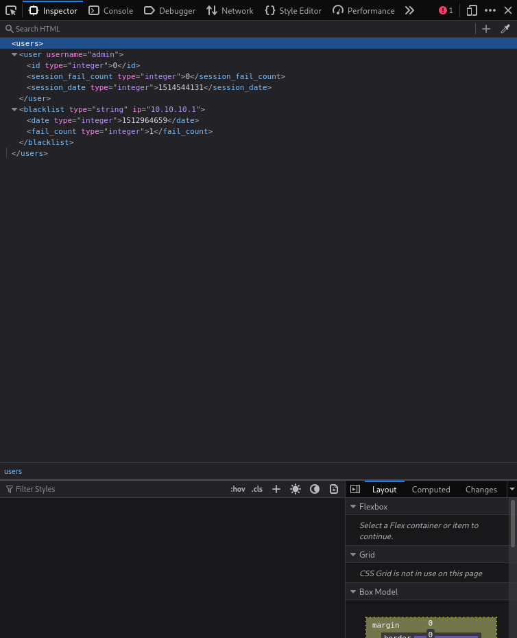

Nel file README troviamo la versione 4.0.3 di Nibbleblog. Questa versione è vulnerabile alla CVE-2015-6967, la quale permette, grazie al plugin My Image, ad un admin, di eseguire comandi arbitrari sulla macchina caricando un file con estensione eseguibile, nel nostro caso php visto che il sito è scritto in questo linguaggio

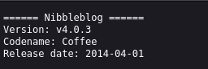

nella pagina /nibbleblog/admin.php possiamo provare a loggarci con utente admin, usando le password più comuni, come ad esempio admin, password e nibbles. Vediamo che quest'ultima è quella corretta e possiamo loggarci con l'utente admin

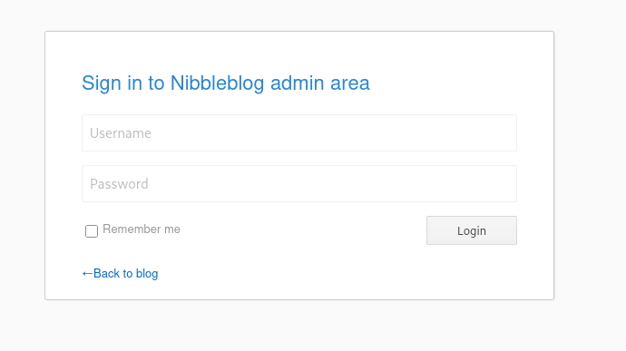
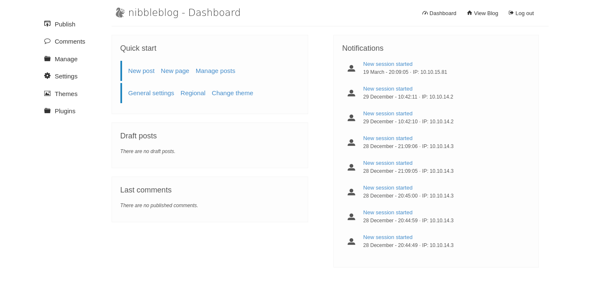

Una volta loggati vediamo che dentro 'Plugins' possiamo caricare un file, proprio con My Image, creaiamo un file in php con una reverse shell e carichiamolo

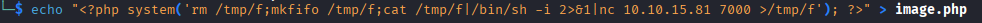
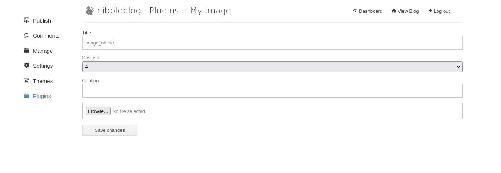

Cercando tra le directory troviamo il nostro file php dentro /content/private/plugins/my_image/ avviamo il listener e apriamo il file per ottenere la reverse shell

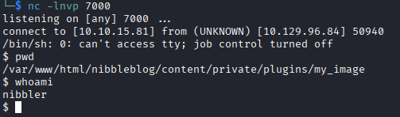

Una volta ottenuta la shell siamo dentro come utente nibbler e possiamo ottenere la prima flag

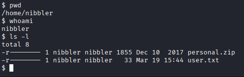

Cerchiamo quali comandi possiamo lanciare con sudo e vediamo il file monitor.sh che è dentro un file .zip nella nostra home, estraiamolo

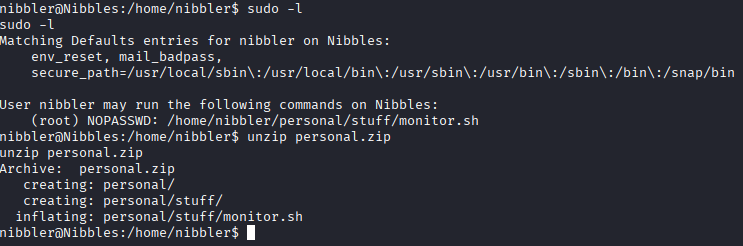

Ora scriviamo una reverse shell dentro il file, come abbiamo fatto prima, ed eseguiamo monitor.sh con sudo

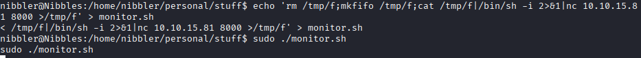

Aprendo un listener abbiamo una shell come root e possiamo ottenere l'ultima flag

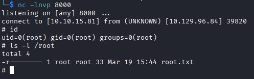