# SOULMATE

Come prima cosa aggiungiamo il nome host al file /etc/hosts

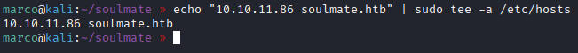

Scansionando il target con nmap, troviamo le porte 22 con ssh e 80 con http

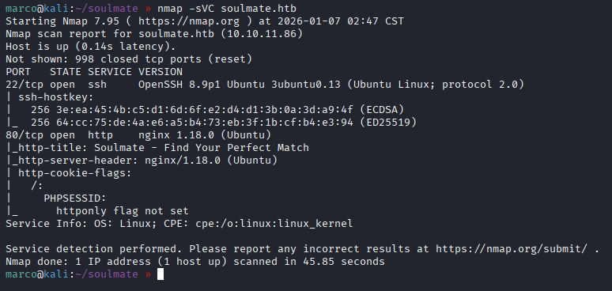

Sulla porta 80 c'è un sito dove è possibile iscriversi e modificare i propri dati, ma nulla di interessante

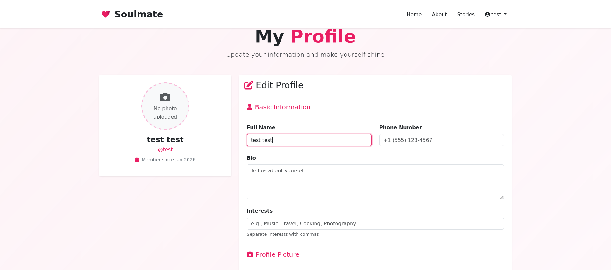

Enumerando i sottodomini troviamo ftp.soulamte.htb, aggiungiamolo al riga già creata dentro /etc/hosts. Per l'enumerazione è necessario usare l'opzione --append-domain, poichè il server web accetta solo richieste con il nome di dominio completo (FQDN)

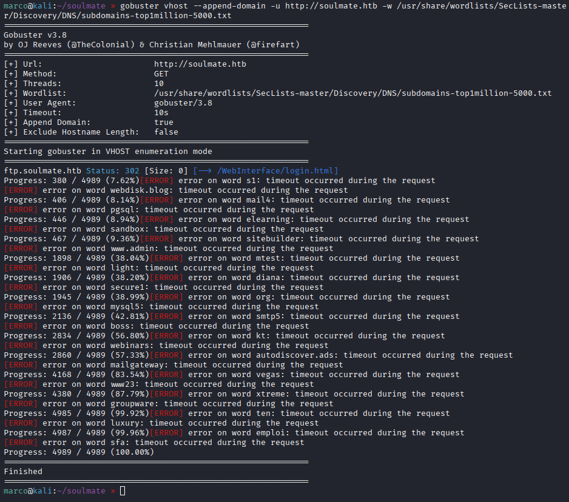

Andiamo sul sito e troviamo l'applicazione CrushFTP, il quale è un server per il trasferimento dati dove si possono gestire anche gli utenti, direttamente da interfaccia web. Nel codice HTML notiamo una versione scritta più volte: 11.W.657

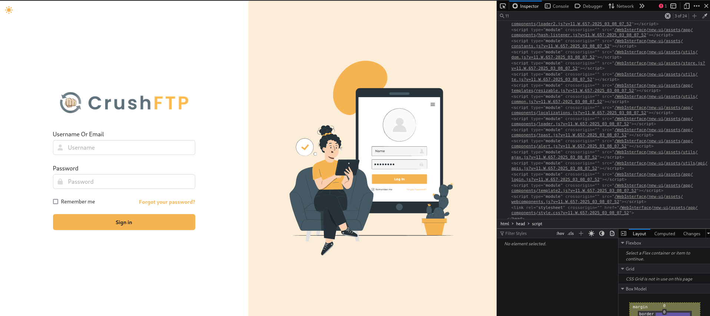

Cerchiamo con searchsploit delle vulnerabilità e troviamo un Authentication Bypass scritto in python. Questo sfrutta una race condition nel metodo di autenticazione per creare un utente admin (CVE-2025-31161)

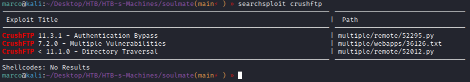

Copiamolo in una nostra cartella e lanciamolo sull'applicazione CrushFTP, dopo qualche tentativo riusciamo a creare un nostro utente

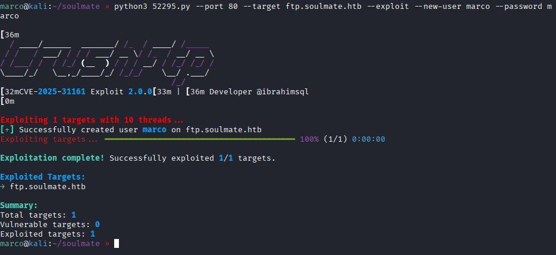

Riusciamo ad entrare e andando nella pagina admin, poi user manager, l'utente ben vede la cartella del sito (webProd), copiamola e aggiungiamola al nostro utente poi salviamo

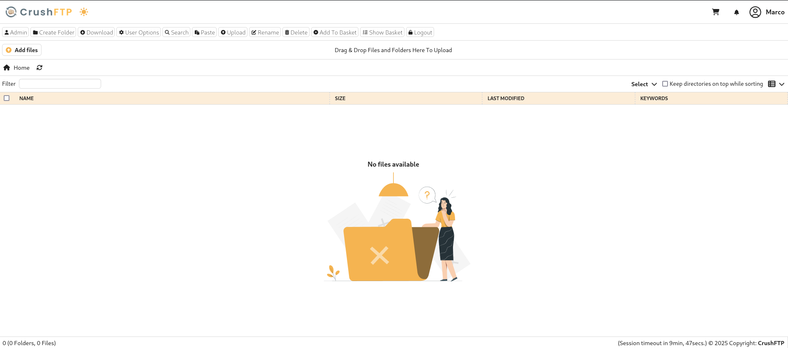
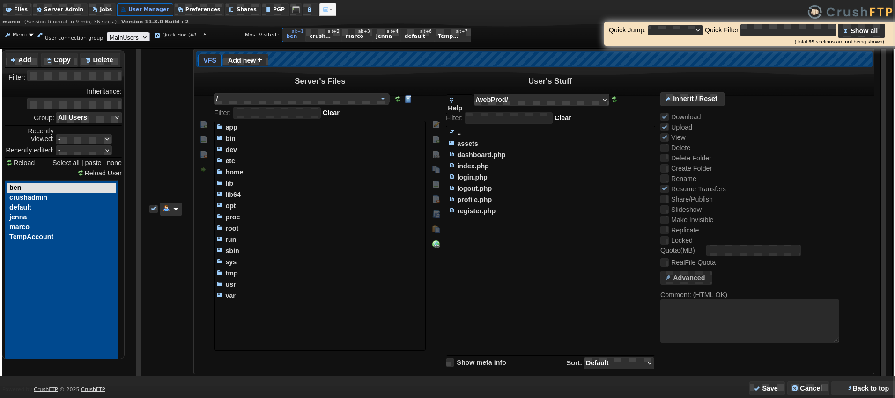
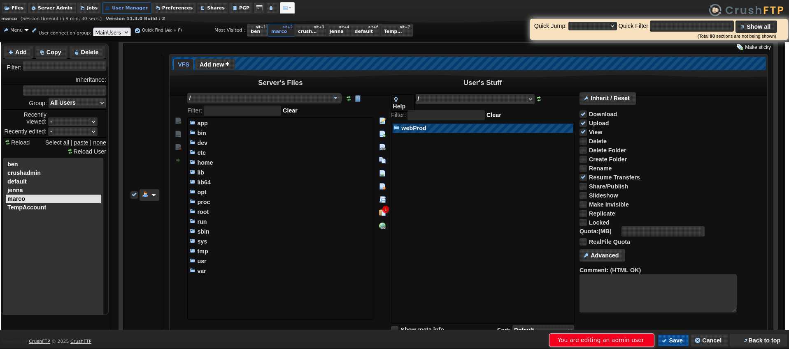

Ora possiamo creare una reverse shell in php e caricarla nella cartella webProd

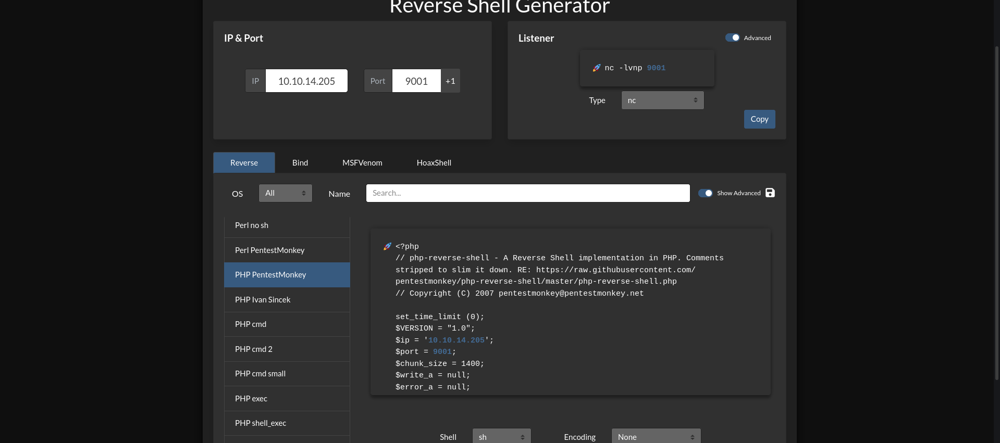
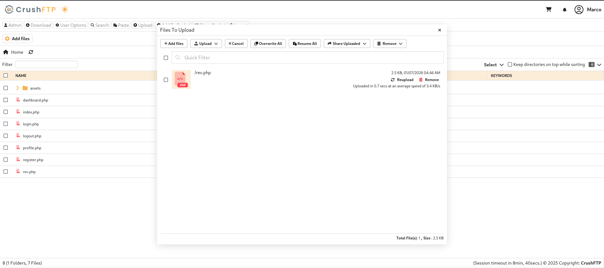

Apriamo la porta con netcat sulla nostra macchina e cerchiamo la reverse shell nel browser, otteremo una shell come www-data

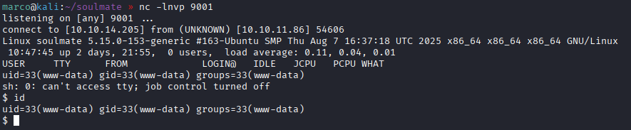

Osserviamo le socket aperte e notiamo che sulla porta 2222 c'è un server SSH scritto in Erlang

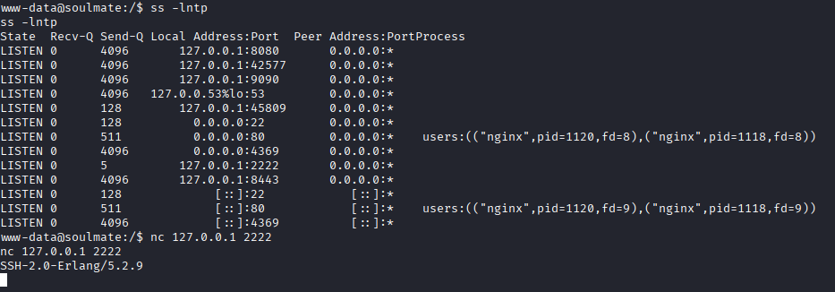

Cerchiamo le directory di Erlang e vediamo se c'è scritto qualcosa che ci può servire

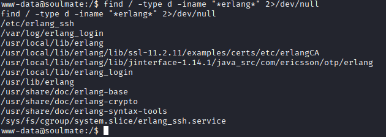

Troviamo le credenziali dell'utente ben dentro il file /usr/local/lib/erlang_login/start.escript

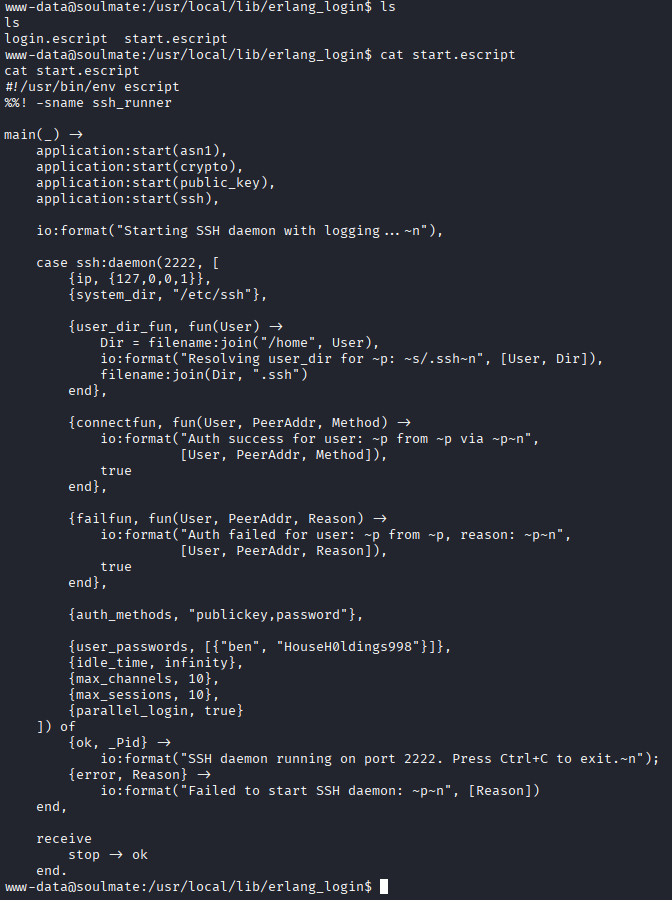

Ci colleghiamo al target con ssh e le credenziali di ben e otteniamo la flag

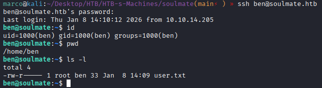

Ci colleghiamo al servizio Erlang sulla porta 2222 con le credenziali di ben e otteniamo una shell Erlang come root

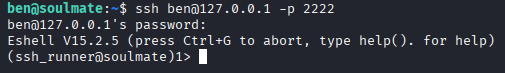

Per i comandi Erlang  rimando al sito ufficiale: https://www.erlang.org/docs/21/man/os#cmd-1

Ora possiamo prendere la flag di root

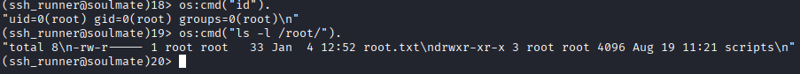