# Breach

Iniziamo con una scansione nmap, notiamo subito che è un DC, il suo nome host è BREACHDC ed il dominio è breach.vl.

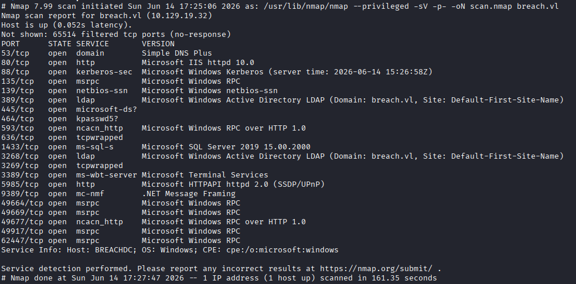

Partiamo da SMB, provando a listare le shares con degli utenti di default e vediamo che con l'utente guest possiamo scrivere e leggere in alcune di queste.

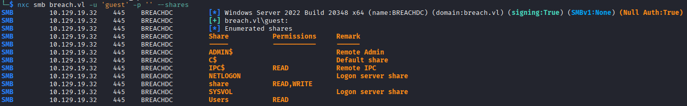

Dentro la share 'share' ci sono 3 cartelle, solo transfer non è vuota. Questa contiene 3 cartelle con i nomi di 3 utenti ma non possiamo entrare in nessuna di queste.

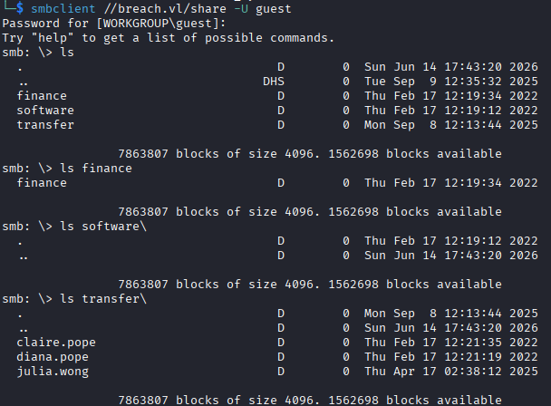

Controllando se questi utenti hanno il pre-auth disabilitato, vediamo che non è così.

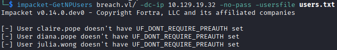

Avendo i diritti di scrittura su una share possiamo provare una coercion opportunity. Questa consiste nel forzare una macchina Windows ad autenticarsi verso la nostra macchina. Caricando un file .url in una cartella dentro una share SMB, quando un utente o un processo la apre, Windows Explorer carica automaticamente certi tipi di file, come gli url. A questo punto Explorer legge il file, e tenta di scaricare automaticamente l'icona, autenticandosi con NTLMv2 verso di noi. Avviando Responder sulla nostra macchina possiamo catturare l'hash.

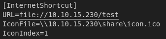\
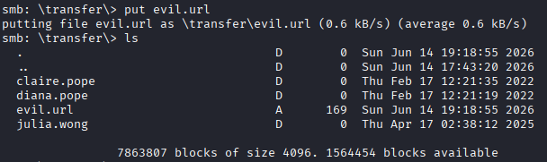\
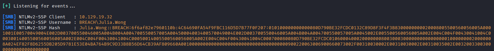

Crackiamo questo hash con hashcat e troviamo la password in chiaro.

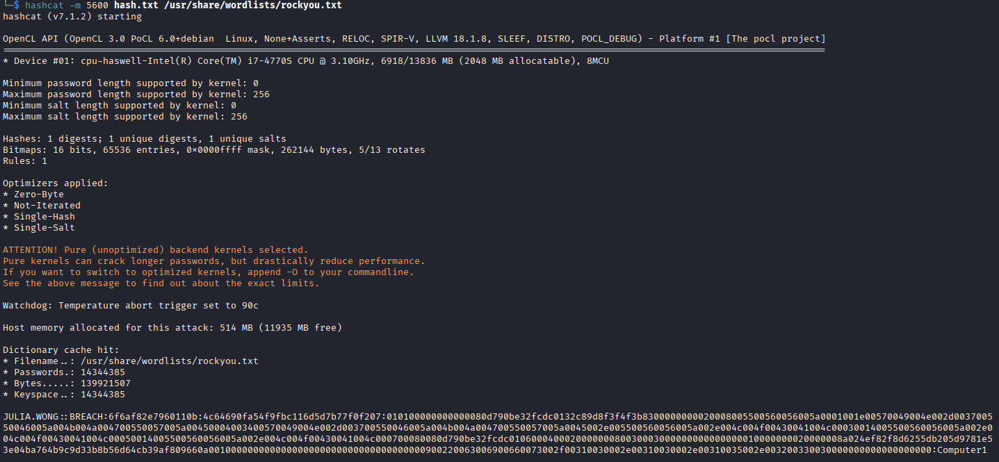

La flag di questo utente si trova nella share smb 'share', entriamo con la password appena scoperta e prendiamo la prima flag.

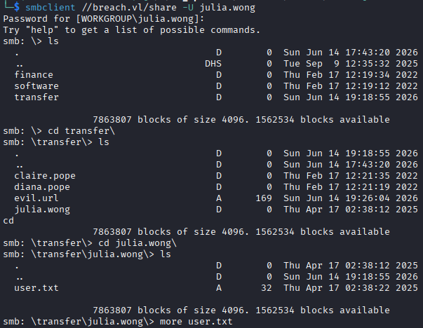

Listiamo gli utenti all'interno del dominio con ldapsearch, uno dei più interessanti è svc_mssql, un account di servizio di MSSQL, proviamo ad ottenere anche il suo SPN con impacket per provare un attacco Kerberoasting.

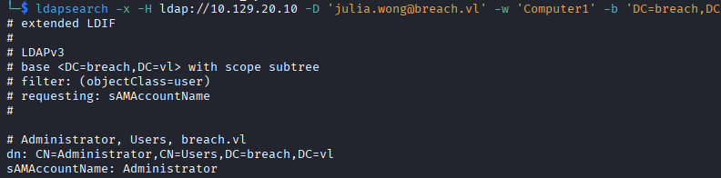\
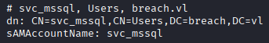\
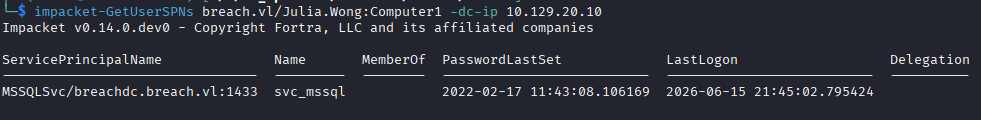

Richiediamo il TGS di questo account per questo servizio con impacket-GetUserSPNs e salviamo l'hash dentro il file tgs_hash.txt. Ora possiamo crackarlo con hashcat, usando la wordlist rockyou.

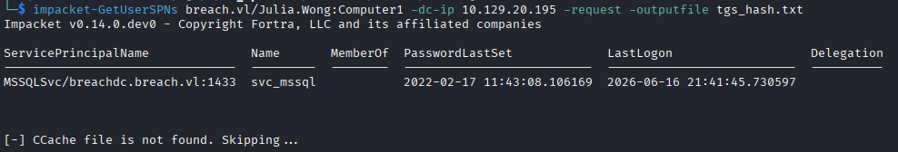\
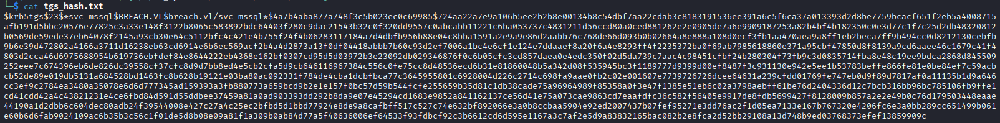\
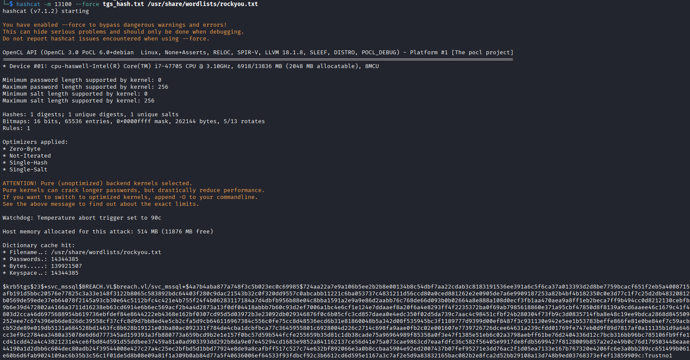

Siccome abbiamo le credenziali per l'utente del servizio MSSQL possiamo provare un attacco silver ticket ed impersonare Administrator, ma prima lanciamo bloodhound per ottenere le informazioni che ci servono.
Il silver ticket è un TGS creato da noi senza contattare il DC, questo è cifrato con l'NT hash del service account e al suo interno possiamo dichiarare di essere Administrator, perchè il servizio non chiederà mai conferma al DC.

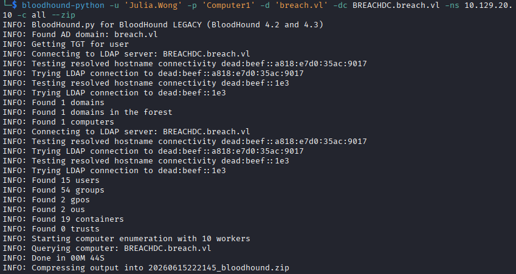

Prendiamo il SID del dominio, cerchiamo breach.vl e nelle informazioni sulla destra lo troviamo nella parte superiore, poi ci serve l'NT hash dell'account svc_mssql, avendo la sua password possiamo ottenerlo con pypykatz. Infine usiamo ticketer di impacket per forgiare il ticket.

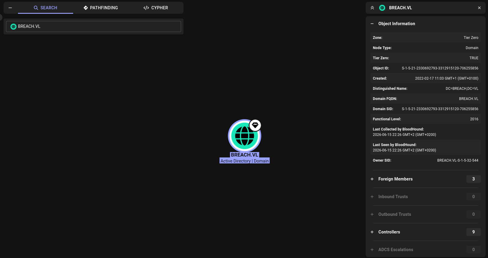\
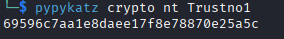\
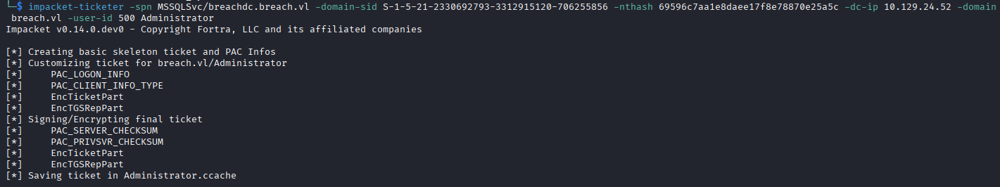

Ora usiamo impacket per connetterci al db come administrator, proviamo a lanciare dei comandi con la xp_cmdshell ma vediamo che questo componente è spento per motivi di sicurezza, solo chi ha i privilegi di sysadmin può abilitarlo, essendoci autenticati come administrator li abbiamo, abilitiamolo e vediamo che siamo l'utente svc_mssql, questo perchè i comandi vengono lanciati con l'utente del servizio.

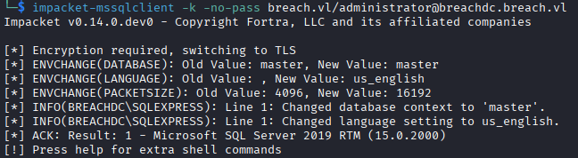\
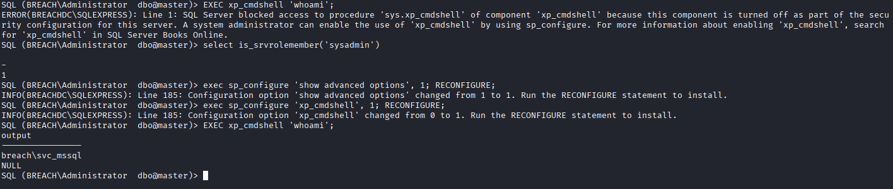

Otteniamo una reverse shell in powershell, trasformiamo i caratteri in utf-16, il flag -enc di powershell li vuole in questo formato, codifichiamola in base64 senza newline e incolliamo questa stringa nel comando, avviamo prima netcat sulla nostra macchina per ricevere la shell.

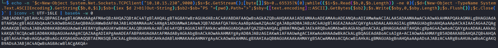\
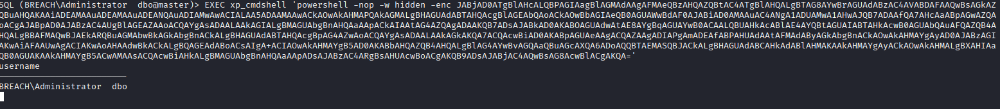\
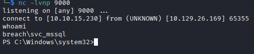

Controllando i permessi che abbiamo troviamo 'SeImpersonatePrivilege', questo ci permette di usare uno dei potato attack per impersonare un altro utente.

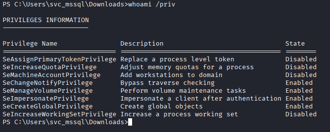

Scarichiamo GodPotato-NET4.exe, apriamo un server http con python e scarichiamolo sulla macchina Windows.

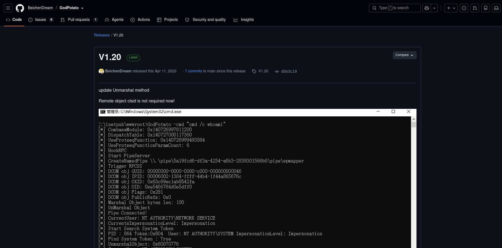\
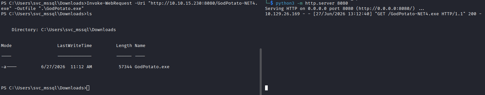

Controlliamo se funziona correttamente e se siamo l'utente NT AUTHORITY\SYSTEM ed è così, creiamoci una rev shell in powershell e come abbiamo fatto prima, trasformiamo i caratteri in utf-16 e codifichiamo in base64, poi prendiamo la stringa e con godpotato lanciamola per ottenere un'altra rev shell, questa volta come NT AUTHORITY\SYSTEM.

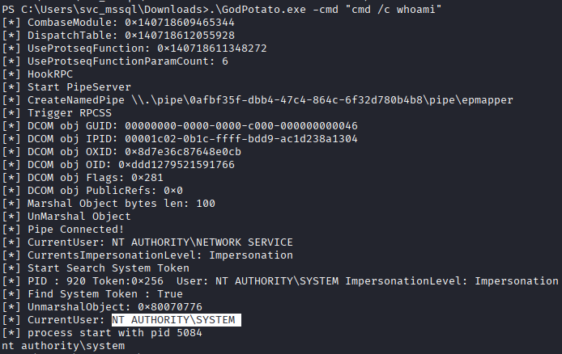\
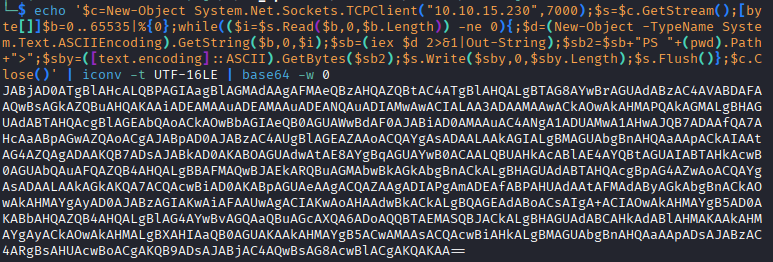\
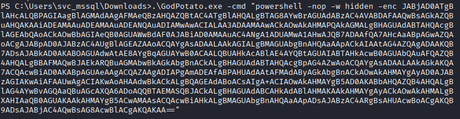\
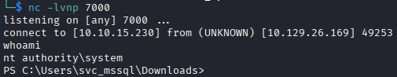

Ora andiamo nel Desktop di Administrator e prendiamo la flag

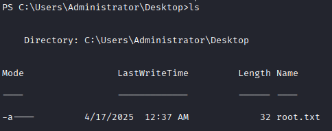