# INTELLIGENCE

Una scansione nmap rivela diverse porte aperte, partiamo dalla 80.
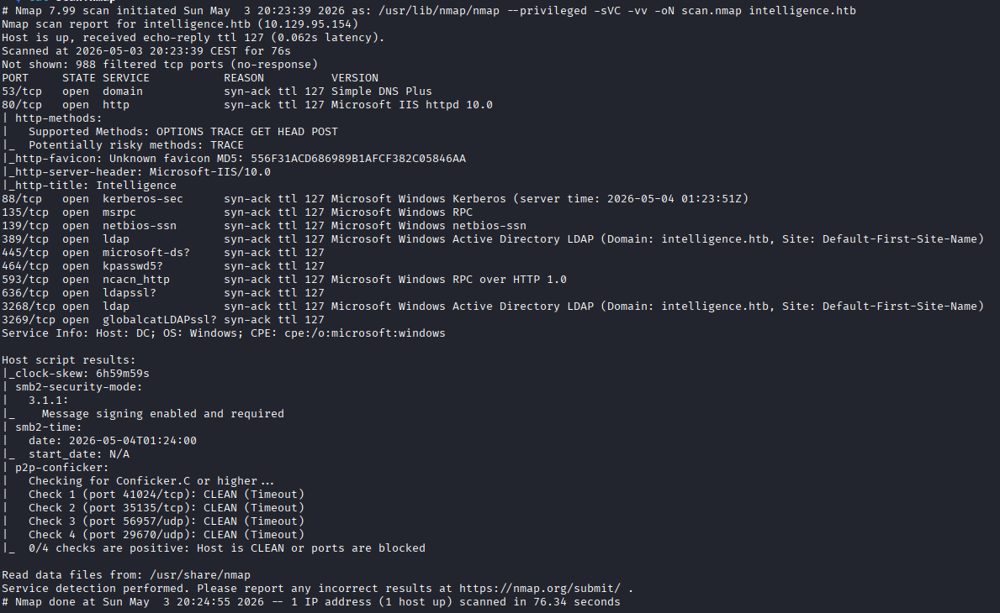

Questa web app è una pagina statica ma con due link a due pdf, il formato del nome di questi pdf sembra standard: YYYY-MM-dd-upload.pdf, provando a cambiare la data nel nome da 2020-01-01 a 2020-01-02 troviamo un altro file.
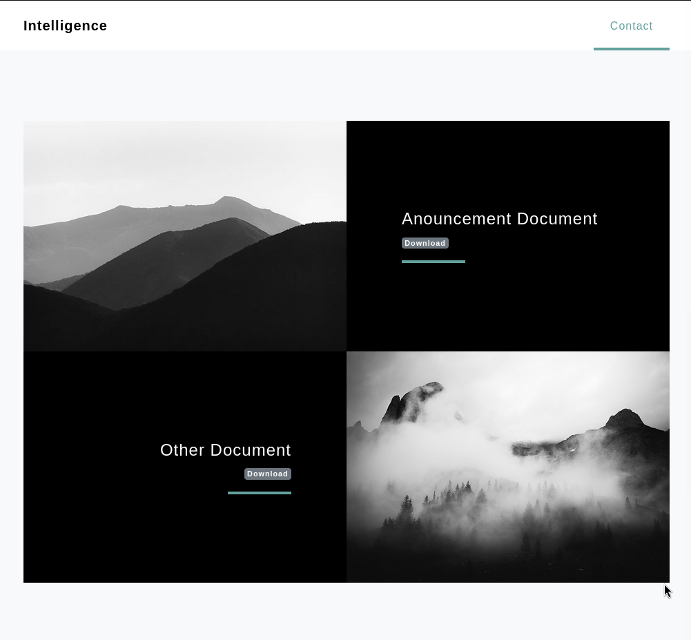
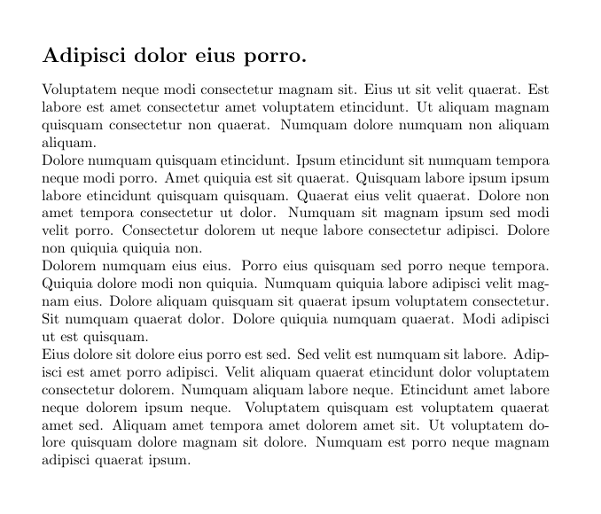

I due file sono entrambi del 2020, quindi con uno script in python creiamo una lista di date di tutto quell'anno per cercare altri pdf.
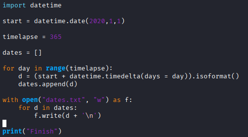

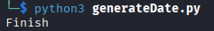

Con ffuf enumeriamo i pdf e salviamoli in un file json per analizzarli successivamente.
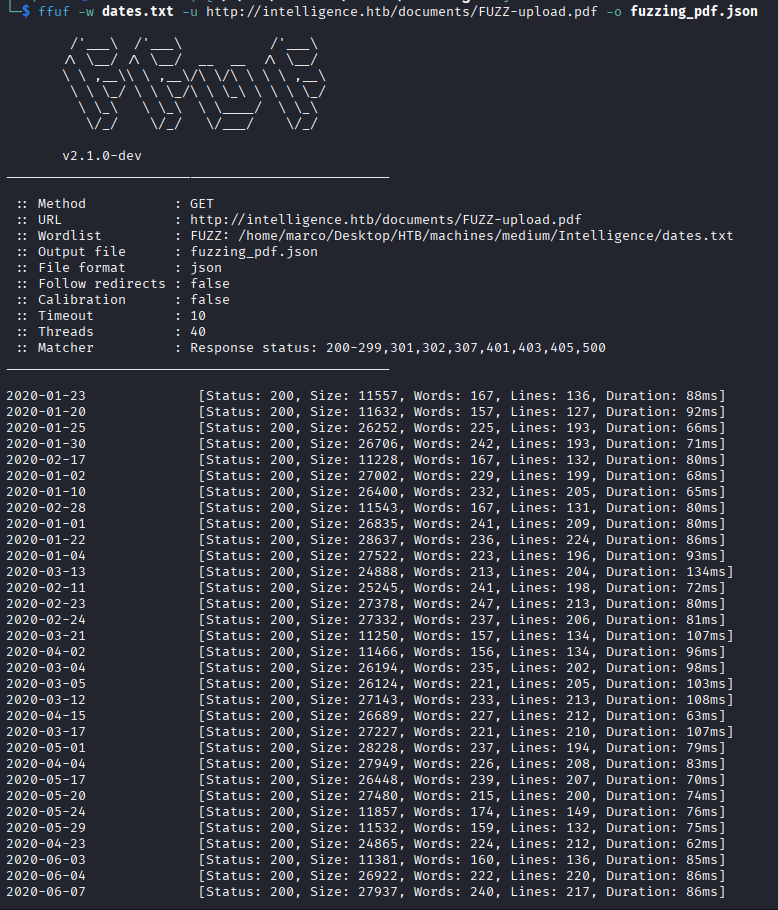

Come possiamo notare l'url del pdf è stato salvato dentro la prop url, usiamo jq per prendere la prop results dalla radice, enumerare gli items dell'array e per ogni oggetto prendere la prop url e salvarla in un file txt.
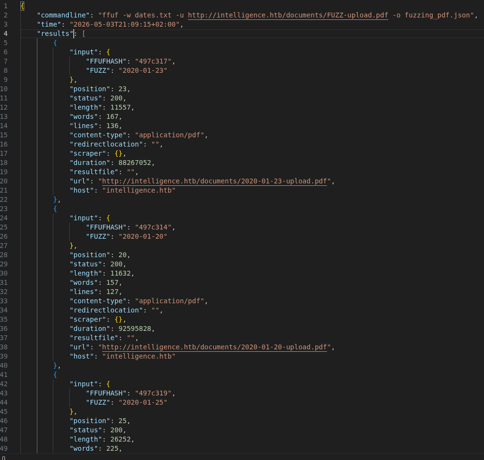
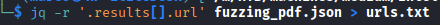

Con curl scarichiamo i pdf con lo stesso nome che hanno sul server, ma visto che sono tanti usiamo xargs per passargli un url alla volta con 5 thread in parallelo.
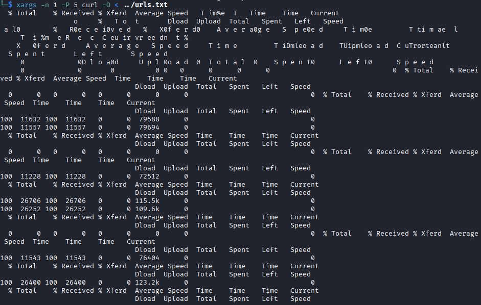

Per poterli analizzare trasformiamoli in testo, cicliamo tutti i pdf della cartella corrente e passiamoli a pdftotext.

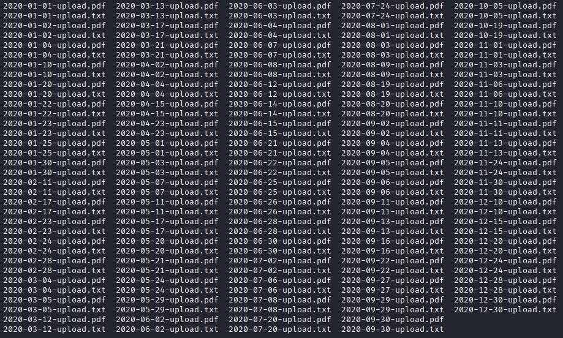

Ora usiamo grep per prendere alcune parole chiave dal testo estratto dai pdf, nel file 2020-06-04-upload.txt sembrano esserci delle credenziali.
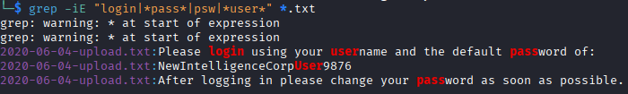

Dando un'occhiata al file vediamo che ci sono scritti i passi da seguire quando si fa il login per la prima volta, con la password di default e dice di usare il proprio username.
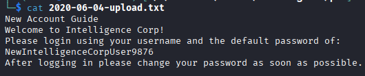

Cerchiamo questi username nei metadati dei file pdf, con exiftool prendiamo i creatori dei file e puliamo l'output, con grep escludiamo le righe che contengono ^=====, con cut dividiamo la stringa per ':' e prendiamo il secondo campo e con tr eliminiamo gli spazi, salviamo tutto su un file txt.
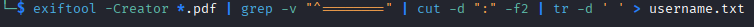

Con crackmapexec facciamo un password spray e scopriamo che l'utente Tiffany.Molina usa ancora la password di default.
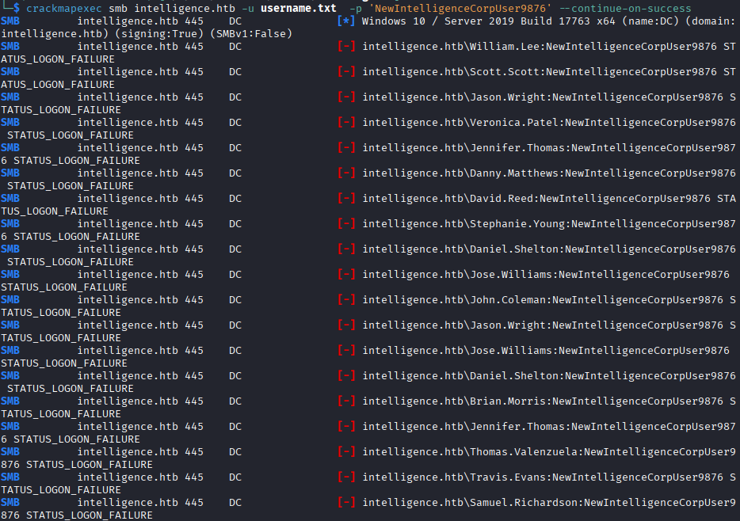

Listiamo le shares disponibili e dentro Users, nel desktop dell'utente, troviamo la prima flag.
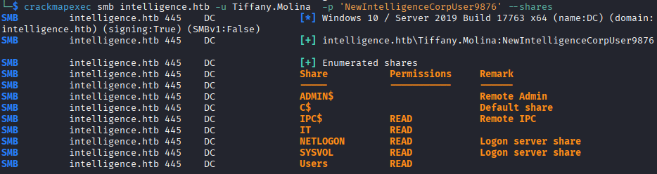
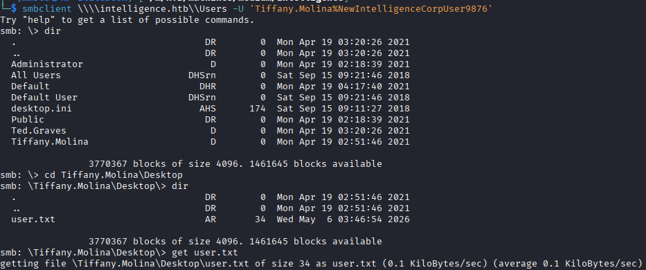

Invece nella share IT troviamo uno script in powershell che viene lanciato ogni 5 minuti. Questo script prende tutti i record DNS del dominio intelligence.htb che iniziano con 'web' e manda una richiesta http con delle credenziali di default ed in caso di risposta negativa manda una mail a Ted Graves.
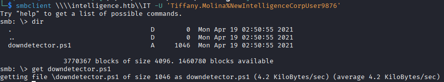
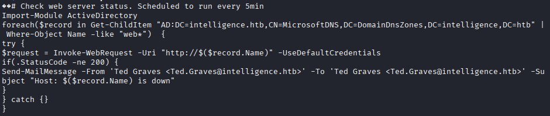

Per ottenere le credenziali possiamo iniettare un record DNS, che inizi con web e che punti al nostro IP. Per fare ciò abbiamo bisogno di dnstool.
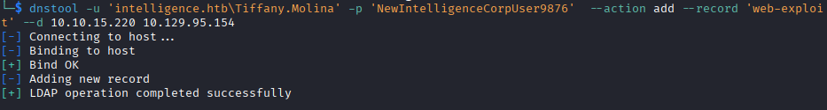

Ora dobbiamo avviare responder, sull'interfaccia della VPN, per ricevere l'hash NTLMv2 della password. E' importante che HTTP server sia ON, nel caso non lo sia è possibile modificarlo nel file /usr/share/responder/Responder.conf. Quello che fa responder è avviare un vero e proprio server http, perchè per ottenere l'hash è necessario un handshake, dove il target ci invierà una richiesta ed il nostro server risponderà con un 401, il target ci manderà una richiesta dicendo che è pronto a negoziare e responder gli invierà una challenge e solo ora riceveremo il NTML.
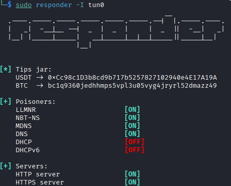
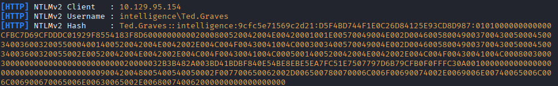

Crackimamo l'hash con hashcat e troviamo la password, visto che nello script in powershell viene mandata una mail all'utente Ted.Graves, c'è la possibilità che questa sia la sua password.
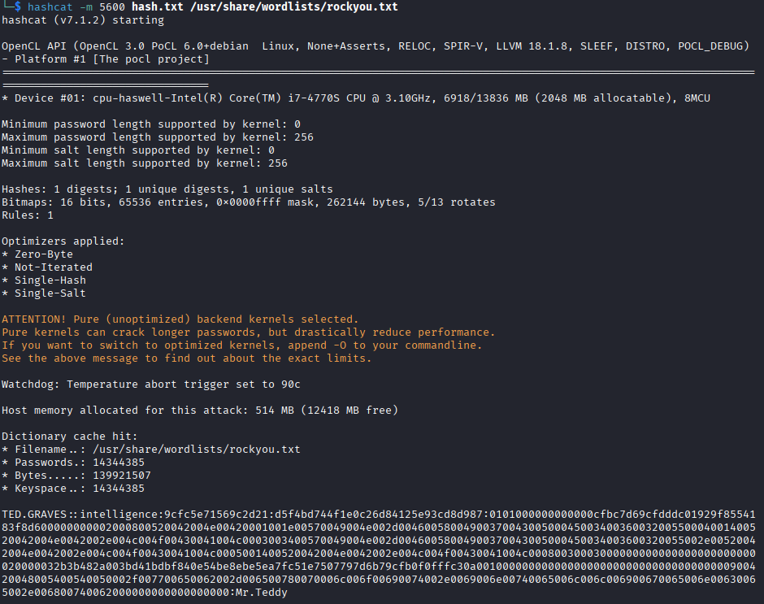

Lanciamo blood-hound con questo utente e la nuova password, riusciamo ad enumerare gli oggetti di AD.
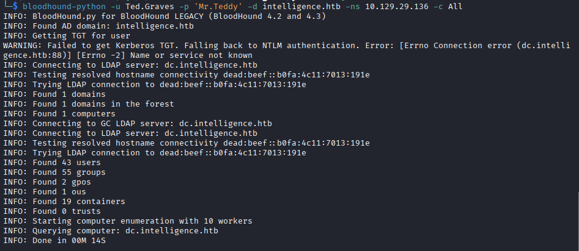

Con bloodhound vediamo che il nostro utente fa parte del gruppo ITSUPPORT che ha la delega ReadGMSAPassword sull'utente SVC_INT$. Con questa delega possiamo leggere l'hash della sua password, ma questo non è un utente standard, è usato da windows per gestire servizi, task pianificati ecc.. quindi potrebbe avere privilegi elevati.
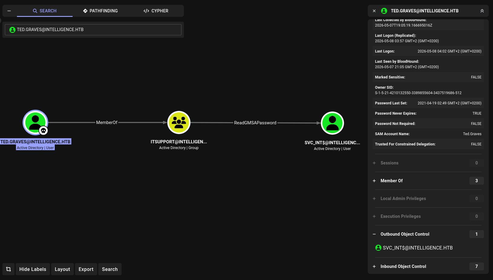

Infatti dando un'occhiata alle sue deleghe, vediamo che ha AllowedToDelegate sul DC, questo vuol dire che può chiedere un ST impersonando un qualsiasi utente all'interno del dominio.
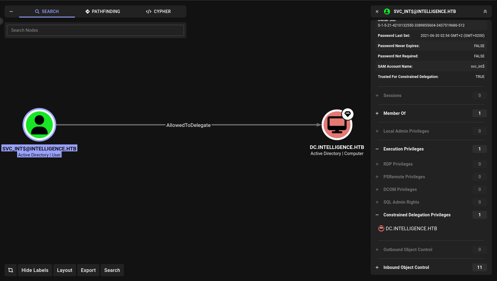

Con bloodyAD possiamo quindi ottenere l'hash della password di SVC_INT$.
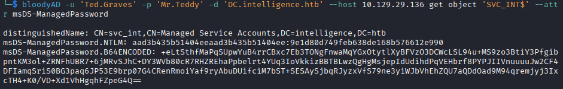

Con impacket-getST e l'hash possiamo ottenere un ticket come Administrator per SPN WWW/DC.intelligence.htb, ma visto che il mio pc ha un orario diverso da quello del DC, è necessario sincronizzare gli orari. faketime è il tool adatto per questo.
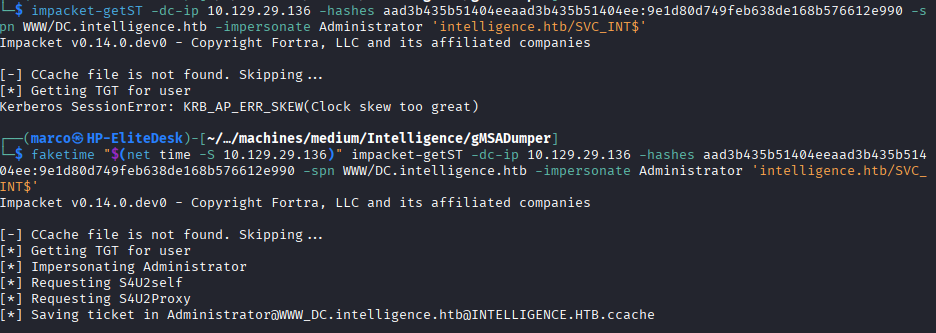

Con il file .ccache esportato nella var d'ambiente KRB5CCNAME possiamo usare impacket per connetterci a smb, tramite Pass-the-ticket, come Administrator ed ottenere l'ultima flag.
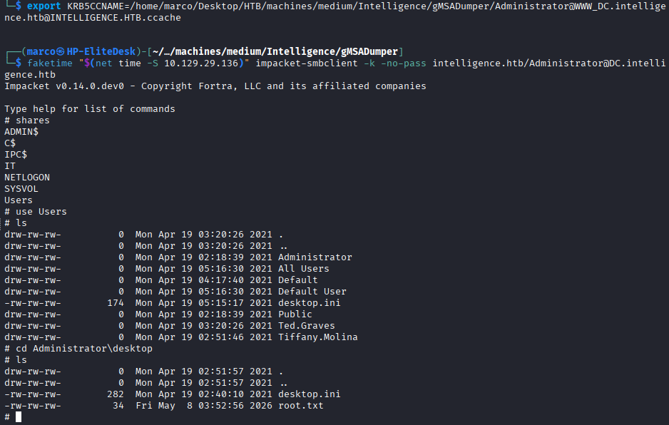

