# Job

Iniziamo con una scansione con nmap e troviamo 5 porte aperte.

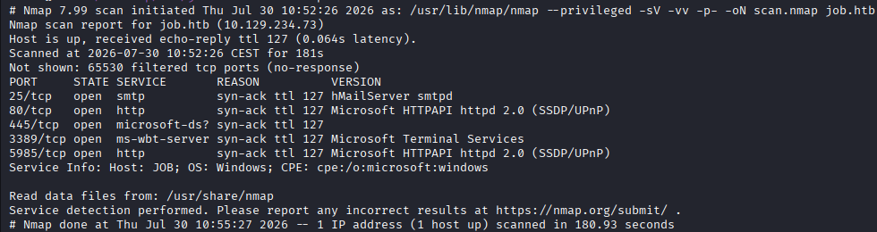

Diamo un'occhiata alla pagina web, dicono che stanno passando a software open source e che, per candidarci, il CV dovrà essere un LibreOffice document. Questo ci permette di sfruttare le macro come vettore di attacco. Abbiamo anche l'indirizzo email a cui inviare il documento.

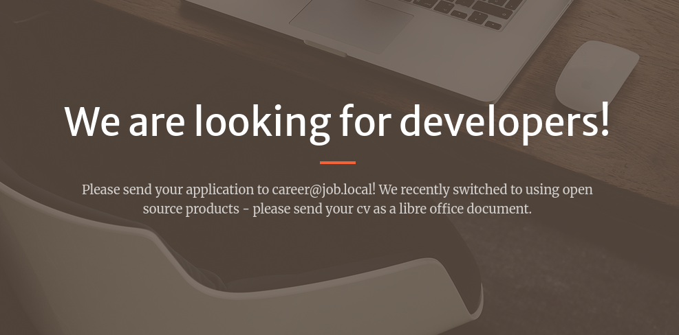

Andiamo su Metasploit per creare un file ODT con una macro. Cerchiamo il modulo openoffice_document_macro e impostiamo come payload un eseguibile Windows a 64 bit. Il comando che verrà lanciato è una chiamata al nostro server web da cui scaricare il file rev.txt, una reverse shell. Come server host indichiamo il nostro IP di tun0 e lanciamo. Nell'ultima riga vediamo dove è stato salvato il file, ma notiamo che è stato usato un URL diverso da quello indicato da noi.

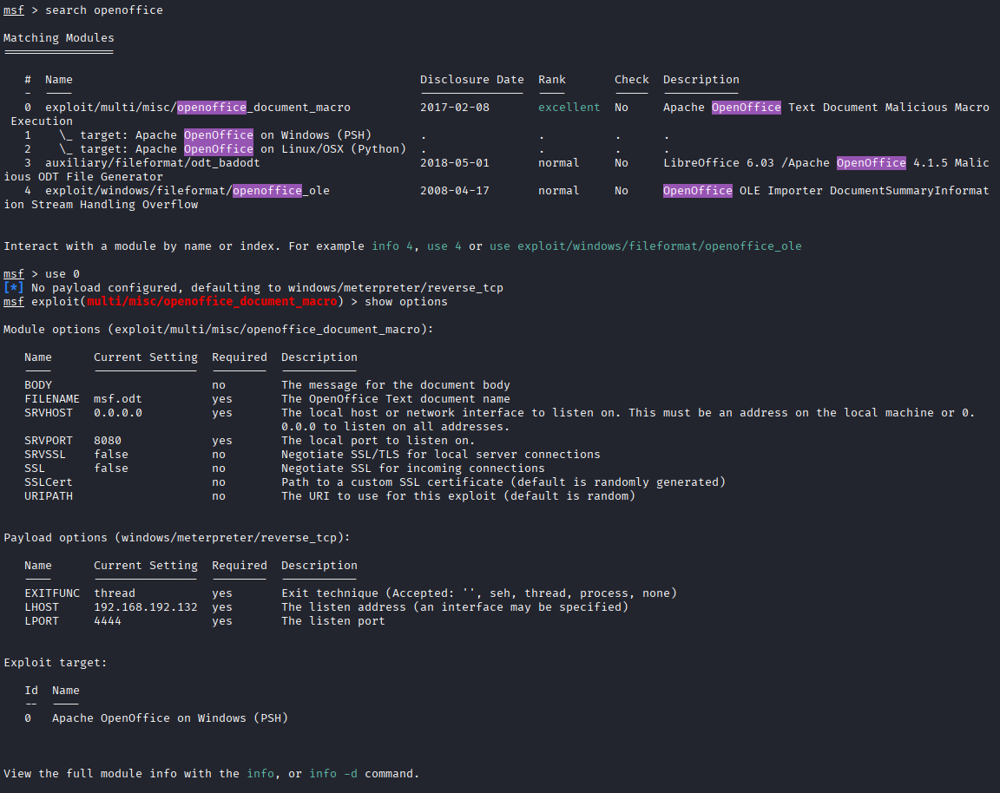
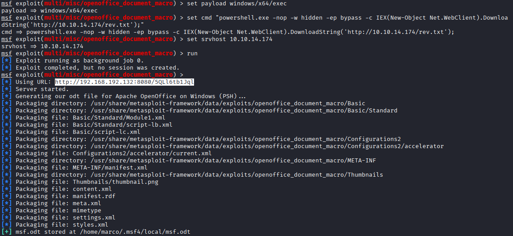

Apriamo il file ODT e dentro Basic/Standard troviamo Module1.xml, modifichiamo l'IP e il nome del file da scaricare.

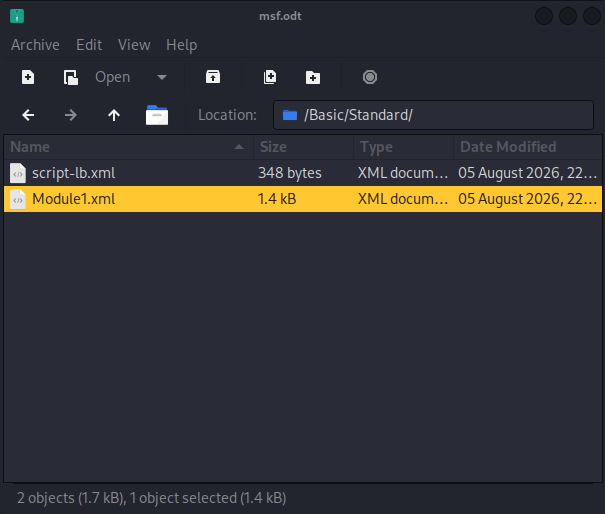
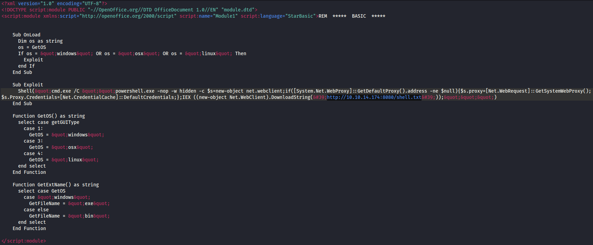

Creiamo il file shell.txt con una reverse shell in PowerShell. L'estensione è indifferente perché la macro userà IEX su DownloadString, che scarica il contenuto come testo e lo esegue in memoria, nessun file viene mai scritto sul target.

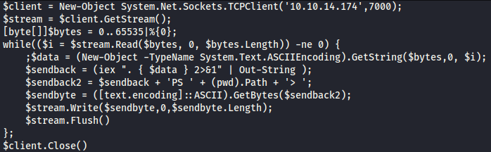

Avviamo i due listener, un HTTP server sulla porta specificata nella macro e un netcat sulla porta indicata nella reverse shell. Inviamo poi la mail con swaks, specificando destinatario (l'indirizzo visto sul sito), mittente (una mail qualunque con lo stesso dominio), IP e porta del target, oggetto della mail, corpo e allegato. Poco dopo l'invio vediamo la richiesta di shell.txt sul server HTTP e, subito dopo, la connessione al nostro netcat.

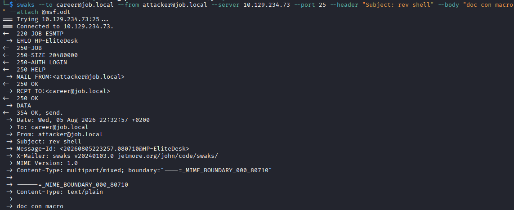
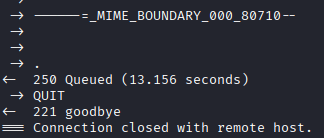
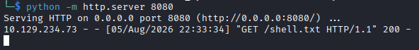
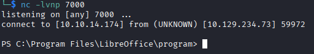

Controlliamo chi siamo, l'utente jack.black, possiamo prendere la prima flag dal suo Desktop.

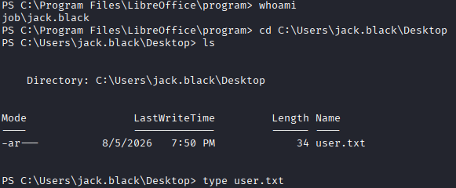

Diamo un'occhiata ai privilegi di questo utente, l'unica cosa particolare è che fa parte del gruppo developers. Controlliamo allora se ci siano cartelle standard per sviluppatori, troviamo C:\inetpub. Qui abbiamo i permessi di scrittura in wwwroot, dove si trova l'app ASPX, la stessa che abbiamo visto all'inizio dal browser.

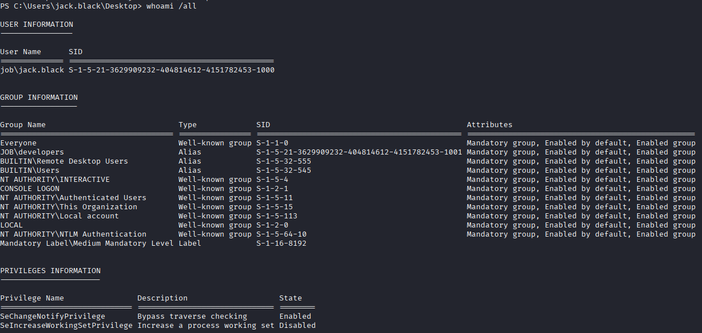
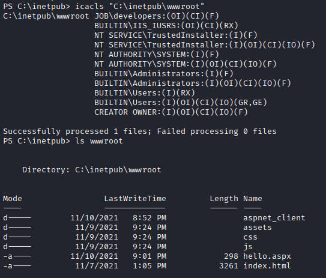

Prendiamo una reverse shell in ASPX, ci mettiamo il nostro IP e la porta, e avviamo un server HTTP nella stessa cartella. La scarichiamo sul target con curl, direttamente in wwwroot. Avviamo netcat sulla porta scelta e visitiamo la pagina dal browser per ottenere subito una shell come iis apppool\defaultapppool.

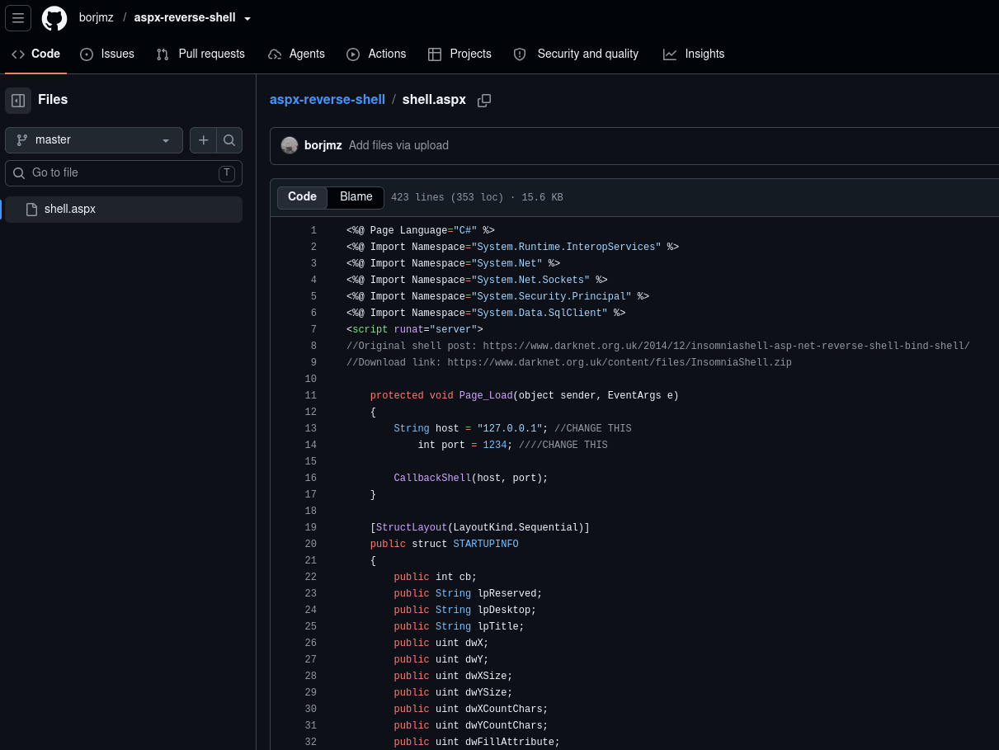
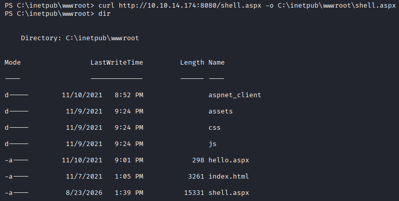
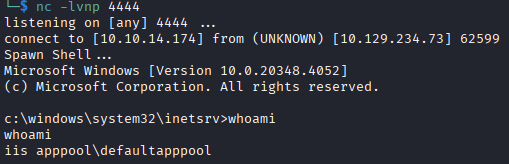

Questo utente ha il privilegio SeImpersonatePrivilege, possiamo quindi provare un Potato attack. Scarichiamo GodPotato sulla nostra macchina e poi lo trasferiamo sul target.

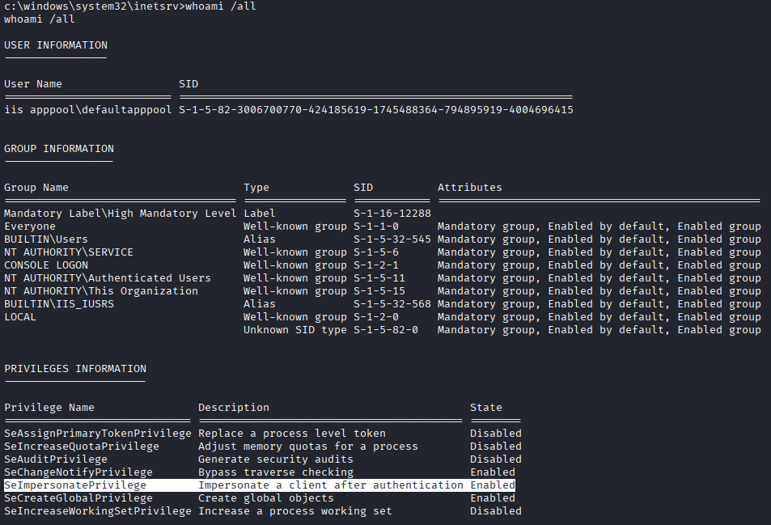
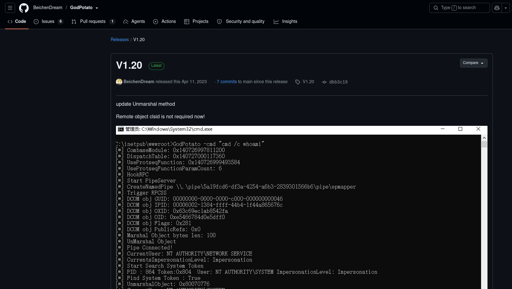
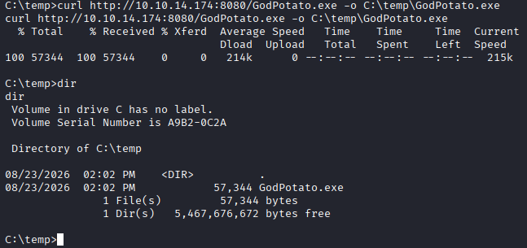

Lanciamo GodPotato usandolo per leggere direttamente la flag dal Desktop di Administrator.

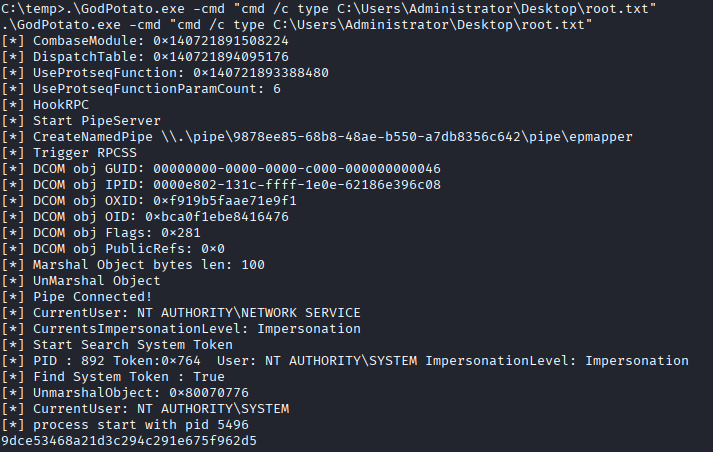