# PRINCIPAL

Con una scansione nmap troviamo 2 porte aperte: la 22 con SSH e la 8080 con HTTP

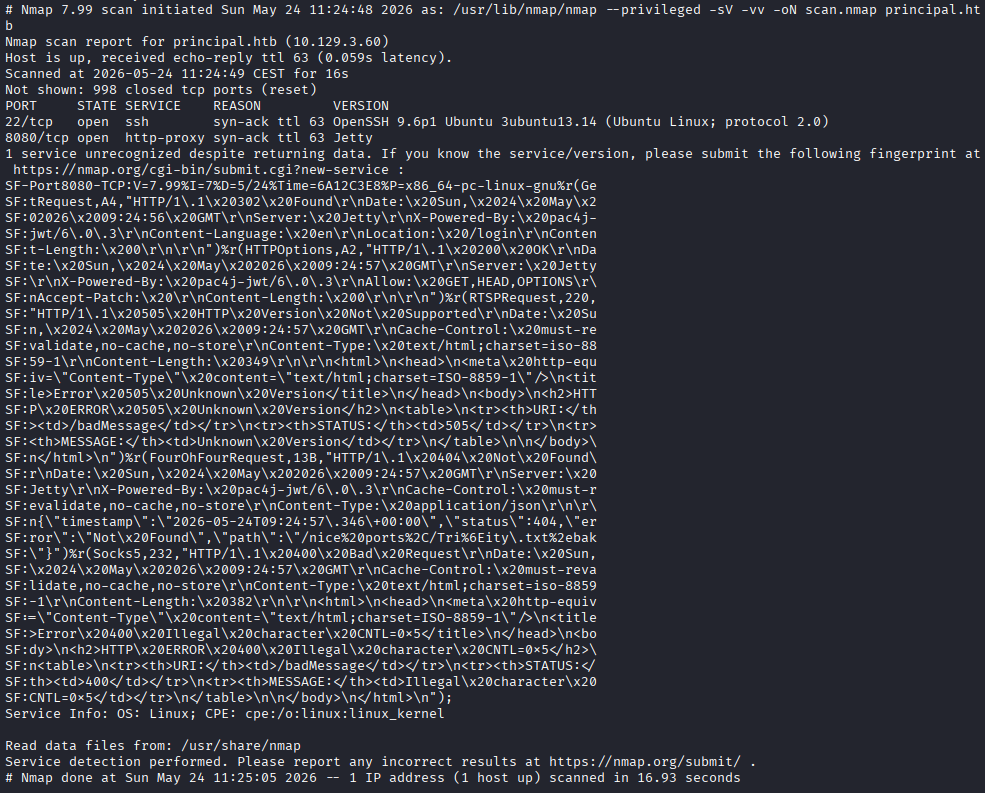

Nella pagina web c'è solo una form di login, provando a resettare la password dice che questa funzione è ancora in fase di sviluppo e provando un attacco bruteforce sulla form e una directory enumeration non è emerso nulla di interessante

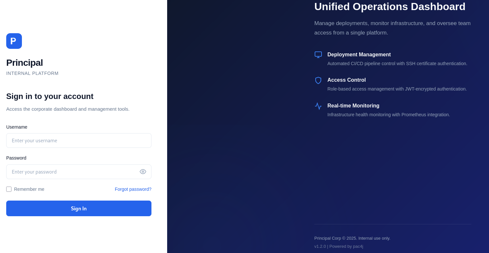
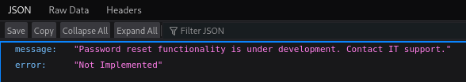

Sul sito vediamo che c'è scritto 'Powered by pac4j', proviamo una scansione con nmap con gli script NSE e vediamo che pac4j-jwt è alla versione 6.0.3. pac4j é un framework java che gestisce l'autenticazione e pac4j-jwt è una sua libreria che fornisce supporto per i JWT

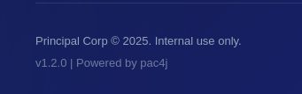
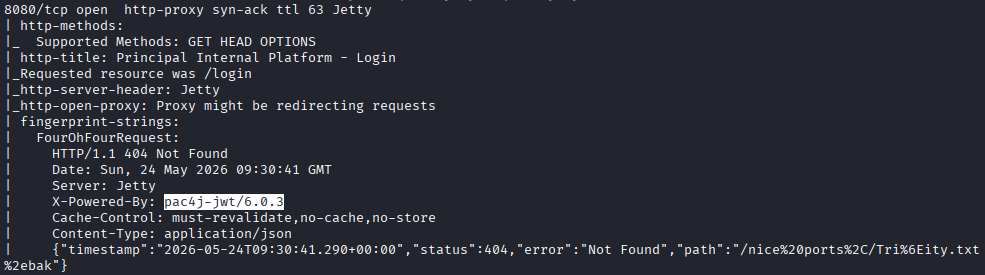

Questa versione è vulnerabile alla CVE-2026-29000, la quale permette un authentication bypass. È possibile creare un PlainJWT, un JWT con "alg":"none", quindi privo di firma, contenente claim arbitrari, e wrapparlo all'interno di un JWE cifrato con la chiave pubblica RSA del server. pac4j-jwt, in questa versione, decripta correttamente il JWE con la propria chiave privata, ma non verifica la firma del JWT interno: poiché il PlainJWT non ne possiede una, in questo modo i claim forgiati vengono considerati validi, permettendo l'autenticazione senza credenziali

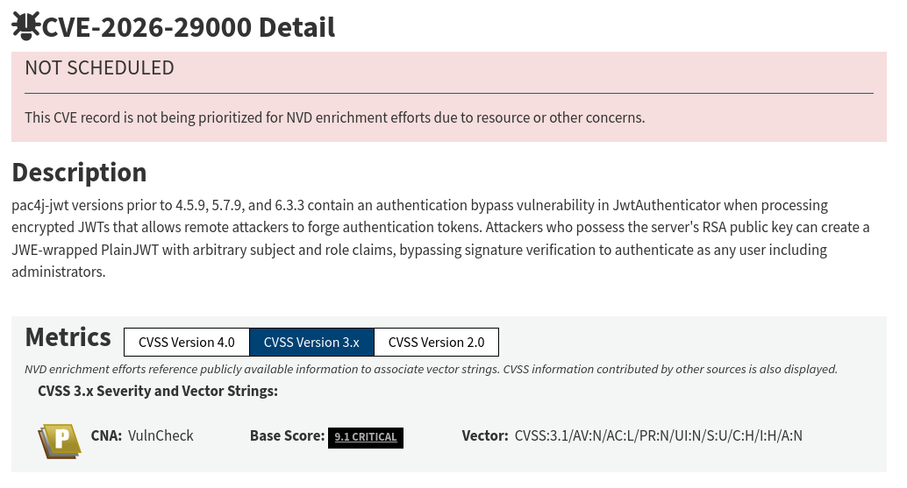

Dal sorgente app.js recuperiamo l'endpoint /api/auth/jwks, che serve per ottenere la chiave pubblica RSA, e notiamo che il token viene salvato nel sessionStorage sotto la chiave auth_token

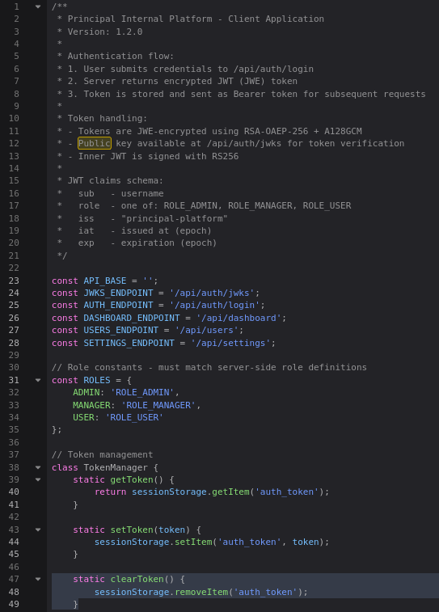

Su github c'è un PoC per questo exploit, fa già una chiamata a /api/auth/jwks, imposta il ruolo a ROLE_ADMIN, forgia il JWE e prova ad accedere a /api/dashboard, pagina che può vedere solo chi è autenticato

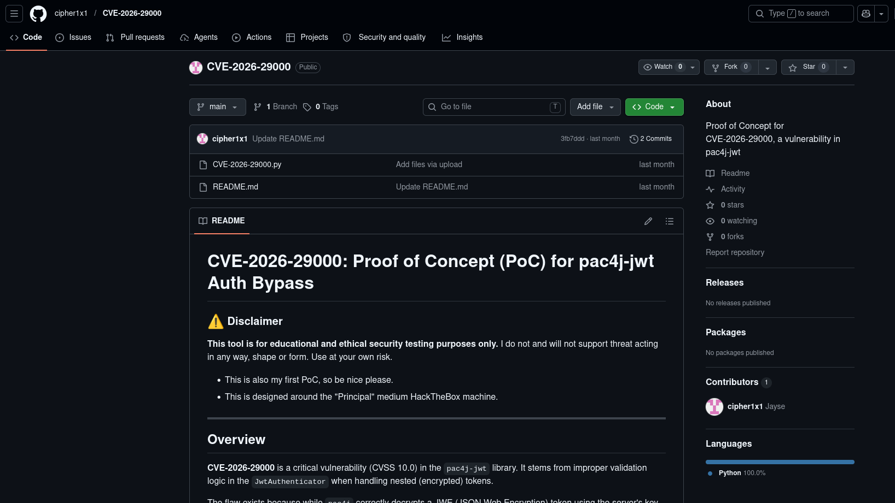

Salviamolo in un file e lanciamolo, specificando l'url bersaglio, per ottenere il JWE con la conferma che è valido

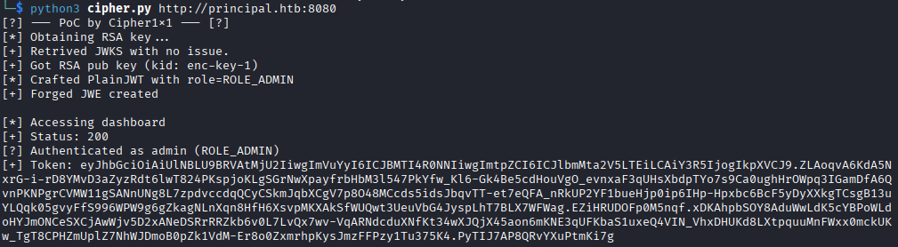

Dal DevTools impostiamo nel sessionStorage la coppia auth_token:JWE e ricarichiamo la pagina, il server valida il token e ci redirige alla dashboard come admin

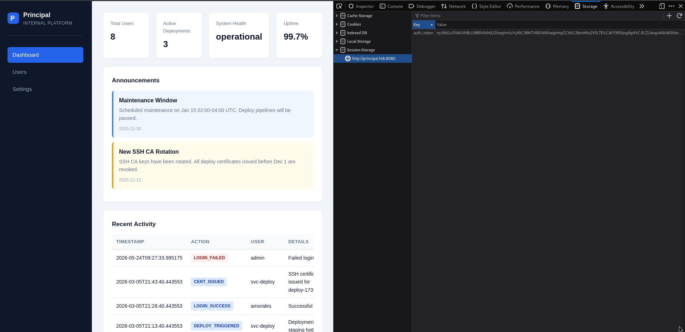

Nella tab Settings troviamo il campo encryptionKey con il valore in chiaro, una possibile password. Recuperiamo la lista utenti dalla tab Users salvandoli in un file e con Hydra eseguiamo un attacco a dizionario su SSH, scoprendo che la password appartiene all'utente svc-deploy

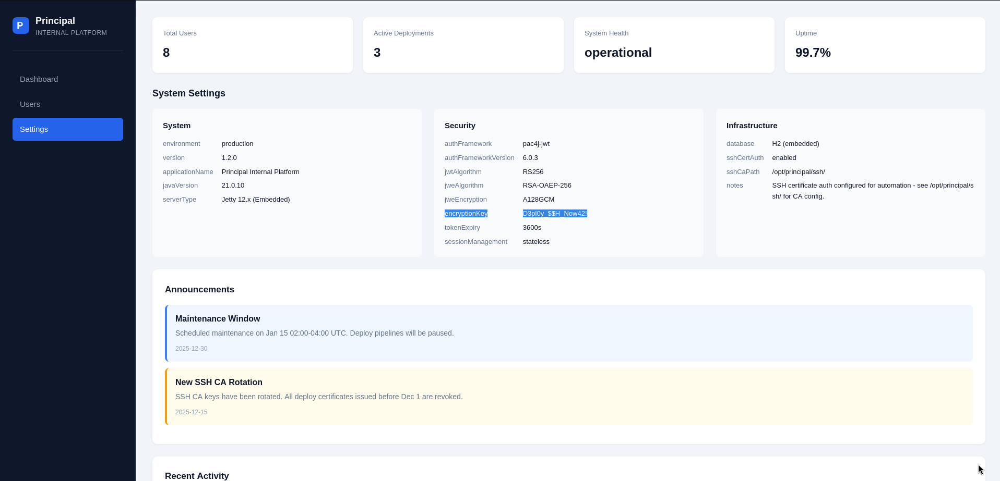
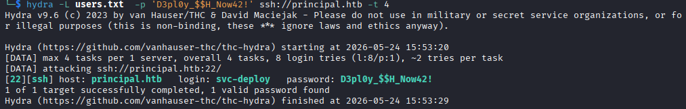

Entriamo con le credenziali appena trovate con ssh e troviamo la prima flag

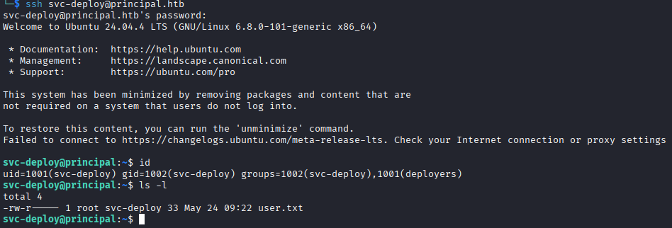

Il sito, sotto la tab Settings specifica che la cartella /opt/principal/ssh/ è quella che contiene la configurazione per CA (Certificate Authority), un'entità che firma certificati digitali

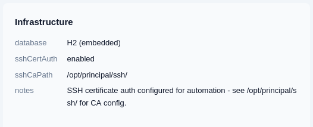

Il server si fida di tutte le chiavi ssh firmate con la chiave privata ca, che può essere letta da root ed il gruppo deployers e noi facciamo parte di questo gruppo, quindi possiamo firmare una chiave pubblica ssh come root e loggarci come questo utente

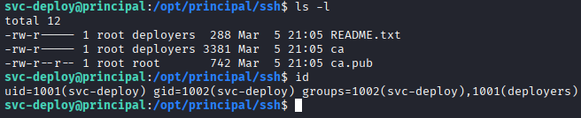

Generiamo una coppia di chiavi con ssh-keygen, firmiamo quella pubblica specificando per quale utente il certificato è valido, il principal, root, e ci autentichiamo come tale con il certificato firmato, prendendo la flag finale

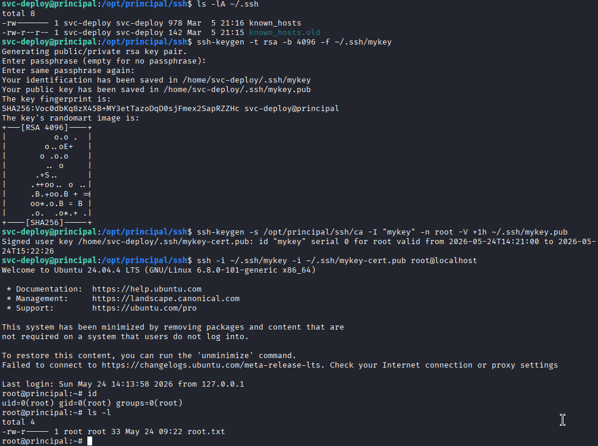